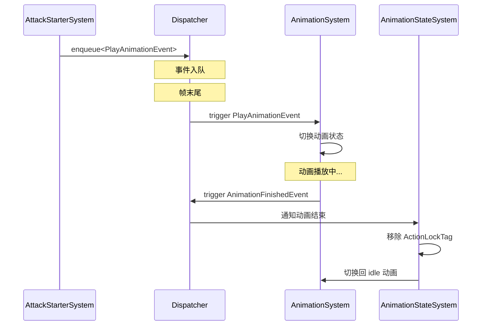
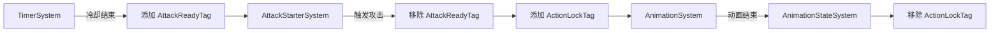
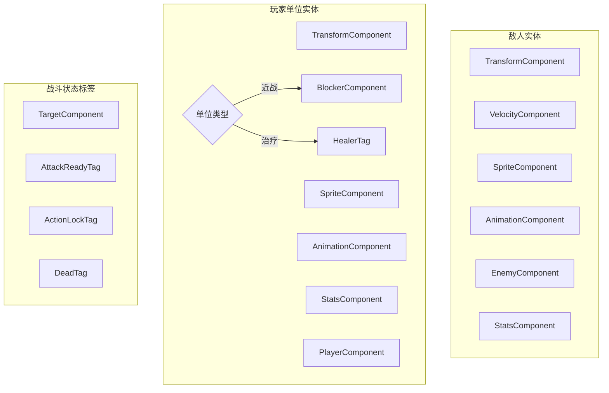
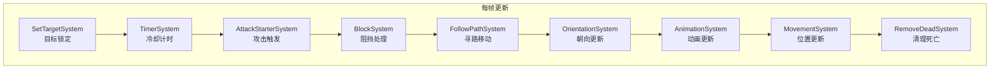

# ECS 架构总览

> **相关文档**: [主文档](README.md) | [组件模块](engine/component/README.md) | [系统模块](engine/system/README.md)

---

## 目录

- [概述](#概述)
- [ECS 核心概念](#ecs-核心概念)
- [项目中的 ECS 实现](#项目中的-ecs-实现)
- [架构设计](#架构设计)
- [模块交互关系](#模块交互关系)
- [使用 EnTT 库](#使用-entt-库)
- [性能考虑](#性能考虑)
- [最佳实践](#最佳实践)
- [事件系统](#事件系统)

---

## 概述

本项目采用 **ECS（Entity-Component-System）** 架构作为核心设计模式，使用 [EnTT](https://github.com/skypjack/entt) 库作为 ECS 框架实现。

ECS 架构将游戏对象的数据和行为分离：

- **数据（组件）**：纯数据结构，无逻辑
- **行为（系统）**：处理具有特定组件的实体
- **标识（实体）**：轻量级的唯一标识符

这种设计带来了以下优势：

1. **高性能**：数据连续存储，缓存友好
2. **灵活性**：通过组合组件定义实体行为
3. **可扩展性**：易于添加新组件和系统
4. **可维护性**：数据与逻辑分离，代码更清晰

---

## ECS 核心概念

### 实体（Entity）

实体是一个轻量级的唯一标识符（在 EnTT 中是 `entt::entity`），本身不包含任何数据或逻辑。实体只是组件的容器。

```cpp
// 创建实体
auto entity = registry.create();

// 实体只是一个ID，没有数据
// 数据存储在组件中
```

### 组件（Component）

组件是纯数据结构（POD），只包含数据，不包含任何逻辑。组件定义了实体的属性。

```cpp
// 变换组件示例
struct TransformComponent {
    glm::vec2 position_{0.0f, 0.0f};  // 位置
    glm::vec2 scale_{1.0f, 1.0f};     // 缩放
    float rotation_{0.0f};             // 旋转
};

// 添加组件到实体
registry.emplace<TransformComponent>(entity, glm::vec2(100.0f, 100.0f));
```

**本项目中的组件**：

| 组件 | 功能 | 所在文件 |
|------|------|----------|
| TransformComponent | 位置、旋转、缩放 | `engine/component/transform_component.h` |
| VelocityComponent | 线速度 | `engine/component/velocity_component.h` |
| SpriteComponent | 精灵渲染数据 | `engine/component/sprite_component.h` |
| AnimationComponent | 动画状态和数据 | `engine/component/animation_component.h` |
| TargetComponent | 锁定目标引用 | `game/component/target_component.h` |
| StatsComponent | 战斗属性数据 | `game/component/stats_component.h` |

---

### 系统（System）

系统包含处理逻辑，遍历具有特定组件的实体，并执行相应的操作。

```cpp
class MovementSystem {
public:
    void update(entt::registry& registry, float deltaTime) {
        // 获取同时具有 VelocityComponent 和 TransformComponent 的实体
        auto view = registry.view<VelocityComponent, TransformComponent>();
        
        for (auto entity : view) {
            auto& velocity = view.get<VelocityComponent>(entity);
            auto& transform = view.get<TransformComponent>(entity);
            
            // 更新位置
            transform.position_ += velocity.velocity_ * deltaTime;
        }
    }
};
```

**本项目中的系统**：

| 系统 | 功能 | 处理的组件 | 所在文件 |
|------|------|------------|----------|
| MovementSystem | 更新实体位置 | VelocityComponent + TransformComponent | `engine/system/movement_system.h` |
| RenderSystem | 渲染实体 | TransformComponent + SpriteComponent | `engine/system/render_system.h` |
| AnimationSystem | 更新动画 | AnimationComponent + SpriteComponent | `engine/system/animation_system.h` |
| SetTargetSystem | 锁定攻击/治疗目标 | StatsComponent + TargetComponent + Tags | `game/system/set_target_system.h` |
| TimerSystem | 攻击冷却计时 | StatsComponent + AttackReadyTag | `game/system/timer_system.h` |
| AttackStarterSystem | 触发攻击行为 | AttackReadyTag + TargetComponent + ActionLockTag | `game/system/attack_starter_system.h` |
| AnimationStateSystem | 动作收尾逻辑 | ActionLockTag + AnimationFinishedEvent | `game/system/animation_state_system.h` |
| OrientationSystem | 朝向状态同步 | TransformComponent + SpriteComponent + Target/Velocity | `game/system/orientation_system.h` |

---

## 项目中的 ECS 实现

### 目录结构

```
src/engine/
├── component/          # 组件定义
│   ├── transform_component.h
│   ├── velocity_component.h
│   ├── sprite_component.h
│   └── animation_component.h
├── system/             # 系统实现
│   ├── movement_system.h/cpp
│   ├── render_system.h/cpp
│   └── animation_system.h/cpp
└── render/             # 渲染支持
    ├── image.h         # 精灵图像数据
    └── ...
```

### 典型使用流程

```cpp
// 1. 在场景初始化时创建系统
void GameScene::init() {
    render_system_ = std::make_unique<engine::system::RenderSystem>();
    movement_system_ = std::make_unique<engine::system::MovementSystem>();
    animation_system_ = std::make_unique<engine::system::AnimationSystem>();
    
    // 2. 创建 ECS 实体并添加组件
    testECS();
}

// 3. 在游戏循环中更新系统
void GameScene::update(float delta_time) {
    movement_system_->update(registry_, delta_time);
    animation_system_->update(registry_, delta_time);
}

void GameScene::render() {
    render_system_->update(registry_, context_.getRenderer(), context_.getCamera());
}
```

---

## 架构设计

### 数据流向

```
┌─────────────────────────────────────────────────────────────┐
│                         游戏循环                              │
└─────────────────────────────────────────────────────────────┘
                              │
          ┌───────────────────┼───────────────────┐
          ▼                   ▼                   ▼
┌─────────────────┐  ┌─────────────────┐  ┌─────────────────┐
│  MovementSystem │  │ AnimationSystem │  │  RenderSystem   │
│                 │  │                 │  │                 │
│ 读取: Velocity  │  │ 读取: Animation │  │ 读取: Transform │
│       Transform │  │       Sprite    │  │       Sprite    │
│                 │  │                 │  │                 │
│ 修改: Transform │  │ 修改: Sprite    │  │ 输出: 渲染命令  │
│   (position)    │  │   (src_rect)    │  │                 │
└─────────────────┘  └─────────────────┘  └─────────────────┘
          │                   │                   │
          └───────────────────┼───────────────────┘
                              ▼
              ┌───────────────────────────────┐
              │      EnTT Registry            │
              │  (存储所有实体和组件)          │
              └───────────────────────────────┘
```

### 组件关系图

```
┌─────────────────────┐
│       Entity        │
│  (轻量级标识符)      │
└──────────┬──────────┘
           │
     ┌─────┴─────┬─────────────┬──────────────┐
     ▼           ▼             ▼              ▼
┌─────────┐ ┌─────────┐ ┌────────────┐ ┌────────────┐
│Transform│ │Velocity │ │   Sprite   │ │  Animation │
│Component│ │Component│ │  Component │ │  Component │
├─────────┤ ├─────────┤ ├────────────┤ ├────────────┤
│position │ │velocity │ │  sprite    │ │ animations │
│rotation  │ └─────────┘ │  offset    │ │ current_id │
│scale     │             │  size      │ │ frame_idx  │
└────┬────┘             └──────┬─────┘ │ time_ms    │
     │                         │       └─────┬──────┘
     │                         │             │
     └───────────┬─────────────┴─────────────┘
                 ▼
        ┌─────────────────┐
        │   RenderSystem  │
        │  (需要两者都有)  │
        └─────────────────┘
```

## 模块交互关系

### ECS 模块与渲染模块

```
┌────────────────────────────────────────────────────────────┐
│                      ECS 模块                               │
│  ┌─────────────┐  ┌─────────────┐  ┌─────────────────────┐ │
│  │ Transform   │  │   Sprite    │  │     Animation       │ │
│  │ Component   │  │  Component  │  │    Component        │ │
│  └──────┬──────┘  └──────┬──────┘  └──────────┬──────────┘ │
│         │                │                    │            │
│         └────────────────┼────────────────────┘            │
│                          ▼                                 │
│              ┌───────────────────────┐                     │
│              │    RenderSystem       │                     │
│              │  (读取组件数据)        │                     │
│              └───────────┬───────────┘                     │
└──────────────────────────┼─────────────────────────────────┘
                           │
                           ▼
┌────────────────────────────────────────────────────────────┐
│                     渲染模块                                │
│              ┌───────────────────┐                         │
│              │      Renderer     │                         │
│              │  (执行实际渲染)    │                         │
│              └───────────────────┘                         │
└────────────────────────────────────────────────────────────┘
```

### ECS 与 UI 的关系

UI 系统**不使用 ECS 架构**，原因如下：

1. **生命周期不同**：UI 元素通常与场景生命周期不同
2. **层次结构**：UI 需要父子层次关系，ECS 不擅长处理
3. **交互模式**：UI 需要事件冒泡和捕获，传统继承更适合

```
┌────────────────────────────────────────────────────────────┐
│                      游戏世界 (ECS)                         │
│  ┌─────────┐  ┌─────────┐  ┌─────────┐                    │
│  │  Entity │  │  Entity │  │  Entity │  (游戏对象)         │
│  │  (玩家) │  │  (敌人) │  │  (道具) │                    │
│  └────┬────┘  └────┬────┘  └────┬────┘                    │
│       └─────────────┴─────────────┘                        │
│                     ▼                                      │
│           ┌───────────────────┐                           │
│           │   RenderSystem    │                           │
│           └───────────────────┘                           │
└────────────────────────────────────────────────────────────┘
                              │
                              ▼ (渲染到屏幕)
┌────────────────────────────────────────────────────────────┐
│                      UI 系统 (非ECS)                        │
│  ┌─────────────────────────────────────────────┐          │
│  │              UIManager                       │          │
│  │  ┌─────────┐  ┌─────────┐  ┌─────────┐     │          │
│  │  │UIPanel  │  │UIImage  │  │UIText   │     │          │
│  │  │(父)     │──┤(子)    │──┤(子)    │     │          │
│  │  └─────────┘  └─────────┘  └─────────┘     │          │
│  └─────────────────────────────────────────────┘          │
└────────────────────────────────────────────────────────────┘
```

---

## 使用 EnTT 库

### 核心 API

#### 创建和销毁实体

```cpp
entt::registry registry;

// 创建实体
auto entity = registry.create();

// 销毁实体
registry.destroy(entity);
```

#### 添加和访问组件

```cpp
// 添加组件
registry.emplace<TransformComponent>(entity, glm::vec2(100.0f, 100.0f));
registry.emplace<SpriteComponent>(entity, sprite);

// 访问组件
auto& transform = registry.get<TransformComponent>(entity);
transform.position_ += glm::vec2(10.0f, 0.0f);

// 检查实体是否有组件
if (registry.all_of<TransformComponent>(entity)) {
    // 实体有 TransformComponent
}
```

#### 使用视图（View）

```cpp
// 获取同时具有两种组件的实体
auto view = registry.view<TransformComponent, SpriteComponent>();

for (auto entity : view) {
    auto& transform = view.get<TransformComponent>(entity);
    auto& sprite = view.get<SpriteComponent>(entity);
    
    // 处理实体...
}
```

### 性能优势

EnTT 使用**稀疏集（Sparse Set）**数据结构，提供：

- **O(1)** 的组件访问
- **缓存友好**的数据布局
- **高效的**实体遍历

---

## 性能考虑

### 1. 组件大小

保持组件小巧，避免大对象：

```cpp
// 好的做法：小组件
struct PositionComponent {
    glm::vec2 position_;
};

struct VelocityComponent {
    glm::vec2 velocity_;
};

// 避免：大组件
struct BigComponent {
    glm::vec2 position_;
    glm::vec2 velocity_;
    std::vector<int> large_data_;  // 避免在组件中使用动态容器
    std::string name_;              // 避免字符串
};
```

### 2. 系统更新顺序

合理安排系统执行顺序：

```cpp
void update(float delta_time) {
    // 先更新输入和AI
    input_system_->update(registry_, delta_time);
    ai_system_->update(registry_, delta_time);
    
    // 再更新物理和移动
    movement_system_->update(registry_, delta_time);
    collision_system_->update(registry_, delta_time);
    
    // 最后更新动画和渲染
    animation_system_->update(registry_, delta_time);
}
```

### 3. 使用视图而非遍历

```cpp
// 好的做法：使用视图
auto view = registry.view<TransformComponent, SpriteComponent>();
for (auto entity : view) {
    // 只处理符合条件的实体
}

// 避免：遍历所有实体
for (auto entity : registry.view<entt::entity>()) {
    if (registry.all_of<TransformComponent, SpriteComponent>(entity)) {
        // 检查每个实体
    }
}
```

---

## 最佳实践

### 1. 组件设计原则

- **单一职责**：每个组件只做一件事
- **无逻辑**：组件只包含数据，无成员函数（除构造函数）
- **可序列化**：组件应该易于保存和加载

### 2. 系统设计原则

- **只读或只写**：系统应该明确是读取还是修改组件
- **无副作用**：系统不应该修改不相关的组件
- **顺序无关**：尽量设计为系统执行顺序不影响结果

### 3. 实体创建模式

```cpp
// 使用工厂函数创建复杂实体
entt::entity createPlayer(entt::registry& registry, glm::vec2 position) {
    auto entity = registry.create();
    
    registry.emplace<TransformComponent>(entity, position);
    registry.emplace<VelocityComponent>(entity);
    registry.emplace<SpriteComponent>(entity, 
        Sprite("player.png", Rect(0, 0, 32, 32)));
    
    return entity;
}
```

### 4. 调试技巧

```cpp
// 打印实体数量
spdlog::info("实体数量: {}", registry.size());

// 打印特定组件的实体数量
spdlog::info("可渲染实体: {}", 
    registry.view<TransformComponent, SpriteComponent>().size());
```

---

## 总结

本项目采用 ECS 架构实现了数据与逻辑的分离：

| 层次 | 职责 | 示例 |
|------|------|------|
| **组件** | 定义实体的属性 | Transform、Velocity、Sprite、Animation |
| **系统** | 处理具有特定组件的实体 | Movement、Render、Animation |
| **实体** | 轻量级的标识符，将组件关联在一起 | `entt::entity` |

这种架构提供了高性能、灵活性和可扩展性，适合游戏开发的需求。

---

## 事件系统

本项目使用 EnTT 的事件分发器 (`entt::dispatcher`) 实现观察者模式，实现系统间的解耦通信。

### 事件定义

```cpp
// 事件结构体定义在 engine/utils/events.h
namespace engine::utils {

struct QuitEvent {};

struct PushSceneEvent {
    std::unique_ptr<engine::scene::Scene> scene;
};

struct PopSceneEvent {};

struct PlayAnimationEvent {
    entt::entity entity;
    entt::id_type animation_id;
};

struct AnimationFinishedEvent {
    entt::entity entity;
    entt::id_type animation_id;
};

struct EnemyArriveHomeEvent {};

}
```

### 事件发送与接收

```cpp
// 发送事件（立即触发）
dispatcher.trigger<AnimationFinishedEvent>(entity, "attack"_hs);

// 入队事件（延迟处理）
dispatcher.enqueue<EnemyArriveHomeEvent>();

// 在帧末尾处理队列
dispatcher.update();
```

### 系统订阅事件

```cpp
class AnimationSystem {
public:
    AnimationSystem(entt::registry& registry, entt::dispatcher& dispatcher)
        : registry_(registry), dispatcher_(dispatcher) {
        
        // 订阅动画播放请求
        dispatcher_.sink<PlayAnimationEvent>().connect<&AnimationSystem::onPlayAnimation>(*this);
    }
    
    ~AnimationSystem() {
        dispatcher_.sink<PlayAnimationEvent>().disconnect<&AnimationSystem::onPlayAnimation>(*this);
    }
    
private:
    void onPlayAnimation(const PlayAnimationEvent& event) {
        auto& anim = registry_.get<AnimationComponent>(event.entity);
        anim.current_animation_id_ = event.animation_id;
        anim.current_frame_index_ = 0;
        anim.current_time_ms_ = 0.0f;
    }
    
    entt::registry& registry_;
    entt::dispatcher& dispatcher_;
};
```

### 事件流程图



---

## 标签（Tags）

标签是空结构体，用于标记实体状态，不占用存储空间。

### 常用标签

```cpp
// 定义在 game/defs/tags.h
namespace game::defs {

struct DeadTag {};              // 死亡标记，等待删除
struct ActionLockTag {};        // 动作锁定，无法移动
struct AttackReadyTag {};       // 攻击就绪
struct InjuredTag {};           // 受伤状态（血量不满）
struct HealerTag {};            // 治疗单位
struct MeleeUnitTag {};         // 近战单位
struct FaceLeftTag {};          // 初始朝左

}
```

### 标签使用示例

```cpp
// 添加标签
registry.emplace<game::defs::DeadTag>(entity);

// 检查标签
if (registry.all_of<game::defs::ActionLockTag>(entity)) {
    // 实体处于动作锁定状态
}

// 移除标签
registry.remove<game::defs::AttackReadyTag>(entity);

// 查询带标签的实体
auto dead_entities = registry.view<game::defs::DeadTag>();
```

### 标签与系统配合



---

## 战斗系统 ECS 实现

### 组件组合



### 系统协作流程



### 完整实体创建示例

```cpp
// 创建敌人
entt::entity createEnemy(
    entt::registry& registry,
    const EnemyClassBlueprint& blueprint,
    glm::vec2 position,
    int waypoint_id
) {
    auto entity = registry.create();
    
    // 基础组件
    registry.emplace<TransformComponent>(entity, position);
    registry.emplace<VelocityComponent>(entity, glm::vec2(0.0f));
    registry.emplace<RenderComponent>(entity, 1, position.y);
    
    // 表现组件
    registry.emplace<SpriteComponent>(entity, 
        Sprite(blueprint.sprite_path_, blueprint.sprite_rect_));
    registry.emplace<AnimationComponent>(entity, 
        blueprint.animations_, "idle"_hs);
    
    // 战斗组件
    registry.emplace<StatsComponent>(entity,
        blueprint.base_hp_, blueprint.base_hp_,
        blueprint.base_atk_, blueprint.base_def_,
        blueprint.base_range_, blueprint.base_atk_interval_, 0.0f,
        1, 1);
    
    // 敌人特有组件
    registry.emplace<EnemyComponent>(entity, waypoint_id, blueprint.base_speed_);
    registry.emplace<ClassNameComponent>(entity, blueprint.class_id_, blueprint.class_name_);
    
    // 初始标签
    registry.emplace<FaceLeftTag>(entity);
    
    return entity;
}
```
