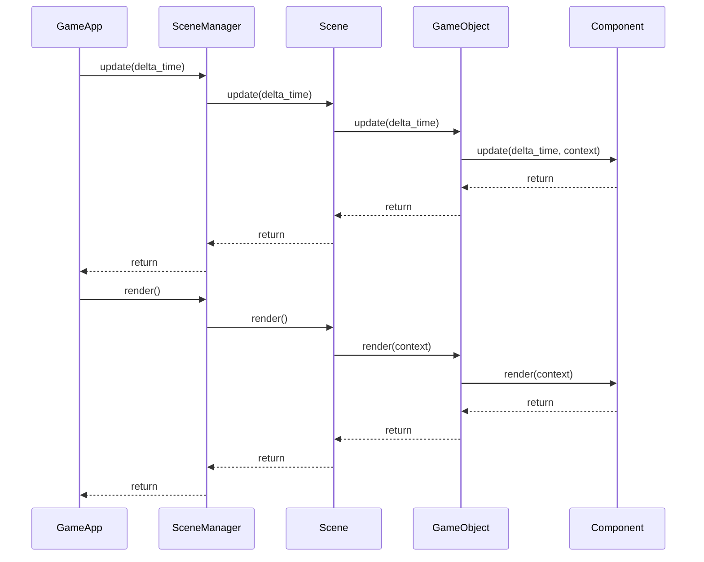

# MonsterWar 游戏引擎文档

本文档记录了 MonsterWar 游戏引擎的核心架构、类设计和 API 参考。

## 架构概览

MonsterWar 引擎采用组件化架构（Component-Based Architecture），基于 SDL3 构建，支持 2D 游戏开发。

```mermaid
graph TB
    subgraph Core[核心层]
        GameApp[GameApp<br/>游戏应用主类]
        Context[Context<br/>引擎上下文]
        Config[Config<br/>配置管理]
        GameState[GameState<br/>游戏状态]
        Time[Time<br/>时间管理]
    end

    subgraph ObjectSystem[对象系统]
        GameObject[GameObject<br/>游戏对象]
        ObjectBuilder[ObjectBuilder<br/>对象生成器]
    end

    subgraph ComponentSystem[组件系统]
        Component[Component<br/>组件基类]
        Transform[TransformComponent<br/>变换组件]
        Sprite[SpriteComponent<br/>精灵组件]
        Animation[AnimationComponent<br/>动画组件]
        Health[HealthComponent<br/>生命值组件]
        AI[AIComponent<br/>AI组件]
        Audio[AudioComponent<br/>音频组件]
        Parallax[ParallaxComponent<br/>视差组件]
        TileLayer[TileLayerComponent<br/>瓦片图层组件]
    end

    subgraph RenderSystem[渲染系统]
        Renderer[Renderer<br/>渲染器]
        Camera[Camera<br/>摄像机]
        Sprite2[Sprite<br/>精灵]
        Animation2[Animation<br/>动画]
        TextRenderer[TextRenderer<br/>文本渲染]
    end

    subgraph ResourceSystem[资源系统]
        ResourceManager[ResourceManager<br/>资源管理器]
        TextureManager[TextureManager<br/>纹理管理]
        AudioManager[AudioManager<br/>音频管理]
        FontManager[FontManager<br/>字体管理]
    end

    subgraph SceneSystem[场景系统]
        Scene[Scene<br/>场景基类]
        SceneManager[SceneManager<br/>场景管理器]
        LevelLoader[LevelLoader<br/>关卡加载器]
    end

    subgraph UISystem[UI系统]
        UIManager[UIManager<br/>UI管理器]
        UIElement[UIElement<br/>UI元素基类]
        UIButton[UIButton<br/>按钮]
        UIPanel[UIPanel<br/>面板]
        UIText[UIText<br/>文本]
        UIImage[UIImage<br/>图片]
    end

    subgraph AudioSystem[音频系统]
        AudioLocator[AudioLocator<br/>音频定位器]
        IAudioPlayer[IAudioPlayer<br/>音频播放器接口]
        AudioPlayer[AudioPlayer<br/>音频播放器]
    end

    subgraph InputSystem[输入系统]
        InputManager[InputManager<br/>输入管理器]
    end

    subgraph ObserverSystem[观察者系统]
        Subject[Subject<br/>主题]
        Observer[Observer<br/>观察者]
    end

    GameApp --> Context
    GameApp --> SceneManager
    Context --> ResourceManager
    Context --> Renderer
    Context --> Camera
    Context --> InputManager
    Context --> GameState

    SceneManager --> Scene
    Scene --> GameObject
    GameObject --> Component
    Component --> Transform
    Component --> Sprite
    Component --> Animation
    Component --> Health
    Component --> AI
    Component --> Audio
    Component --> Parallax
    Component --> TileLayer

    Sprite --> Sprite2
    Animation --> Animation2
    Renderer --> Sprite2
    Renderer --> TextRenderer
    Camera --> Renderer

    ResourceManager --> TextureManager
    ResourceManager --> AudioManager
    ResourceManager --> FontManager

    LevelLoader --> Scene

    Scene --> UIManager
    UIManager --> UIElement
    UIElement --> UIButton
    UIElement --> UIPanel
    UIElement --> UIText
    UIElement --> UIImage

    AudioLocator --> IAudioPlayer
    IAudioPlayer --> AudioPlayer
    AudioPlayer --> ResourceManager

    Health --> Subject
    UIText --> Observer
```



## 模块索引

| 模块 | 描述 | 主要类 |
|------|------|--------|
| [Core](core/README.md) | 引擎核心，包含游戏主循环和基础系统 | GameApp, Context, Config, GameState, Time |
| [Component](component/README.md) | 组件系统，实现 ECS 架构 | Component, TransformComponent, SpriteComponent, AnimationComponent, HealthComponent, AIComponent, AudioComponent, ParallaxComponent, TileLayerComponent |
| [Render](render/README.md) | 渲染系统，处理 2D 图形渲染 | Renderer, Camera, Sprite, Animation, TextRenderer |
| [Resource](resource/README.md) | 资源管理，统一管理纹理、音频、字体 | ResourceManager, TextureManager, AudioManager, FontManager |
| [Scene](scene/README.md) | 场景系统，管理游戏场景和关卡 | Scene, SceneManager, LevelLoader |
| [UI](ui/README.md) | UI 系统，提供用户界面控件 | UIManager, UIElement, UIButton, UIPanel, UIText, UIImage |
| [Audio](audio/README.md) | 音频系统，处理音效和音乐播放 | AudioLocator, IAudioPlayer, AudioPlayer |
| [Input](input/README.md) | 输入系统，处理键盘鼠标输入 | InputManager |
| [Object](object/README.md) | 对象系统，游戏对象和生成器 | GameObject, ObjectBuilder |
| [Interface](interface/README.md) | 接口系统，观察者模式实现 | Subject, Observer |
| [Utils](utils/README.md) | 工具类，数学和辅助功能 | Rect, FColor, Alignment |

## 快速开始

### 创建游戏应用

```cpp
#include "engine/core/game_app.h"

int main() {
    engine::core::GameApp app;
    
    // 设置初始化回调
    app.setOnInit([](engine::scene::SceneManager& scene_manager) {
        // 加载初始场景
    });
    
    // 运行游戏
    app.run();
    
    return 0;
}
```

### 创建游戏对象

```cpp
auto player = std::make_unique<engine::object::GameObject>("Player", "Character");
player->addComponent<engine::component::TransformComponent>(glm::vec2(100, 100));
player->addComponent<engine::component::SpriteComponent>("player_texture", resource_manager);
player->addComponent<engine::component::HealthComponent>(100);
```

### 场景生命周期



## 命名规范

- **类名**: PascalCase (如 `GameObject`, `SpriteComponent`)
- **函数名**: camelCase (如 `getPosition()`, `setVelocity()`)
- **私有成员**: 前缀 `m_` (如 `m_position`, `m_velocity`)
- **文件名**: 小写，下划线分隔 (如 `game_object.h`, `sprite_component.cpp`)

## 依赖关系

- **SDL3**: 底层窗口、渲染、输入
- **SDL3_mixer**: 音频播放
- **SDL3_ttf**: 字体渲染
- **glm**: 数学库 (向量、矩阵)
- **nlohmann/json**: JSON 解析
- **spdlog**: 日志系统
- **entt**: ECS 信号系统
