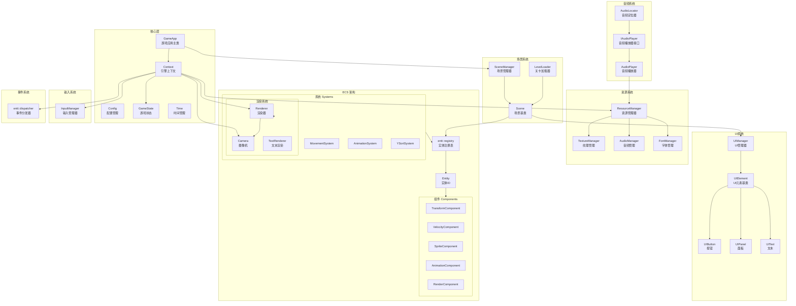
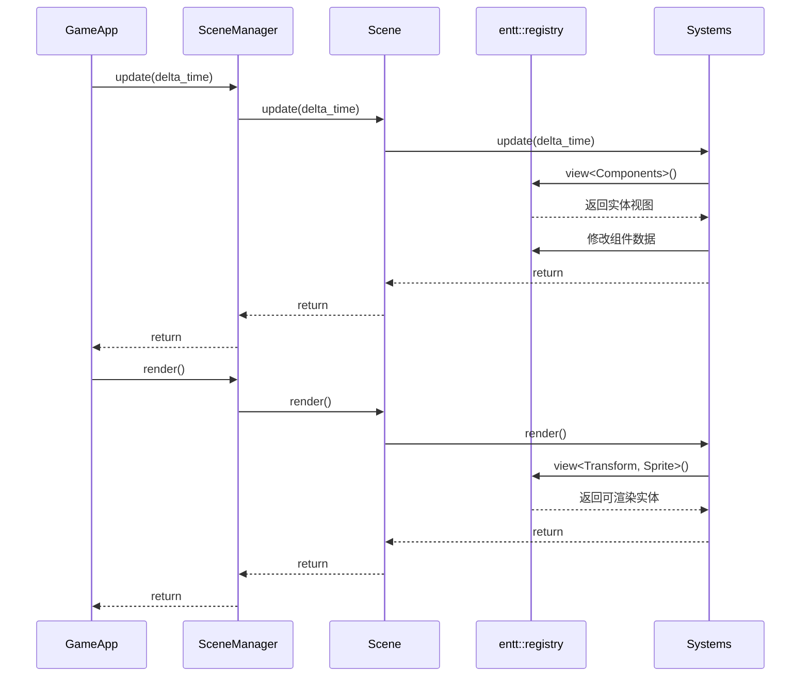

# MonsterWar 游戏引擎文档

> **版本**: 1.0.0  
> **最后更新**: 2026-04

本文档记录了 MonsterWar 游戏引擎的核心架构、类设计和 API 参考。

---

## 目录

- [架构概览](#架构概览)
- [ECS 架构说明](#ecs-架构说明)
- [模块索引](#模块索引)
  - [引擎模块](#引擎模块)
  - [游戏模块](#游戏模块)
- [项目进度统计](#项目进度统计)
- [项目计划表](#项目计划表)
- [快速开始](#快速开始)
- [命名规范](#命名规范)
- [依赖关系](#依赖关系)

---

## 架构概览

MonsterWar 引擎采用 **ECS（Entity-Component-System）架构**，基于 SDL3 构建，使用 EnTT 作为 ECS 框架实现。


```mermaid
graph TB
    subgraph Core[核心层]
        GameApp[GameApp<br/>游戏应用主类]
        Context[Context<br/>引擎上下文]
        Config[Config<br/>配置管理]
        GameState[GameState<br/>游戏状态]
        Time[Time<br/>时间管理]
    end

    subgraph ECS[ECS 架构]
        Registry[entt::registry<br/>实体注册表]
        Entity[Entity<br/>实体ID]
        
        subgraph Components[组件 Components]
            Transform[TransformComponent]
            Velocity[VelocityComponent]
            Sprite[SpriteComponent]
            Animation[AnimationComponent]
            Render[RenderComponent]
        end
        
        subgraph Systems[系统 Systems]
            MovementSystem[MovementSystem]
            RenderSystem[RenderSystem]
            AnimationSystem[AnimationSystem]
            YSortSystem[YSortSystem]
        end
    end

    subgraph RenderSystem[渲染系统]
        Renderer[Renderer<br/>渲染器]
        Camera[Camera<br/>摄像机]
        TextRenderer[TextRenderer<br/>文本渲染]
    end

    subgraph ResourceSystem[资源系统]
        ResourceManager[ResourceManager<br/>资源管理器]
        TextureManager[TextureManager<br/>纹理管理]
        AudioManager[AudioManager<br/>音频管理]
        FontManager[FontManager<br/>字体管理]
    end

    subgraph SceneSystem[场景系统]
        Scene[Scene<br/>场景基类]
        SceneManager[SceneManager<br/>场景管理器]
        LevelLoader[LevelLoader<br/>关卡加载器]
    end

    subgraph UISystem[UI系统]
        UIManager[UIManager<br/>UI管理器]
        UIElement[UIElement<br/>UI元素基类]
        UIButton[UIButton<br/>按钮]
        UIPanel[UIPanel<br/>面板]
        UIText[UIText<br/>文本]
    end

    subgraph AudioSystem[音频系统]
        AudioLocator[AudioLocator<br/>音频定位器]
        IAudioPlayer[IAudioPlayer<br/>音频播放器接口]
        AudioPlayer[AudioPlayer<br/>音频播放器]
    end

    subgraph InputSystem[输入系统]
        InputManager[InputManager<br/>输入管理器]
    end

    subgraph EventSystem[事件系统]
        Dispatcher[entt::dispatcher<br/>事件分发器]
    end

    GameApp --> Context
    GameApp --> SceneManager
    Context --> ResourceManager
    Context --> Renderer
    Context --> Camera
    Context --> InputManager
    Context --> GameState
    Context --> Dispatcher

    SceneManager --> Scene
    Scene --> Registry
    Registry --> Entity
    Entity --> Components
    Systems --> Registry

    Renderer --> Camera
    RenderSystem --> Renderer

    ResourceManager --> TextureManager
    ResourceManager --> AudioManager
    ResourceManager --> FontManager

    LevelLoader --> Scene

    Scene --> UIManager
    UIManager --> UIElement
    UIElement --> UIButton
    UIElement --> UIPanel
    UIElement --> UIText

    AudioLocator --> IAudioPlayer
    IAudioPlayer --> AudioPlayer
    AudioPlayer --> ResourceManager
```

### ECS 架构说明

ECS 架构将游戏对象的数据和行为分离：

| 概念 | 描述 | 示例 |
|------|------|------|
| **实体 (Entity)** | 轻量级的唯一标识符 | `entt::entity` |
| **组件 (Component)** | 纯数据结构，定义实体的属性 | `TransformComponent`, `VelocityComponent` |
| **系统 (System)** | 处理具有特定组件的实体，实现游戏逻辑 | `MovementSystem`, `RenderSystem` |

详细说明请参考 [ECS 架构文档](ECS_ARCHITECTURE.md)。

---

## 模块索引

### 引擎模块

| 模块 | 描述 | 主要类 |
|------|------|--------|
| [Core](engine/core/README.md) | 引擎核心，包含游戏主循环和基础系统 | GameApp, Context, Config, GameState, Time |
| [Component](engine/component/README.md) | 组件系统，实现 ECS 架构 | TransformComponent, VelocityComponent, SpriteComponent, AnimationComponent |
| [System](engine/system/README.md) | 系统模块，处理实体逻辑 | MovementSystem, RenderSystem, AnimationSystem, YSortSystem |
| [Render](engine/render/README.md) | 渲染系统，处理 2D 图形渲染 | Renderer, Camera, Sprite, TextRenderer |
| [Resource](engine/resource/README.md) | 资源管理，统一管理纹理、音频、字体 | ResourceManager, TextureManager, AudioManager, FontManager |
| [Scene](engine/scene/README.md) | 场景系统，管理游戏场景和关卡 | Scene, SceneManager, LevelLoader |
| [UI](engine/ui/README.md) | UI 系统，提供用户界面控件 | UIManager, UIElement, UIButton, UIPanel, UIText, UIImage |
| [Audio](engine/audio/README.md) | 音频系统，处理音效和音乐播放 | AudioLocator, IAudioPlayer, AudioPlayer |
| [Input](engine/input/README.md) | 输入系统，处理键盘鼠标输入 | InputManager |
| [Utils](engine/utils/README.md) | 工具类，数学和辅助功能 | Rect, FColor, Alignment, Events |

---

### 游戏模块

| 模块 | 描述 | 主要类 |
|------|------|--------|
| [Component](game/component/README.md) | 游戏组件，定义游戏特有属性 | EnemyComponent, StatsComponent, TargetComponent, BlockerComponent |
| [System](game/system/README.md) | 游戏系统，实现游戏逻辑 | FollowPathSystem, BlockSystem, SetTargetSystem, AttackStarterSystem |
| [Factory](game/factory/README.md) | 工厂模块，实体创建和管理 | EntityFactory, BlueprintManager |
| [Data](game/data/README.md) | 数据模块，游戏数据结构 | WaypointNode, SessionData, EnemyClassBlueprint |

---

## 项目进度统计

| 文档 | 说明 |
|------|------|
| [项目进度统计](PROJECT_PROGRESS.md) | 当前项目规模、实现状态和后续补齐方向 |
| [项目计划表](PROJECT_PLAN.md) | 分阶段推进计划与执行规则 |

---

## 项目计划表

| 文档 | 说明 |
|------|------|
| [项目计划表](PROJECT_PLAN.md) | 塔防游戏的分阶段执行路线 |

---

## 快速开始

### 创建游戏应用

```cpp
#include "engine/core/game_app.h"

int main() {
    engine::core::GameApp app;
    
    // 设置初始化回调
    app.setOnInitCallback([](engine::core::Context& context) {
        // 加载初始场景
        auto& scene_manager = context.getSceneManager();
        scene_manager.requestReplaceScene(
            std::make_unique<GameScene>(context)
        );
    });
    
    // 运行游戏
    app.run();
    
    return 0;
}
```

---

### 创建 ECS 实体

```cpp
// 在 Scene 中创建实体
auto entity = registry.create();

// 添加组件
registry.emplace<engine::component::TransformComponent>(
    entity, glm::vec2(100.0f, 200.0f)
);
registry.emplace<engine::component::VelocityComponent>(
    entity, glm::vec2(0.0f, 0.0f)
);
registry.emplace<engine::component::SpriteComponent>(
    entity, sprite_data
);
registry.emplace<engine::component::AnimationComponent>(
    entity, animations, "idle"_hs
);
```

---

### 场景生命周期


```mermaid
sequenceDiagram
    participant Main as GameApp
    participant SM as SceneManager
    participant Scene as Scene
    participant Registry as entt::registry
    participant System as Systems

    Main->>SM: update(delta_time)
    SM->>Scene: update(delta_time)
    Scene->>System: update(delta_time)
    System->>Registry: view<Components>()
    Registry-->>System: 返回实体视图
    System->>Registry: 修改组件数据
    System-->>Scene: return
    Scene-->>SM: return
    SM-->>Main: return

    Main->>SM: render()
    SM->>Scene: render()
    Scene->>System: render()
    System->>Registry: view<Transform, Sprite>()
    Registry-->>System: 返回可渲染实体
    System-->>Scene: return
    Scene-->>SM: return
    SM-->>Main: return
```

---

## 命名规范

| 类型 | 规范 | 示例 |
|------|------|------|
| 类名 | PascalCase | `GameObject`, `SpriteComponent` |
| 函数名 | camelCase | `getPosition()`, `setVelocity()` |
| 私有成员 | 前缀 `m_` | `m_position`, `m_velocity` |
| 文件名 | 小写，下划线分隔 | `game_object.h`, `sprite_component.cpp` |

---

## 依赖关系

| 库 | 用途 |
|------|------|
| **SDL3** | 底层窗口、渲染、输入 |
| **SDL3_mixer** | 音频播放 |
| **SDL3_ttf** | 字体渲染 |
| **glm** | 数学库 (向量、矩阵) |
| **nlohmann/json** | JSON 解析 |
| **spdlog** | 日志系统 |
| **entt** | ECS 信号系统 |
