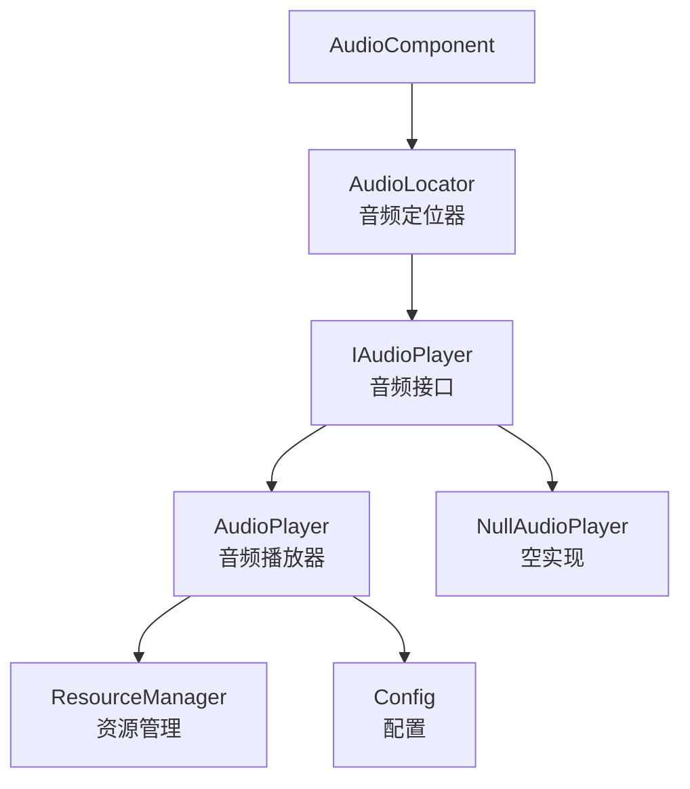
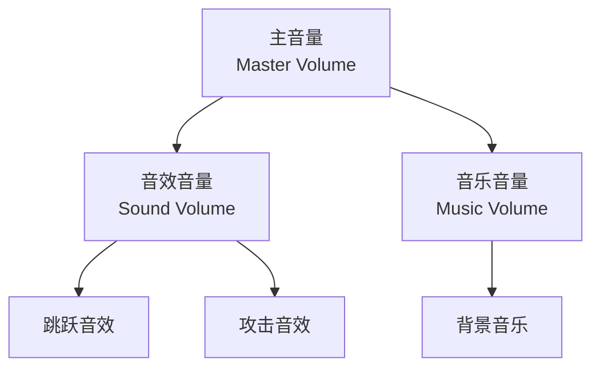
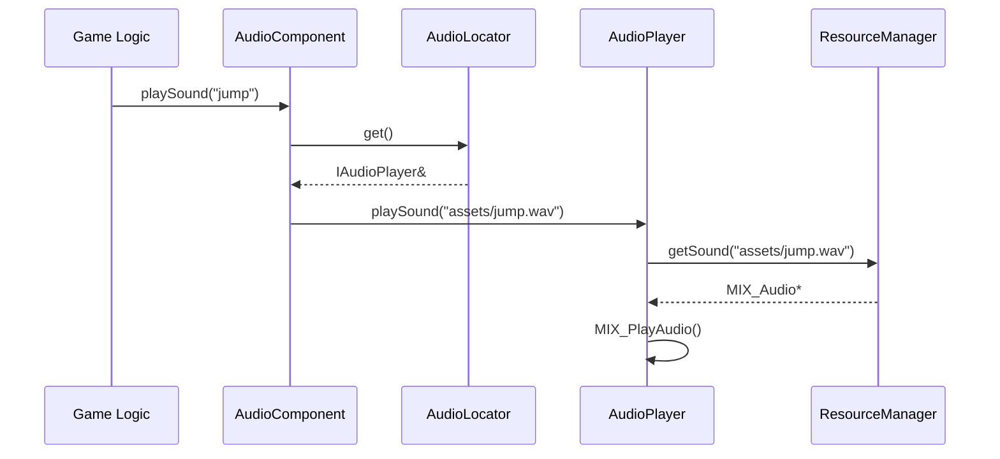
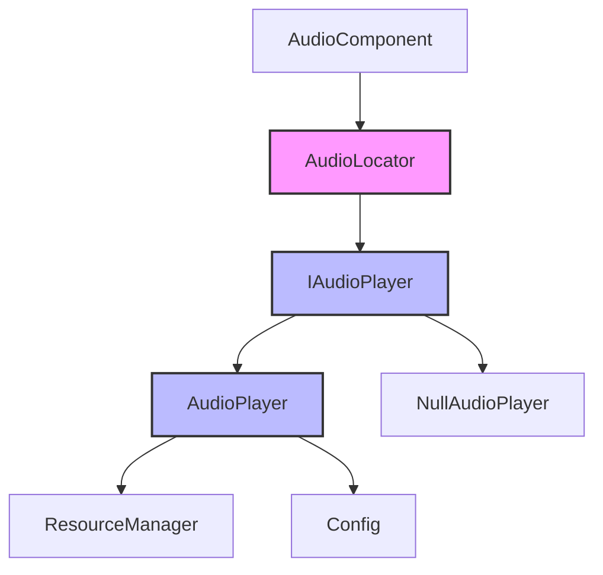

# Audio 音频模块

Audio 模块实现了服务定位器模式，提供全局音频播放功能，支持音效、音乐和 3D 空间化音频。

## 架构概览



## 类概览

| 类名 | 描述 |
|------|------|
| [AudioLocator](#audiolocator) | 音频服务定位器，提供全局访问 |
| [IAudioPlayer](#iaudioplayer) | 音频播放器接口 |
| [AudioPlayer](#audioplayer) | 音频播放器实现 |
| [NullAudioPlayer](#nullaudioplayer) | 空音频播放器（默认实现）|

---

## AudioLocator

**文件**: `src/engine/audio/audio_locator.h`

音频播放器服务定位器，提供全局访问音频系统的能力，解耦具体实现和使用。

### 类定义

```cpp
class AudioLocator final {
public:
    AudioLocator() = delete;
    
    // 获取当前音频服务
    static IAudioPlayer& get();
    
    // 注册音频服务
    static void provide(IAudioPlayer* service);

private:
    static IAudioPlayer* service_;
    static NullAudioPlayer null_service_;
};
```

### 使用示例

```cpp
// 初始化时注册音频服务
auto audio_player = std::make_unique<AudioPlayer>(resource_manager, config);
engine::audio::AudioLocator::provide(audio_player.get());

// 全局访问音频服务
engine::audio::AudioLocator::get().playSound("assets/jump.wav");
engine::audio::AudioLocator::get().playMusic("assets/bgm.mp3");

// 取消注册（恢复空服务）
engine::audio::AudioLocator::provide(nullptr);
```

---

## IAudioPlayer

**文件**: `src/engine/audio/iaudio_player.h`

音频播放器接口，定义了音频播放和管理的核心方法。

### 类定义

```cpp
class IAudioPlayer {
public:
    virtual ~IAudioPlayer() = default;
    
    // 音量控制
    virtual void setMasterVolume(float volume) = 0;
    virtual void setSoundVolume(float volume) = 0;
    virtual void setMusicVolume(float volume) = 0;
    
    virtual float getMasterVolume() const = 0;
    virtual float getSoundVolume() const = 0;
    virtual float getMusicVolume() const = 0;
    
    // 音效播放
    virtual int playSound(const std::string& path) = 0;
    virtual int playSoundSpatial(const std::string& path, 
                                  const glm::vec2& emitter_world_pos, 
                                  const glm::vec2& listener_world_pos, 
                                  float max_distance) = 0;
    
    // 音乐播放
    virtual bool playMusic(const std::string& path, int loops = -1) = 0;
    virtual void stopMusic() = 0;
};
```

### 音量层级



---

## AudioPlayer

**文件**: `src/engine/audio/audio_player.h`

音频播放器类，负责游戏中的音效和音乐播放。

### 类定义

```cpp
class AudioPlayer final : public IAudioPlayer {
public:
    explicit AudioPlayer(engine::resource::ResourceManager& resource_manager,
                         engine::core::Config& config);
    
    // 禁止拷贝和移动
    AudioPlayer(const AudioPlayer&) = delete;
    AudioPlayer& operator=(const AudioPlayer&) = delete;
    AudioPlayer(AudioPlayer&&) = delete;
    AudioPlayer& operator=(AudioPlayer&&) = delete;
    
    // 音量控制
    void setMasterVolume(float volume) override;
    void setSoundVolume(float volume) override;
    void setMusicVolume(float volume) override;
    float getMasterVolume() const override;
    float getSoundVolume() const override;
    float getMusicVolume() const override;
    
    // 音效播放
    int playSound(const std::string& path) override;
    int playSoundSpatial(const std::string& path, 
                         const glm::vec2& emitter_world_pos, 
                         const glm::vec2& listener_world_pos, 
                         float max_distance) override;
    
    // 音乐播放
    bool playMusic(const std::string& path, int loops = -1) override;
    void stopMusic() override;
};
```

### 3D 空间化音频

空间化音频根据发射器和听众的距离计算音量衰减：

```
音量 = 最大音量 * (1 - 距离 / 最大距离)
```

| 参数 | 描述 |
|------|------|
| emitter_world_pos | 音效发射器的世界位置 |
| listener_world_pos | 听众（通常是玩家/摄像机）的世界位置 |
| max_distance | 最大有效距离，超过此距离音量变为 0 |

### 使用示例

```cpp
// 基本音效播放
AudioLocator::get().playSound("assets/jump.wav");

// 空间化音效
AudioLocator::get().playSoundSpatial(
    "assets/explosion.wav",
    glm::vec2(500.0f, 300.0f),   // 爆炸位置
    player_position,              // 玩家位置
    1000.0f                       // 最大距离
);

// 播放背景音乐（循环）
AudioLocator::get().playMusic("assets/bgm.mp3", -1);

// 停止音乐
AudioLocator::get().stopMusic();

// 设置音量
AudioLocator::get().setMasterVolume(0.8f);
AudioLocator::get().setSoundVolume(1.0f);
AudioLocator::get().setMusicVolume(0.5f);
```

---

## NullAudioPlayer

**文件**: `src/engine/audio/iaudio_player.h`

空音频播放器，实现了 IAudioPlayer 接口但没有任何操作。用于服务定位器模式的默认实现，避免空指针检查。

### 类定义

```cpp
class NullAudioPlayer final : public IAudioPlayer {
public:
    void setMasterVolume(float /*volume*/) override {}
    void setSoundVolume(float /*volume*/) override {}
    void setMusicVolume(float /*volume*/) override {}

    float getMasterVolume() const override { return 0.0f; }
    float getSoundVolume() const override { return 0.0f; }
    float getMusicVolume() const override { return 0.0f; }

    int playSound(const std::string& /*path*/) override { return -1; }
    int playSoundSpatial(const std::string& /*path*/, 
                         const glm::vec2& /*emitter_world_pos*/, 
                         const glm::vec2& /*listener_world_pos*/, 
                         float /*max_distance*/) override { return -1; }
    bool playMusic(const std::string& /*path*/, int /*loops*/ = -1) override { return false; }
    void stopMusic() override {}
};
```

### 使用场景

- 游戏静音模式
- 服务器端运行（无音频设备）
- 默认状态（未注册实际音频服务时）

---

## 与 AudioComponent 的配合



### AudioComponent 使用示例

```cpp
// 为游戏对象添加音频组件
auto audio = player->addComponent<AudioComponent>();

// 注册音效
audio->registerSound("jump", "assets/jump.wav");
audio->registerSound("attack", "assets/attack.wav");

// 设置最小播放间隔（毫秒）
audio->setMinIntervalMs(100);

// 播放音效
audio->playSound("jump");

// 空间化播放（以摄像机为中心）
audio->playSoundNearCamera("explosion", context, 500.0f);

// 直接播放（绕过注册表）
audio->playDirect("assets/special.wav");
```

---

## 模块依赖图



## 最佳实践

1. **初始化时注册**: 在 GameApp 初始化时注册 AudioPlayer
2. **使用定位器**: 通过 AudioLocator 全局访问，避免传递音频引用
3. **音量控制**: 使用 Config 中的音量设置初始化 AudioPlayer
4. **空间化音频**: 对于环境音效使用空间化播放，增强沉浸感
5. **资源管理**: 音频资源通过 ResourceManager 统一管理
