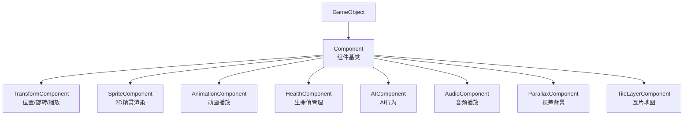
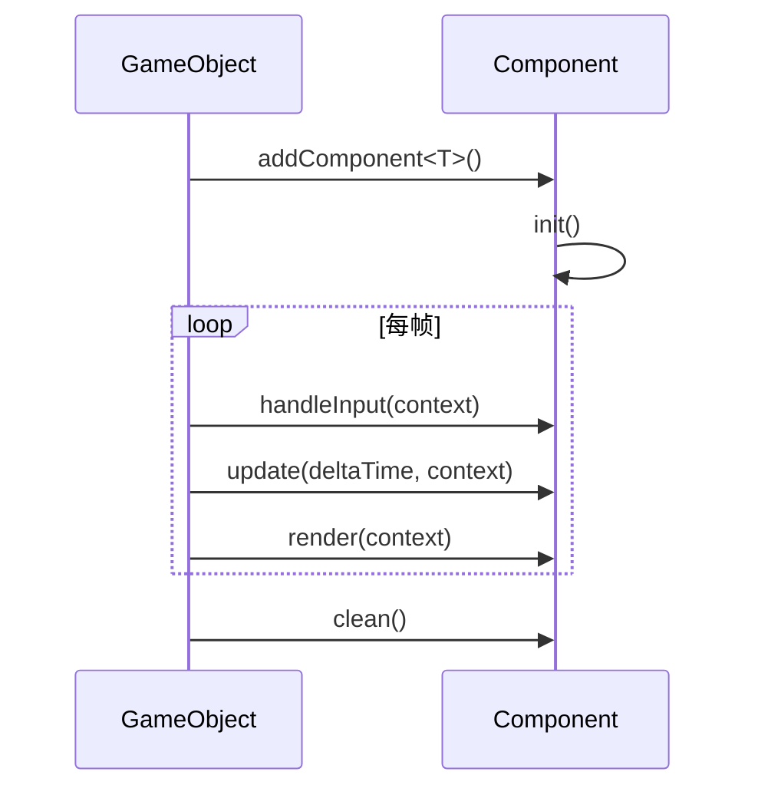
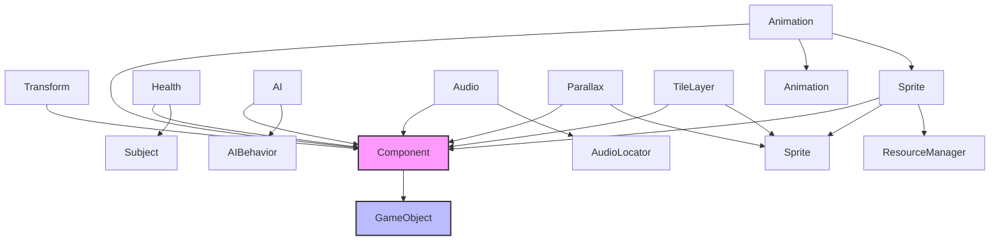

# Component 组件模块

Component 模块实现了 ECS (Entity-Component-System) 架构中的组件部分。每个组件负责游戏对象的特定功能，通过组合方式构建复杂的游戏对象行为。

## 架构概览



## 类概览

| 类名 | 描述 |
|------|------|
| [Component](#component) | 所有组件的抽象基类 |
| [TransformComponent](#transformcomponent) | 管理位置、旋转和缩放 |
| [SpriteComponent](#spritecomponent) | 2D 精灵渲染 |
| [AnimationComponent](#animationcomponent) | 精灵动画播放控制 |
| [HealthComponent](#healthcomponent) | 生命值和无敌状态管理 |
| [AIComponent](#aicomponent) | AI 行为策略容器 |
| [AudioComponent](#audiocomponent) | 音频播放管理 |
| [ParallaxComponent](#parallaxcomponent) | 视差滚动背景 |
| [TileLayerComponent](#tilelayercomponent) | 瓦片地图图层 |

---

## Component

**文件**: `src/engine/component/component.h`

所有组件的抽象基类，定义了组件的生命周期接口。

### 类定义

```cpp
class Component {
protected:
    engine::object::GameObject* owner_ = nullptr;

public:
    Component() = default;
    virtual ~Component() = default;
    
    // 禁止拷贝和移动
    Component(const Component&) = delete;
    Component& operator=(const Component&) = delete;
    Component(Component&&) = delete;
    Component& operator=(Component&&) = delete;
    
    void setOwner(engine::object::GameObject* owner);
    engine::object::GameObject* getOwner() const;

protected:
    // 生命周期方法
    virtual void init() {}
    virtual void handleInput(engine::core::Context& context) {}
    virtual void update(float deltaTime, engine::core::Context& context) {}
    virtual void render(engine::core::Context& context) {}
    virtual void clean() {}
};
```

### 生命周期



---

## TransformComponent

**文件**: `src/engine/component/transform_component.h`

负责管理游戏对象的位置、旋转和缩放。

### 类定义

```cpp
class TransformComponent final : public Component {
private:
    glm::vec2 position_{ 0.0f, 0.0f };  // 位置坐标 (x, y)
    float rotation_{ 0.0f };             // 旋转角度（度）
    glm::vec2 scale_{ 1.0f, 1.0f };     // 缩放比例 (x, y)

public:
    TransformComponent(glm::vec2 position = { 0,0 }, 
                       float rotation = 0.0f, 
                       glm::vec2 scale = { 1.0f,1.0f });
    
    // Getters
    const glm::vec2& getPosition() const;
    float getRotation() const;
    const glm::vec2& getScale() const;
    
    // Setters
    void setPosition(const glm::vec2& position);
    void setRotation(float rotation);
    void setScale(const glm::vec2& scale);
    
    // 辅助方法
    void translate(const glm::vec2& offset);
};
```

### 使用示例

```cpp
auto player = std::make_unique<GameObject>("Player");
auto transform = player->addComponent<TransformComponent>(
    glm::vec2(100.0f, 200.0f),  // 位置
    0.0f,                        // 旋转
    glm::vec2(2.0f, 2.0f)        // 缩放
);

// 移动对象
transform->translate(glm::vec2(5.0f, 0.0f));

// 旋转对象
transform->setRotation(45.0f);
```

---

## SpriteComponent

**文件**: `src/engine/component/sprite_component.h`

负责处理游戏对象的 2D 图像渲染。

### 类定义

```cpp
class SpriteComponent final : public Component {
public:
    SpriteComponent(
        const std::string& texture_id,
        engine::resource::ResourceManager& resource_manager,
        engine::utils::Alignment alignment = engine::utils::Alignment::NONE,
        std::optional<SDL_FRect> source_rect_opt = std::nullopt,
        bool is_flipped = false
    );
    
    // Getters
    const engine::render::Sprite& getSprite() const;
    const std::string& getTextureId() const;
    bool isFlipped() const;
    bool isHidden() const;
    const glm::vec2& getSpriteSize() const;
    const glm::vec2& getOffset() const;
    engine::utils::Alignment getAlignment() const;
    
    // Setters
    void setSpriteById(const std::string& texture_id, 
                       const std::optional<SDL_FRect>& source_rect_opt = std::nullopt);
    void setFlipped(bool flipped);
    void setHidden(bool hidden);
    void setAlignment(engine::utils::Alignment alignment);
    void setSourceRect(const std::optional<SDL_FRect>& source_rect_opt);
    
    void updateOffset();
};
```

### 对齐方式

| 对齐方式 | 描述 |
|----------|------|
| NONE | 无对齐，使用原始位置 |
| TOP_LEFT | 左上角对齐 |
| TOP_CENTER | 顶部中心对齐 |
| TOP_RIGHT | 右上角对齐 |
| CENTER_LEFT | 中心左侧对齐 |
| CENTER | 正中心对齐 |
| CENTER_RIGHT | 中心右侧对齐 |
| BOTTOM_LEFT | 左下角对齐 |
| BOTTOM_CENTER | 底部中心对齐 |
| BOTTOM_RIGHT | 右下角对齐 |

### 使用示例

```cpp
auto sprite = player->addComponent<SpriteComponent>(
    "player_texture",      // 纹理ID
    resource_manager,      // 资源管理器
    engine::utils::Alignment::CENTER,  // 居中对齐
    std::nullopt,          // 使用整个纹理
    false                  // 不翻转
);

// 水平翻转精灵
sprite->setFlipped(true);

// 隐藏精灵
sprite->setHidden(true);
```

---

## AnimationComponent

**文件**: `src/engine/component/animation_component.h`

负责管理和播放精灵动画。

### 类定义

```cpp
class AnimationComponent : public Component {
public:
    AnimationComponent() = default;
    ~AnimationComponent() override;
    
    // 动画管理
    void addAnimation(std::unique_ptr<engine::render::Animation> animation);
    void playAnimation(const std::string& name);
    void stopAnimation();
    void setPlaying(bool playing);
    
    // 查询
    std::string getCurrentAnimationName() const;
    bool isPlaying() const;
    bool isAnimationFinished() const;
    bool isOneShotRemoval() const;
    void setOneShotRemoval(bool is_one_shot_removal);

protected:
    void init() override;
    void update(float deltaTime, engine::core::Context& context) override;
};
```

### 使用示例

```cpp
auto anim_component = player->addComponent<AnimationComponent>();

// 创建并添加动画
auto walk_anim = std::make_unique<Animation>("walk", true);
walk_anim->addFrame({0, 0, 32, 32}, 0.1f);
walk_anim->addFrame({32, 0, 32, 32}, 0.1f);
walk_anim->addFrame({64, 0, 32, 32}, 0.1f);
anim_component->addAnimation(std::move(walk_anim));

// 播放动画
anim_component->playAnimation("walk");

// 设置动画结束后删除对象（用于特效）
anim_component->setOneShotRemoval(true);
```

---

## HealthComponent

**文件**: `src/engine/component/health_component.h`

负责管理游戏对象的生命值和无敌状态，继承自 Subject 支持观察者模式。

### 类定义

```cpp
class HealthComponent final : public Component, public engine::interface::Subject {
public:
    HealthComponent(int maxHealth, float invincibility_duration = 1.5f);
    
    // 生命值管理
    void setMaxHealth(int maxHealth);
    void setCurrentHealth(int currentHealth);
    void takeDamage(int damage);
    void heal(int amount);
    void setInvincible(float duration);
    void setInvincibilityDuration(float duration);
    
    // Getters
    int getCurrentHealth() const;
    int getMaxHealth() const;
    bool isInvincible() const;
    float getInvincibilityTimer() const;
    float getInvincibilityDuration() const;

protected:
    void update(float deltaTime, engine::core::Context& context) override;
};
```

### 事件类型

HealthComponent 会触发以下事件：

| 事件 | 触发时机 | 数据类型 |
|------|----------|----------|
| HEALTH_CHANGED | 生命值变化时 | int (当前生命值) |
| MAX_HEALTH_CHANGED | 最大生命值变化时 | int (最大生命值) |
| ENTITY_DIED | 生命值归零时 | int (0) |

### 使用示例

```cpp
auto health = player->addComponent<HealthComponent>(100, 2.0f);

// 订阅生命值变化
auto ui_observer = std::make_shared<HealthUIObserver>();
health->addObserver(ui_observer.get());

// 受到伤害
health->takeDamage(20);

// 治疗
health->heal(10);

// 设置无敌
health->setInvincible(3.0f);
```

---

## AIComponent

**文件**: `src/engine/component/ai_component.h`

AI 组件，作为上下文持有并调用策略对象。

### 类定义

```cpp
class AIComponent final : public Component {
public:
    explicit AIComponent(std::unique_ptr<AIBehavior> behavior);
    ~AIComponent() override = default;
    
    void setBehavior(std::unique_ptr<AIBehavior> behavior);
    AIBehavior* getBehavior() const;

protected:
    void init() override;
    void update(float deltaTime, engine::core::Context& context) override;
    void clean() override;

private:
    std::unique_ptr<AIBehavior> behavior_;
};
```

### AIBehavior 基类

```cpp
class AIBehavior {
public:
    virtual ~AIBehavior() = default;
    virtual void init(GameObject* owner) {}
    virtual void update(float deltaTime, engine::core::Context& context) = 0;
    virtual void clean() {}
};
```

### 使用示例

```cpp
// 定义具体的 AI 行为
class PatrolBehavior : public AIBehavior {
public:
    void update(float deltaTime, engine::core::Context& context) override {
        // 巡逻逻辑
    }
};

// 应用到游戏对象
auto ai = enemy->addComponent<AIComponent>(
    std::make_unique<PatrolBehavior>()
);

// 运行时切换行为
ai->setBehavior(std::make_unique<ChaseBehavior>());
```

---

## AudioComponent

**文件**: `src/engine/component/audio_component.h`

轻量级音频组件，用于将动作/事件映射到音频资源路径。

### 类定义

```cpp
class AudioComponent : public Component {
public:
    AudioComponent() = default;
    
    // 配置
    void setMinIntervalMs(uint64_t ms);
    void registerSound(const std::string& action, const std::string& file_path);
    
    // 播放
    void playSound(const std::string& id);
    void playSoundSpatial(const std::string& id, 
                          const glm::vec2& listener_world_pos, 
                          float max_distance);
    void playSoundNearCamera(const std::string& id, 
                             engine::core::Context& context, 
                             float max_distance);
    void playDirect(const std::string& file_path);
};
```

### 使用示例

```cpp
auto audio = player->addComponent<AudioComponent>();

// 注册音效
audio->registerSound("jump", "assets/audio/jump.wav");
audio->registerSound("attack", "assets/audio/attack.wav");

// 设置最小播放间隔（毫秒）
audio->setMinIntervalMs(100);

// 播放音效
audio->playSound("jump");

// 空间化播放
audio->playSoundNearCamera("explosion", context, 500.0f);
```

---

## ParallaxComponent

**文件**: `src/engine/component/parallax_component.h`

视差背景组件，用于实现 2D 游戏中的视差滚动效果。

### 类定义

```cpp
class ParallaxComponent final : public Component {
public:
    ParallaxComponent(std::string& texture_id, 
                      const glm::vec2& parallax_factor = { 1.0f, 1.0f },
                      const glm::bvec2& repeat = { true, true });
    ~ParallaxComponent();
    
    // Getters and Setters
    const glm::vec2& getParallaxFactor() const;
    void setParallaxFactor(const glm::vec2& factor);
    const glm::bvec2& getRepeat() const;
    void setRepeat(const glm::bvec2& repeat);
    bool isHidden() const;
    void setHidden(bool hidden);
    engine::render::Sprite getSprite() const;
    void setSprite(engine::render::Sprite sprite);

protected:
    void init() override;
    void update(float deltaTime, engine::core::Context& context) override;
    void render(engine::core::Context& context) override;
};
```

### 视差因子说明

| 视差因子 | 效果 |
|----------|------|
| (1.0, 1.0) | 背景随摄像机同步移动（静态前景）|
| (0.5, 0.5) | 背景移动速度是摄像机的一半（远处）|
| (0.0, 0.0) | 背景完全静止（无穷远处）|

### 使用示例

```cpp
// 远景层
auto bg_far = background->addComponent<ParallaxComponent>(
    "bg_far_texture",
    glm::vec2(0.2f, 0.2f),  // 缓慢移动
    glm::bvec2(true, false)  // 水平重复，垂直不重复
);

// 中景层
auto bg_mid = background->addComponent<ParallaxComponent>(
    "bg_mid_texture",
    glm::vec2(0.5f, 0.5f),  // 中等速度
    glm::bvec2(true, false)
);
```

---

## TileLayerComponent

**文件**: `src/engine/component/tilelayer_component.h`

瓦片图层组件，用于管理和渲染由大量瓦片组成的地图层。

### 瓦片类型

```cpp
enum class TileType {
    EMPTY,      // 空瓦片
    NORMAL,     // 普通瓦片
    SOLID,      // 实体瓦片（碰撞检测）
    UNISOLID,   // 非实体瓦片
    SLOPE_0_1,  // 1x1 上升斜坡
    SLOPE_1_0,  // 1x1 下降斜坡
    SLOPE_0_2,  // 2x1 上升斜坡前半段
    SLOPE_2_1,  // 2x1 上升斜坡后半段
    SLOPE_1_2,  // 2x1 下降斜坡前半段
    SLOPE_2_0,  // 2x1 下降斜坡后半段
    HAZARD,     // 危险区域
    LADDER,     // 梯子
    LEVEL_EXIT  // 关卡出口
};
```

### 类定义

```cpp
struct TileInfo {
    engine::render::Sprite sprite;
    TileType type{ TileType::NORMAL };
};

class TileLayerComponent final : public Component {
public:
    TileLayerComponent(const glm::ivec2& tile_size, 
                       const glm::ivec2& map_size,
                       const std::vector<TileInfo>& tiles);
    ~TileLayerComponent();
    
    // Getters
    const glm::ivec2& getTileSize() const;
    const glm::ivec2& getMapSize() const;
    const std::vector<TileInfo>& getTiles() const;
    const glm::vec2& getOffset() const;
    glm::vec2 getWorldSize() const;
    bool isHidden() const;
    
    // Setters
    void setOffset(const glm::vec2& offset);
    void setHidden(bool hidden);
    
    // 瓦片操作
    TileInfo* getTileAt(int x, int y);
    TileInfo* getTileAtWorldPos(const glm::vec2& world_pos);
    void setTileAt(int x, int y, const TileInfo& tile);

protected:
    void render(engine::core::Context& context) override;
};
```

### 使用示例

```cpp
// 创建瓦片数据
std::vector<TileInfo> tiles;
for (int i = 0; i < map_width * map_height; ++i) {
    TileInfo tile;
    tile.sprite = engine::render::Sprite("tileset", src_rect);
    tile.type = TileType::SOLID;
    tiles.push_back(std::move(tile));
}

// 创建瓦片图层
auto tile_layer = map->addComponent<TileLayerComponent>(
    glm::ivec2(16, 16),           // 瓦片大小
    glm::ivec2(100, 20),          // 地图尺寸
    tiles                         // 瓦片数据
);

// 获取特定位置的瓦片
auto tile = tile_layer->getTileAtWorldPos(player_pos);
if (tile && tile->type == TileType::SOLID) {
    // 处理碰撞
}
```

---

## 模块依赖图


