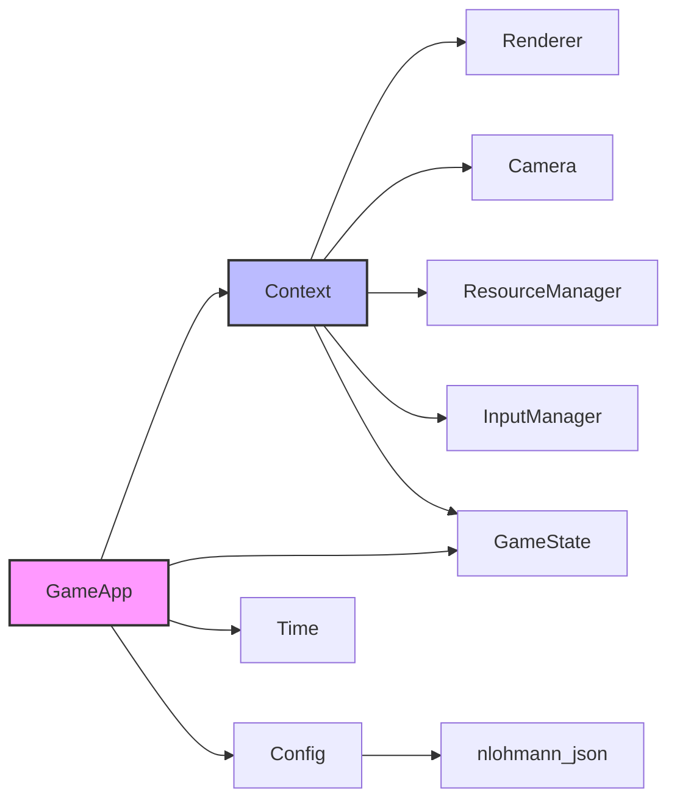

# Core 核心模块

Core 模块是游戏引擎的基础层，负责游戏生命周期管理、配置、时间计算和游戏状态管理。

## 类概览

| 类名 | 描述 |
|------|------|
| [GameApp](#gameapp) | 游戏应用主类，负责初始化和主循环 |
| [Context](#context) | 引擎上下文，集中管理核心系统引用 |
| [Config](#config) | 配置管理类，处理游戏配置加载和保存 |
| [GameState](#gamestate) | 游戏状态管理，处理游戏状态转换 |
| [Time](#time) | 时间管理器，计算 Delta Time 和帧率限制 |

---

## GameApp

**文件**: `src/engine/core/game_app.h`

游戏应用的核心类，负责初始化所有系统、运行游戏主循环和管理游戏状态。

### 职责

- 初始化 SDL 和其他游戏系统
- 创建和管理游戏资源
- 运行游戏主循环（事件处理、更新、渲染）
- 处理游戏退出和资源清理

### 类定义

```cpp
class GameApp final {
public:
    GameApp();
    ~GameApp();
    
    // 禁止拷贝和移动
    GameApp(const GameApp&) = delete;
    GameApp& operator=(const GameApp&) = delete;
    GameApp(GameApp&&) = delete;
    GameApp& operator=(GameApp&&) = delete;
    
    void run();  // 运行游戏主循环
    void stop(); // 停止游戏
    
    // 设置初始化回调
    void setOnInit(std::function<void(engine::scene::SceneManager&)> callback);
    
    // 获取各子系统
    engine::core::Time* getTime() const;
    engine::resource::ResourceManager* getResourceManager() const;
    engine::render::Renderer* getRenderer() const;
    engine::render::TextRenderer* getTextRenderer() const;
    engine::render::Camera* getCamera() const;
    engine::core::Config* getConfig() const;
    engine::input::InputManager* getInputManager() const;
    engine::core::Context* getContext() const;
    engine::scene::SceneManager* getSceneManager() const;
    engine::audio::IAudioPlayer* getAudioPlayer() const;
    engine::core::GameState* getGameState() const;
};
```

### 使用示例

```cpp
#include "engine/core/game_app.h"
#include "engine/scene/scene_manager.h"

int main() {
    engine::core::GameApp app;
    
    // 设置初始化回调
    app.setOnInit([](engine::scene::SceneManager& scene_manager) {
        // 在这里创建和注册初始场景
    });
    
    // 运行游戏
    app.run();
    
    return 0;
}
```

---

## Context

**文件**: `src/engine/core/context.h`

游戏引擎上下文类，用于集中管理和访问引擎的核心系统。

### 职责

Context 类作为引擎各系统之间的桥梁，提供了对所有核心系统的统一访问点，避免了系统之间的直接依赖，提高了代码的模块化和可维护性。

### 类定义

```cpp
class Context final {
public:
    Context(engine::render::Renderer& renderer,
            engine::render::TextRenderer& text_renderer,
            engine::render::Camera& camera,
            engine::resource::ResourceManager& resource_manager,
            engine::input::InputManager& input_manager,
            engine::core::GameState& game_state);
    
    // 禁止拷贝和移动
    Context(const Context&) = delete;
    Context& operator=(const Context&) = delete;
    Context(Context&&) = delete;
    Context& operator=(Context&&) = delete;
    
    // 获取各系统引用
    engine::render::Renderer& getRenderer();
    engine::render::TextRenderer& getTextRenderer();
    engine::render::Camera& getCamera();
    engine::resource::ResourceManager& getResourceManager();
    engine::input::InputManager& getInputManager();
    engine::core::GameState& getGameState();
};
```

### 使用示例

```cpp
void SomeComponent::update(float deltaTime, engine::core::Context& context) {
    // 通过上下文访问渲染器
    auto& renderer = context.getRenderer();
    
    // 通过上下文访问资源管理器
    auto& resource_manager = context.getResourceManager();
    
    // 通过上下文访问摄像机
    auto& camera = context.getCamera();
}
```

---

## Config

**文件**: `src/engine/core/config.h`

配置管理类，负责加载、保存和管理游戏配置。

### 支持的配置项

| 类别 | 配置项 | 类型 | 默认值 |
|------|--------|------|--------|
| 窗口设置 | window_title_ | string | "SunnyLand" |
| | window_width_ | int | 1280 |
| | window_height_ | int | 720 |
| | window_resizable_ | bool | true |
| 图形设置 | vsync_enabled_ | bool | true |
| 性能设置 | target_fps_ | int | 144 |
| 音频设置 | master_volume_ | float | 0.5 |
| | music_volume_ | float | 0.5 |
| | sound_volume_ | float | 0.5 |
| 输入映射 | input_mappings_ | map | 预定义映射 |

### 类定义

```cpp
class Config final {
public:
    // 配置成员（公有，方便访问）
    std::string window_title_ = "SunnyLand";
    int window_width_ = 1280;
    int window_height_ = 720;
    bool window_resizable_ = true;
    bool vsync_enabled_ = true;
    int target_fps_ = 144;
    float master_volume_ = 0.5f;
    float music_volume_ = 0.5f;
    float sound_volume_ = 0.5f;
    std::unordered_map<std::string, std::vector<std::string>> input_mappings_;
    
    explicit Config(const std::string& filepath);
    
    // 禁止拷贝和移动
    Config(const Config&) = delete;
    Config& operator=(const Config&) = delete;
    Config(Config&&) = delete;
    Config& operator=(Config&&) = delete;
    
    bool loadFromFile(const std::string& filepath);
    bool saveToFile(const std::string& filepath);
};
```

### 配置文件格式 (JSON)

```json
{
    "window": {
        "title": "SunnyLand",
        "width": 1280,
        "height": 720,
        "resizable": true
    },
    "graphics": {
        "vsync": true
    },
    "performance": {
        "target_fps": 144
    },
    "audio": {
        "master_volume": 0.5,
        "music_volume": 0.5,
        "sound_volume": 0.5
    },
    "input": {
        "move_left": ["A", "Left"],
        "move_right": ["D", "Right"],
        "jump": ["J", "Space"]
    }
}
```

---

## GameState

**文件**: `src/engine/core/game_state.h`

游戏状态管理类，负责管理游戏的状态和逻辑。

### 游戏状态类型

```cpp
enum class GameStateType {
    Title,      // 标题画面
    Playing,    // 游戏进行中
    Paused,     // 暂停
    GameOver    // 游戏结束
};
```

### 类定义

```cpp
class GameState final {
public:
    GameState(SDL_Renderer* renderer, SDL_Window* window, 
              GameStateType initial_state = GameStateType::Title);
    ~GameState();
    
    // 状态管理
    GameStateType getState() const;
    void setState(GameStateType state);
    
    // 状态检查
    bool isPlaying() const;
    bool isPaused() const;
    bool isGameOver() const;
    
    // 窗口大小管理
    glm::vec2 getWindowSize() const;
    void setWindowSize(glm::vec2 size);
    glm::vec2 getWindowLogicalSize() const;
    void setWindowLogicalSize(glm::vec2 size);
};
```

---

## Time

**文件**: `src/engine/core/time.h`

基础时间管理类，负责计算 Delta Time、管理时间缩放以及帧率限制。

### 类定义

```cpp
class Time final {
public:
    Time();
    
    // 禁止拷贝和移动
    Time(const Time&) = delete;
    Time& operator=(const Time&) = delete;
    Time(Time&&) = delete;
    Time& operator=(Time&&) = delete;
    
    // 每帧更新
    void update();
    
    // Delta Time 获取
    float getDeltaTime() const;        // 原始 Delta Time
    float getScaledDeltaTime() const;  // 考虑时间缩放的 Delta Time
    
    // 时间缩放
    void setTimeScale(double scale);
    float getTimeScale() const;
    
    // 帧率限制
    void setTargetFPS(int fps);
    int getTargetFPS() const;
};
```

### 使用示例

```cpp
void GameApp::run() {
    while (is_running_) {
        // 更新时间
        time_->update();
        
        // 获取缩放后的 Delta Time 用于游戏逻辑更新
        float delta_time = time_->getScaledDeltaTime();
        
        // 更新场景
        scene_manager_->update(delta_time);
        
        // 渲染
        scene_manager_->render();
    }
}
```

### 时间缩放效果

| 时间缩放值 | 效果 |
|-----------|------|
| 1.0 | 正常速度 |
| 0.5 | 慢动作（50% 速度）|
| 2.0 | 快进（200% 速度）|
| 0.0 | 暂停 |

---

## 模块依赖图


