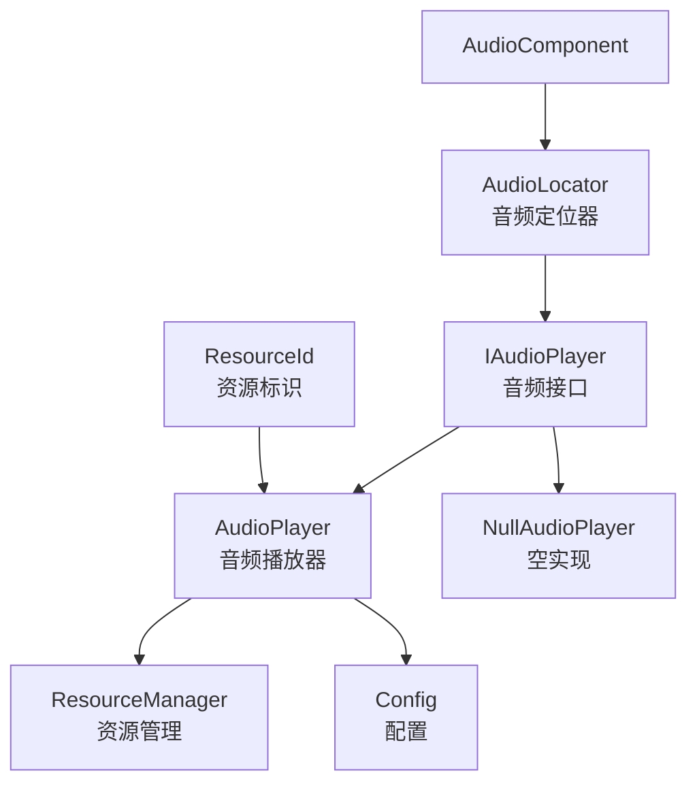
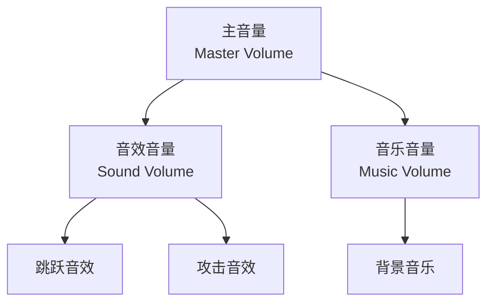
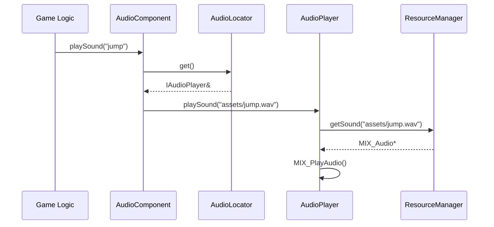
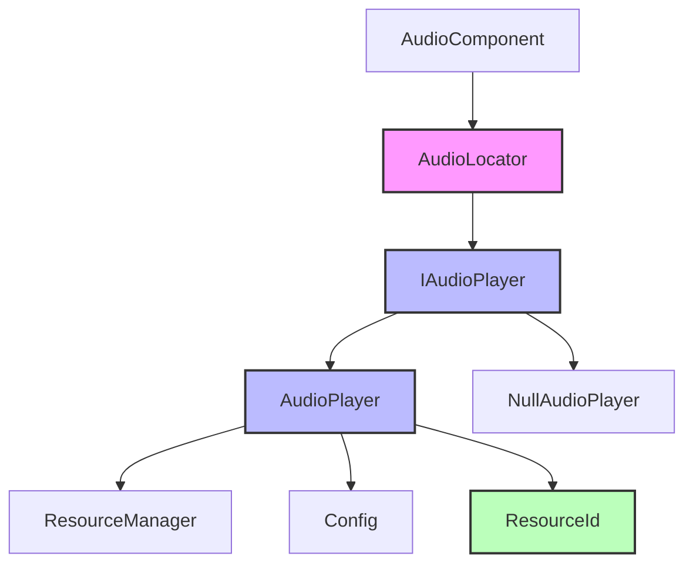

# Audio 音频模块

Audio 模块实现了服务定位器模式，提供全局音频播放功能，支持音效、音乐和 3D 空间化音频。支持使用 ResourceId 进行高效的音频资源标识。

## 架构概览



## 类概览

| 类名 | 描述 |
|------|------|
| [AudioLocator](#audiolocator) | 音频服务定位器，提供全局访问 |
| [IAudioPlayer](#iaudioplayer) | 音频播放器接口，支持 ResourceId |
| [AudioPlayer](#audioplayer) | 音频播放器实现，支持 ResourceId |
| [NullAudioPlayer](#nullaudioplayer) | 空音频播放器（默认实现），支持 ResourceId |
| [LogAudioPlayer](#logaudioplayer) | 装饰器：为音频调用添加日志 |

---

## AudioLocator

**文件**: `src/engine/audio/audio_locator.h`

音频播放器服务定位器，提供全局访问音频系统的能力，解耦具体实现和使用。

### 类定义

```cpp
class AudioLocator final {
public:
    AudioLocator() = delete;
    
    // 获取当前音频服务
    static IAudioPlayer& get();
    
    // 注册音频服务
    static void provide(IAudioPlayer* service);

private:
    static IAudioPlayer* service_;
    static NullAudioPlayer null_service_;
};
```

### 使用示例

```cpp
// 初始化时注册音频服务
auto audio_player = std::make_unique<AudioPlayer>(resource_manager, config);
engine::audio::AudioLocator::provide(audio_player.get());

// 全局访问音频服务
engine::audio::AudioLocator::get().playSound("assets/jump.wav");
engine::audio::AudioLocator::get().playMusic("assets/bgm.mp3");

// 使用 ResourceId 播放
using namespace entt::literals;
engine::audio::AudioLocator::get().playSound("assets/jump.wav"_hs);

// 取消注册（恢复空服务）
engine::audio::AudioLocator::provide(nullptr);
```

---

## IAudioPlayer

**文件**: `src/engine/audio/iaudio_player.h`

音频播放器接口，定义了音频播放和管理的核心方法。支持使用 ResourceId 进行音频资源标识。

### 类定义

```cpp
class IAudioPlayer {
public:
    virtual ~IAudioPlayer() = default;
    
    // 音量控制
    virtual void setMasterVolume(float volume) = 0;
    virtual void setSoundVolume(float volume) = 0;
    virtual void setMusicVolume(float volume) = 0;
    
    virtual float getMasterVolume() const = 0;
    virtual float getSoundVolume() const = 0;
    virtual float getMusicVolume() const = 0;
    
    // 音效播放（字符串路径）
    virtual int playSound(const std::string& path) = 0;
    virtual int playSoundSpatial(const std::string& path, 
                                  const glm::vec2& emitter_world_pos, 
                                  const glm::vec2& listener_world_pos, 
                                  float max_distance) = 0;
    
    // 音效播放（ResourceId）
    virtual int playSound(engine::resource::ResourceId id, 
                          std::string_view file_path = {}) = 0;
    virtual int playSoundSpatial(engine::resource::ResourceId id, 
                                  std::string_view file_path,
                                  const glm::vec2& emitter_world_pos, 
                                  const glm::vec2& listener_world_pos, 
                                  float max_distance) = 0;
    
    // 音乐播放（字符串路径）
    virtual bool playMusic(const std::string& path, int loops = -1) = 0;
    
    // 音乐播放（ResourceId）
    virtual bool playMusic(engine::resource::ResourceId id, 
                           std::string_view file_path = {}, 
                           int loops = -1) = 0;
    
    virtual void stopMusic() = 0;
};
```

### 音量层级



---

## AudioPlayer

**文件**: `src/engine/audio/audio_player.h`

音频播放器类，负责游戏中的音效和音乐播放。支持使用 ResourceId 进行高效的音频资源标识。

### 类定义

```cpp
class AudioPlayer final : public IAudioPlayer {
public:
    explicit AudioPlayer(engine::resource::ResourceManager& resource_manager,
                         engine::core::Config& config);
    
    // 禁止拷贝和移动
    AudioPlayer(const AudioPlayer&) = delete;
    AudioPlayer& operator=(const AudioPlayer&) = delete;
    AudioPlayer(AudioPlayer&&) = delete;
    AudioPlayer& operator=(AudioPlayer&&) = delete;
    
    // 音量控制
    void setMasterVolume(float volume) override;
    void setSoundVolume(float volume) override;
    void setMusicVolume(float volume) override;
    float getMasterVolume() const override { return master_volume_; }
    float getSoundVolume() const override { return sound_volume_; }
    float getMusicVolume() const override { return music_volume_; }
    
    // 音效播放（字符串路径）
    int playSound(const std::string& path) override;
    int playSoundSpatial(const std::string& path, 
                         const glm::vec2& emitter_world_pos, 
                         const glm::vec2& listener_world_pos, 
                         float max_distance) override;
    
    // 音效播放（ResourceId）
    int playSound(engine::resource::ResourceId id, 
                  std::string_view file_path = {}) override;
    int playSoundSpatial(engine::resource::ResourceId id, 
                         std::string_view file_path,
                         const glm::vec2& emitter_world_pos, 
                         const glm::vec2& listener_world_pos, 
                         float max_distance) override;
    
    // 音乐播放（字符串路径）
    bool playMusic(const std::string& path, int loops = -1) override;
    
    // 音乐播放（ResourceId）
    bool playMusic(engine::resource::ResourceId id, 
                   std::string_view file_path = {}, 
                   int loops = -1) override;
    
    void stopMusic() override;

private:
    engine::resource::ResourceManager& resource_manager_;
    engine::core::Config& config_;
    float master_volume_{ 1.0f };
    float sound_volume_{ 1.0f };
    float music_volume_{ 1.0f };
    std::string current_music_;
    engine::resource::ResourceId current_music_id_{ engine::resource::InvalidResourceId };
};
```

### 3D 空间化音频

空间化音频根据发射器和听众的距离计算音量衰减：

```
音量 = 最大音量 * (1 - 距离 / 最大距离)
```

| 参数 | 描述 |
|------|------|
| emitter_world_pos | 音效发射器的世界位置 |
| listener_world_pos | 听众（通常是玩家/摄像机）的世界位置 |
| max_distance | 最大有效距离，超过此距离音量变为 0 |

### 使用示例

```cpp
using namespace entt::literals;

// 基本音效播放
AudioLocator::get().playSound("assets/jump.wav");

// 使用 ResourceId 播放音效
ResourceId jump_id = engine::resource::toResourceId("assets/jump.wav");
AudioLocator::get().playSound(jump_id);
AudioLocator::get().playSound(jump_id, "assets/jump.wav");  // 带备用路径

// 空间化音效
AudioLocator::get().playSoundSpatial(
    "assets/explosion.wav",
    glm::vec2(500.0f, 300.0f),   // 爆炸位置
    player_position,              // 玩家位置
    1000.0f                       // 最大距离
);

// 使用 ResourceId 空间化音效
AudioLocator::get().playSoundSpatial(
    explosion_id,
    "assets/explosion.wav",
    glm::vec2(500.0f, 300.0f),
    player_position,
    1000.0f
);

// 播放背景音乐（循环）
AudioLocator::get().playMusic("assets/bgm.mp3", -1);

// 使用 ResourceId 播放音乐
ResourceId bgm_id = engine::resource::toResourceId("assets/bgm.mp3");
AudioLocator::get().playMusic(bgm_id, {}, -1);

// 停止音乐
AudioLocator::get().stopMusic();

// 设置音量
AudioLocator::get().setMasterVolume(0.8f);
AudioLocator::get().setSoundVolume(1.0f);
AudioLocator::get().setMusicVolume(0.5f);
```

---

## NullAudioPlayer

**文件**: `src/engine/audio/iaudio_player.h`

空音频播放器，实现了 IAudioPlayer 接口但没有任何操作。用于服务定位器模式的默认实现，避免空指针检查。

### 类定义

```cpp
class NullAudioPlayer final : public IAudioPlayer {
public:
    void setMasterVolume(float /*volume*/) override {}
    void setSoundVolume(float /*volume*/) override {}
    void setMusicVolume(float /*volume*/) override {}

    float getMasterVolume() const override { return 0.0f; }
    float getSoundVolume() const override { return 0.0f; }
    float getMusicVolume() const override { return 0.0f; }

    // 字符串路径版本
    int playSound(const std::string& /*path*/) override { return -1; }
    int playSoundSpatial(const std::string& /*path*/, 
                         const glm::vec2& /*emitter_world_pos*/, 
                         const glm::vec2& /*listener_world_pos*/, 
                         float /*max_distance*/) override { return -1; }
    bool playMusic(const std::string& /*path*/, int /*loops*/ = -1) override { return false; }
    void stopMusic() override {}

    // ResourceId 版本
    int playSound(engine::resource::ResourceId /*id*/, 
                  std::string_view /*file_path*/ = {}) override { return -1; }
    int playSoundSpatial(engine::resource::ResourceId /*id*/, 
                         std::string_view /*file_path*/,
                         const glm::vec2& /*emitter_world_pos*/, 
                         const glm::vec2& /*listener_world_pos*/, 
                         float /*max_distance*/) override { return -1; }
    bool playMusic(engine::resource::ResourceId /*id*/, 
                   std::string_view /*file_path*/ = {}, 
                   int /*loops*/ = -1) override { return false; }
};
```

### 使用场景

- 游戏静音模式
- 服务器端运行（无音频设备）
- 默认状态（未注册实际音频服务时）

---

## LogAudioPlayer

**文件**: `src/engine/audio/log_audio_player.h`

装饰器模式实现，包装一个 `IAudioPlayer`，在调用前记录日志，保持原有行为不变。

### 类定义

```cpp
class LogAudioPlayer final : public IAudioPlayer {
public:
    explicit LogAudioPlayer(std::unique_ptr<IAudioPlayer> wrapped_player);

    void setMasterVolume(float volume) override;
    void setSoundVolume(float volume) override;
    void setMusicVolume(float volume) override;

    float getMasterVolume() const override;
    float getSoundVolume() const override;
    float getMusicVolume() const override;

    int playSound(const std::string& path) override;
    int playSoundSpatial(const std::string& path,
                         const glm::vec2& emitter_world_pos,
                         const glm::vec2& listener_world_pos,
                         float max_distance) override;

    int playSound(engine::resource::ResourceId id,
                  std::string_view file_path = {}) override;
    int playSoundSpatial(engine::resource::ResourceId id,
                         std::string_view file_path,
                         const glm::vec2& emitter_world_pos,
                         const glm::vec2& listener_world_pos,
                         float max_distance) override;

    bool playMusic(const std::string& path, int loops = -1) override;
    bool playMusic(engine::resource::ResourceId id,
                   std::string_view file_path = {},
                   int loops = -1) override;

    void stopMusic() override;

private:
    std::unique_ptr<IAudioPlayer> wrapped_player_;
};
```

### 使用示例

```cpp
// 创建真实音频播放器
auto real_player = std::make_unique<AudioPlayer>(resource_manager, config);

// 用日志装饰器包装
auto log_player = std::make_unique<LogAudioPlayer>(std::move(real_player));

// 注册到定位器
engine::audio::AudioLocator::provide(log_player.get());
```

---

## 与 AudioComponent 的配合



### AudioComponent 使用示例

```cpp
using namespace entt::literals;

// 为游戏对象添加音频组件
auto audio = player->addComponent<AudioComponent>();

// 注册音效（字符串路径）
audio->registerSound("jump", "assets/jump.wav");
audio->registerSound("attack", "assets/attack.wav");

// 注册音效（ResourceId）
ResourceId explosion_id = engine::resource::toResourceId("assets/explosion.wav");
audio->registerSound("explosion", explosion_id);

// 设置最小播放间隔（毫秒）
audio->setMinIntervalMs(100);

// 播放音效
audio->playSound("jump");

// 空间化播放（以摄像机为中心）
audio->playSoundNearCamera("explosion", context, 500.0f);

// 直接播放（绕过注册表）
audio->playDirect("assets/special.wav");

// 使用 ResourceId 直接播放
audio->playDirect(explosion_id, "assets/explosion.wav");
```

---

## 模块依赖图



## 最佳实践

1. **初始化时注册**: 在 GameApp 初始化时注册 AudioPlayer
2. **使用定位器**: 通过 AudioLocator 全局访问，避免传递音频引用
3. **使用 ResourceId**: 对于频繁播放的音效，使用 ResourceId 可以提高性能
4. **音量控制**: 使用 Config 中的音量设置初始化 AudioPlayer
5. **空间化音频**: 对于环境音效使用空间化播放，增强沉浸感
6. **资源管理**: 音频资源通过 ResourceManager 统一管理，支持 ResourceId 访问
7. **备用路径**: 使用 ResourceId 播放时，可以提供备用文件路径用于懒加载
