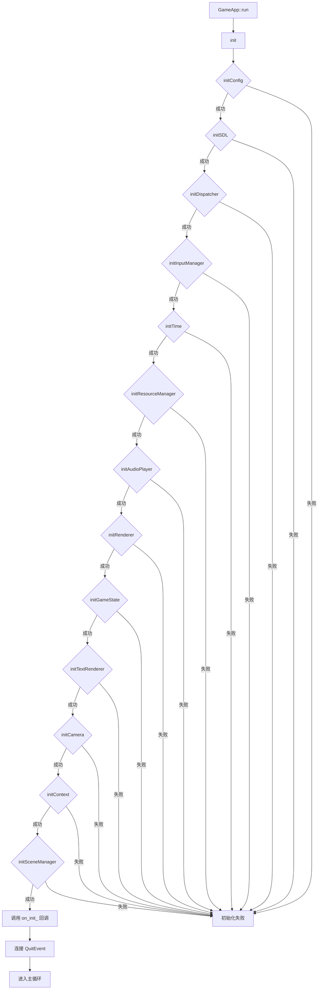
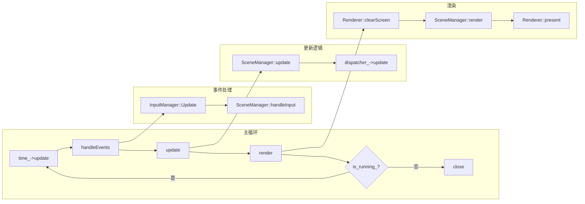
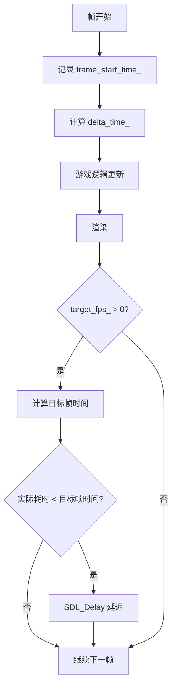
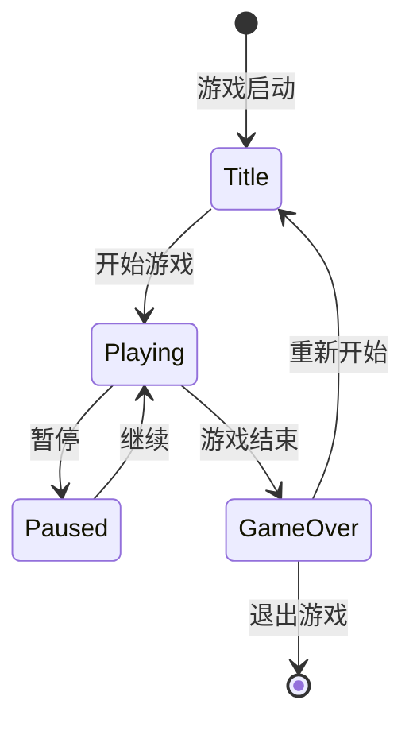
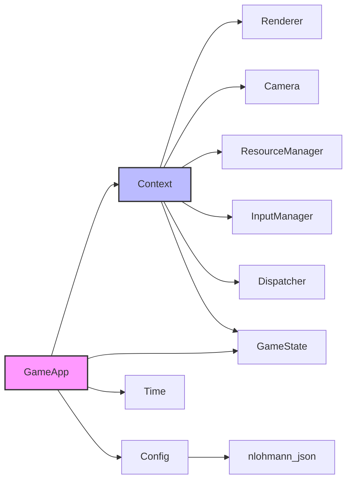

# Core 核心模块

> **版本**: 1.0.0  
> **最后更新**: 2026-02-15  
> **相关文档**: [主文档](../../README.md) | [场景模块](../scene/README.md) | [ECS 架构](../../ECS_ARCHITECTURE.md)

Core 模块是游戏引擎的基础层，负责游戏生命周期管理、配置、时间计算和游戏状态管理。

---

## 目录

- [类概览](#类概览)
- [GameApp](#gameapp)
- [Context](#context)
- [Config](#config)
- [GameState](#gamestate)
- [Time](#time)
- [架构设计](#架构设计)
- [最佳实践](#最佳实践)

---

## 类概览

| 类名 | 描述 |
|------|------|
| [GameApp](#gameapp) | 游戏应用主类，负责初始化和主循环 |
| [Context](#context) | 引擎上下文，集中管理核心系统引用 |
| [Config](#config) | 配置管理类，处理游戏配置加载和保存 |
| [GameState](#gamestate) | 游戏状态管理，处理游戏状态转换 |
| [Time](#time) | 时间管理器，计算 Delta Time 和帧率限制 |

---

## GameApp

**文件**: `src/engine/core/game_app.h`

游戏应用的核心类，负责初始化所有系统、运行游戏主循环和管理游戏状态。

### 职责

- 初始化 SDL 和其他游戏系统
- 创建和管理游戏资源
- 运行游戏主循环（事件处理、更新、渲染）
- 处理游戏退出和资源清理

### 类定义

```cpp
class GameApp final {
public:
    GameApp();
    ~GameApp();
    
    // 禁止拷贝和移动
    GameApp(const GameApp&) = delete;
    GameApp& operator=(const GameApp&) = delete;
    GameApp(GameApp&&) = delete;
    GameApp& operator=(GameApp&&) = delete;
    
    void run();  // 运行游戏主循环
    
    // 设置初始化回调
    void setOnInitCallback(std::function<void(engine::core::Context&)> callback);
};
```

### 使用示例

```cpp
#include "engine/core/game_app.h"
#include "engine/core/context.h"

int main() {
    engine::core::GameApp app;
    
    // 设置初始化回调
    app.setOnInitCallback([](engine::core::Context& context) {
        // 在这里通过 Context 访问各系统并初始化场景
    });
    
    // 运行游戏
    app.run();
    
    return 0;
}
```

---

## Context

**文件**: `src/engine/core/context.h`

游戏引擎上下文类，用于集中管理和访问引擎的核心系统。

### 职责

Context 类作为引擎各系统之间的桥梁，提供了对所有核心系统的统一访问点，避免了系统之间的直接依赖，提高了代码的模块化和可维护性。

### 类定义

```cpp
class Context final {
public:
    Context(engine::render::Renderer& renderer,
            engine::render::TextRenderer& text_renderer,
            entt::dispatcher& dispatcher,
            engine::render::Camera& camera,
            engine::resource::ResourceManager& resource_manager,
            engine::input::InputManager& input_manager,
            engine::core::GameState& game_state);
    
    // 禁止拷贝和移动
    Context(const Context&) = delete;
    Context& operator=(const Context&) = delete;
    Context(Context&&) = delete;
    Context& operator=(Context&&) = delete;
    
    // 获取各系统引用
    engine::render::Renderer& getRenderer();
    engine::render::TextRenderer& getTextRenderer();
    engine::render::Camera& getCamera();
    engine::resource::ResourceManager& getResourceManager();
    engine::input::InputManager& getInputManager();
    engine::core::GameState& getGameState();
    entt::dispatcher& getDispatcher();
};
```

### 使用示例

```cpp
void SomeComponent::update(float deltaTime, engine::core::Context& context) {
    // 通过上下文访问渲染器
    auto& renderer = context.getRenderer();
    
    // 通过上下文访问资源管理器
    auto& resource_manager = context.getResourceManager();
    
    // 通过上下文访问摄像机
    auto& camera = context.getCamera();
    
    // 通过上下文访问事件分发器
    auto& dispatcher = context.getDispatcher();
}
```

---

## Config

**文件**: `src/engine/core/config.h`

配置管理类，负责加载、保存和管理游戏配置。

### 支持的配置项

| 类别 | 配置项 | 类型 | 默认值 |
|------|--------|------|--------|
| 窗口设置 | window_title_ | string | "SunnyLand" |
| | window_width_ | int | 1280 |
| | window_height_ | int | 720 |
| | window_resizable_ | bool | true |
| 图形设置 | vsync_enabled_ | bool | true |
| 性能设置 | target_fps_ | int | 144 |
| 音频设置 | master_volume_ | float | 0.5 |
| | music_volume_ | float | 0.5 |
| | sound_volume_ | float | 0.5 |
| 输入映射 | input_mappings_ | map | 预定义映射 |

### 类定义

```cpp
class Config final {
public:
    // 配置成员（公有，方便访问）
    std::string window_title_ = "SunnyLand";
    int window_width_ = 1280;
    int window_height_ = 720;
    bool window_resizable_ = true;
    bool vsync_enabled_ = true;
    int target_fps_ = 144;
    float master_volume_ = 0.5f;
    float music_volume_ = 0.5f;
    float sound_volume_ = 0.5f;
    std::unordered_map<std::string, std::vector<std::string>> input_mappings_;
    
    explicit Config(const std::string& filepath);
    
    // 禁止拷贝和移动
    Config(const Config&) = delete;
    Config& operator=(const Config&) = delete;
    Config(Config&&) = delete;
    Config& operator=(Config&&) = delete;
    
    bool loadFromFile(const std::string& filepath);
    bool saveToFile(const std::string& filepath);
};
```

### 配置文件格式 (JSON)

```json
{
    "window": {
        "title": "SunnyLand",
        "width": 1280,
        "height": 720,
        "resizable": true
    },
    "graphics": {
        "vsync": true
    },
    "performance": {
        "target_fps": 144
    },
    "audio": {
        "master_volume": 0.5,
        "music_volume": 0.5,
        "sound_volume": 0.5
    },
    "input": {
        "move_left": ["A", "Left"],
        "move_right": ["D", "Right"],
        "jump": ["J", "Space"]
    }
}
```

---

## GameState

**文件**: `src/engine/core/game_state.h`

游戏状态管理类，负责管理游戏的状态和逻辑。

### 游戏状态类型

```cpp
enum class GameStateType {
    Title,      // 标题画面
    Playing,    // 游戏进行中
    Paused,     // 暂停
    GameOver    // 游戏结束
};
```

### 类定义

```cpp
class GameState final {
public:
    GameState(SDL_Renderer* renderer, SDL_Window* window, 
              GameStateType initial_state = GameStateType::Title);
    ~GameState();
    
    // 状态管理
    GameStateType getState() const;
    void setState(GameStateType state);
    
    // 状态检查
    bool isPlaying() const;
    bool isPaused() const;
    bool isGameOver() const;
    
    // 窗口大小管理
    glm::vec2 getWindowSize() const;
    void setWindowSize(glm::vec2 size);
    glm::vec2 getWindowLogicalSize() const;
    void setWindowLogicalSize(glm::vec2 size);
};
```

---

## Time

**文件**: `src/engine/core/time.h`

基础时间管理类，负责计算 Delta Time、管理时间缩放以及帧率限制。

### 类定义

```cpp
class Time final {
public:
    Time();
    
    // 禁止拷贝和移动
    Time(const Time&) = delete;
    Time& operator=(const Time&) = delete;
    Time(Time&&) = delete;
    Time& operator=(Time&&) = delete;
    
    // 每帧更新
    void update();
    
    // Delta Time 获取
    float getDeltaTime() const;        // 原始 Delta Time
    float getScaledDeltaTime() const;  // 考虑时间缩放的 Delta Time
    
    // 时间缩放
    void setTimeScale(double scale);
    float getTimeScale() const;
    
    // 帧率限制
    void setTargetFPS(int fps);
    int getTargetFPS() const;
};
```

### 使用示例

```cpp
void GameApp::run() {
    while (is_running_) {
        // 更新时间
        time_->update();
        
        // 获取缩放后的 Delta Time 用于游戏逻辑更新
        float delta_time = time_->getScaledDeltaTime();
        
        // 更新场景
        scene_manager_->update(delta_time);
        
        // 渲染
        scene_manager_->render();
    }
}
```

### 时间缩放效果

| 时间缩放值 | 效果 |
|-----------|------|
| 1.0 | 正常速度 |
| 0.5 | 慢动作（50% 速度）|
| 2.0 | 快进（200% 速度）|
| 0.0 | 暂停 |

---

## GameApp 初始化流程



## GameApp 主循环



## Context 设计模式

Context 类采用了 **服务定位器模式 (Service Locator Pattern)** 的变体，作为引擎各系统之间的桥梁：

### 设计优势

1. **解耦系统依赖**：各系统通过 Context 访问其他系统，避免直接依赖
2. **统一访问点**：所有核心系统通过一个对象访问，简化代码
3. **便于测试**：可以轻松替换 Mock 对象进行单元测试
4. **生命周期管理**：系统引用的生命周期由 GameApp 统一管理

### 访问的系统

| 系统 | 获取方法 | 用途 |
|------|----------|------|
| Renderer | `getRenderer()` | 2D 渲染操作 |
| TextRenderer | `getTextRenderer()` | 文本渲染 |
| Camera | `getCamera()` | 视口和坐标转换 |
| ResourceManager | `getResourceManager()` | 资源加载和缓存 |
| InputManager | `getInputManager()` | 输入状态查询 |
| GameState | `getGameState()` | 游戏状态管理 |
| Dispatcher | `getDispatcher()` | 事件分发 |

## Time 帧率限制机制



### 帧率限制原理

```cpp
void Time::limitFrameRate(float current_delta_time) {
    if (target_fps_ > 0) {
        double target_frame_time = 1.0 / target_fps_;
        if (current_delta_time < target_frame_time) {
            SDL_Delay(static_cast<Uint32>((target_frame_time - current_delta_time) * 1000.0));
        }
    }
}
```

## GameState 状态转换



### 状态说明

| 状态 | 描述 | 典型行为 |
|------|------|----------|
| Title | 标题画面 | 显示游戏标题、开始按钮 |
| Playing | 游戏进行中 | 正常游戏逻辑更新 |
| Paused | 暂停状态 | 停止游戏逻辑，显示暂停菜单 |
| GameOver | 游戏结束 | 显示结算画面、重玩选项 |

## 模块依赖图



## 最佳实践

### 1. 使用 Context 传递依赖

```cpp
// 推荐：通过 Context 访问系统
class MyScene : public engine::scene::Scene {
    void update(float dt) override {
        auto& renderer = context_.getRenderer();
        auto& resources = context_.getResourceManager();
        // ...
    }
};

// 避免：直接持有系统引用
class BadScene {
    engine::render::Renderer* renderer_;  // 不推荐
};
```

### 2. 时间缩放用于特殊效果

```cpp
// 慢动作效果
time_->setTimeScale(0.3f);

// 暂停游戏
time_->setTimeScale(0.0f);

// 恢复正常
time_->setTimeScale(1.0f);
```

### 3. 配置文件管理

```cpp
// 加载配置
Config config("assets/config.json");

// 运行时修改并保存
config.master_volume_ = 0.8f;
config.saveToFile("assets/config.json");
```
