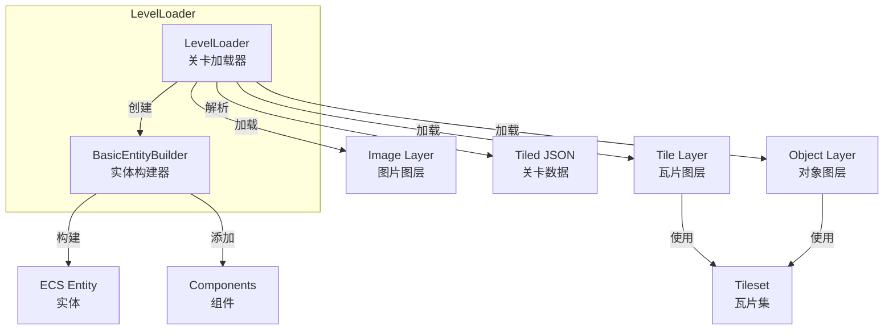
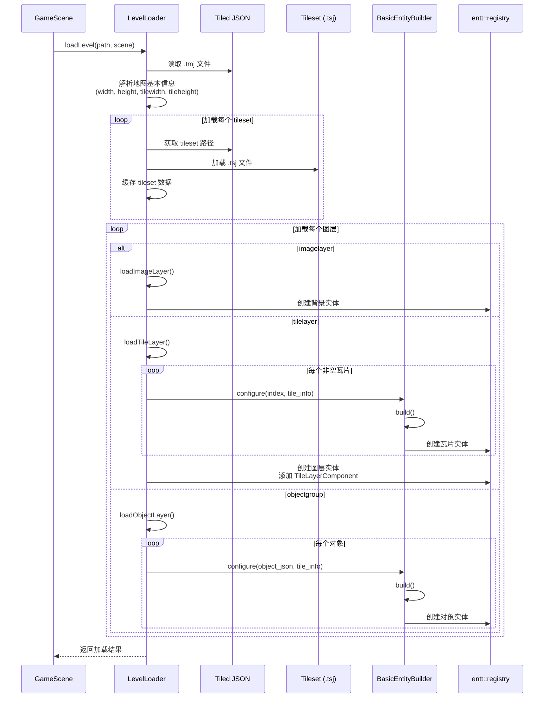
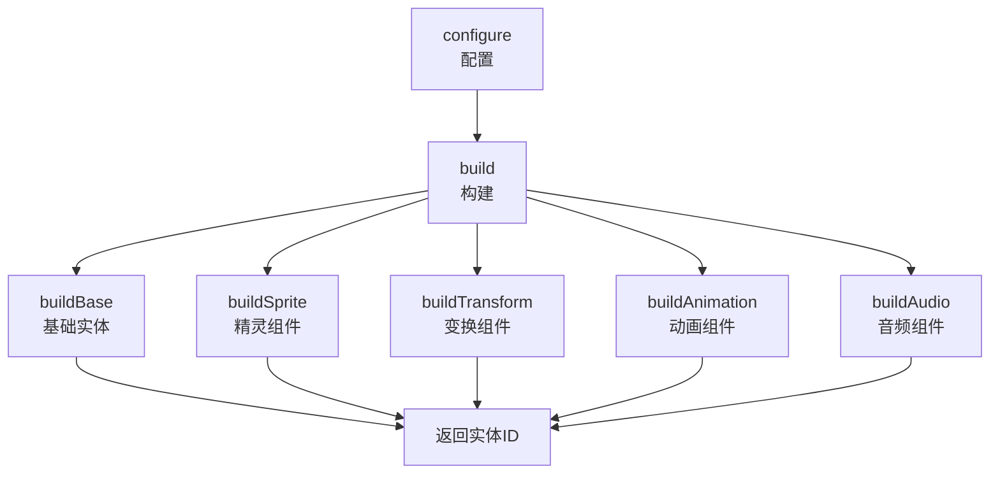
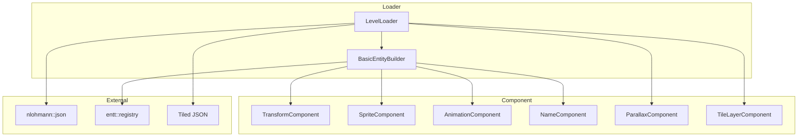

# Loader 关卡加载模块

Loader 模块负责从 Tiled 编辑器生成的 JSON 文件（.tmj）加载关卡数据到游戏场景中。支持图片图层、瓦片图层和对象图层，并处理外部瓦片集（.tsj）链接。

## 架构概览



## 核心组件

| 类名 | 描述 |
|------|------|
| [LevelLoader](#levelloader) | 主加载器，解析 Tiled JSON 并创建图层实体 |
| [BasicEntityBuilder](#basicentitybuilder) | 实体构建器，使用 Builder 模式创建带组件的实体 |
| [TileData](#tiledata) | 瓦片数据封装，包含 TileInfo 和 JSON 指针 |

---

## LevelLoader

**文件**: `src/engine/loader/level_loader.h`

负责从 Tiled JSON 文件加载关卡数据到 Scene 中。

### 支持的图层类型

| 类型 | 描述 | 创建的组件 |
|------|------|-----------|
| `imagelayer` | 图片图层，用于背景 | NameComponent, TransformComponent, ParallaxComponent, SpriteComponent |
| `tilelayer` | 瓦片图层，用于地图 | NameComponent, TransformComponent, TileLayerComponent |
| `objectgroup` | 对象图层，用于实体和触发器 | NameComponent, TransformComponent, SpriteComponent, AnimationComponent |

### 类定义

```cpp
struct TileData {
    engine::component::TileInfo info;      ///< 瓦片的基本渲染信息
    const nlohmann::json* json_ptr = nullptr; ///< 指向 tileset 中该瓦片 JSON 对象的指针
};

class LevelLoader final {
public:
    LevelLoader() = default;
    ~LevelLoader();

    /**
     * @brief 加载关卡数据到指定的 Scene 对象中
     * @param map_path Tiled JSON 地图文件的完整路径
     * @param scene 指向要填充数据的场景实例
     * @return bool 如果加载并解析成功则返回 true
     */
    [[nodiscard]] bool loadLevel(const std::string& map_path, engine::scene::Scene* scene);

    glm::ivec2 getMapSize() const { return map_size_; }
    glm::ivec2 getTileSize() const { return tile_size_; }

private:
    void loadImageLayer(const nlohmann::json& layer_json);
    void loadTileLayer(const nlohmann::json& layer_json);
    void loadObjectLayer(const nlohmann::json& layer_json);
    
    TileData getTileDataByGid(int gid);
    engine::component::TileInfo getTileInfoByGid(int gid);
    const nlohmann::json* findTileset(int gid);
    void loadTileset(const std::string& tileset_path, int first_gid);
    std::string resolvePath(const std::string& relative_path, const std::string& file_path);
    engine::component::TileType getTileType(const nlohmann::json& tile_json);
    std::optional<engine::utils::Rect> getCollisionRect(const nlohmann::json* tile_json) const;
};
```

### 加载流程



### 使用示例

```cpp
// 在 GameScene 中加载关卡
bool GameScene::loadLevel()
{
    engine::loader::LevelLoader level_loader;
    // 不调用 setEntityBuilder，则使用默认的 BasicEntityBuilder
    if (!level_loader.loadLevel("assets/maps/level1.tmj", this)) {
        spdlog::error("加载关卡失败");
        return false;
    }
    return true;
}
```

### 瓦片类型映射

LevelLoader 将 Tiled 中的自定义属性映射到引擎的 TileType：

| Tiled 属性名 | 属性值 | TileType |
|-------------|-------|----------|
| `solid` | `true` | `SOLID` |
| `unisolid` | `true` | `UNISOLID` |
| `slope` | `"0_1"` | `SLOPE_0_1` |
| `slope` | `"1_0"` | `SLOPE_1_0` |
| `slope` | `"0_2"` | `SLOPE_0_2` |
| `slope` | `"2_1"` | `SLOPE_2_1` |
| `slope` | `"1_2"` | `SLOPE_1_2` |
| `slope` | `"2_0"` | `SLOPE_2_0` |
| `hazard` | `true` | `HAZARD` |
| `ladder` | `true` | `LADDER` |
| 无/默认 | - | `NORMAL` |

### GID 处理

Tiled 使用 GID（全局瓦片 ID）的最高三位存储翻转信息：

```cpp
// 清除 GID 的最高三位（翻转信息），得到原始 GID 值
const int FLIP_MASK = 0x1FFFFFFF;
int original_gid = gid & FLIP_MASK;

// 检查水平翻转标志
const unsigned FLIPPED_HORIZONTALLY_FLAG = 0x80000000;
if (gid & FLIPPED_HORIZONTALLY_FLAG) {
    data.info.sprite_.is_flipped_ = true;
}
```

---

## BasicEntityBuilder

**文件**: `src/engine/loader/basic_entity_builder.h`

使用 Builder 模式创建 ECS 实体并添加组件。支持三种配置方式：对象配置、瓦片配置和索引配置。

### 类定义

```cpp
class BasicEntityBuilder {
public:
    BasicEntityBuilder(LevelLoader& level_loader, 
                       engine::core::Context& context, 
                       entt::registry& registry);
    ~BasicEntityBuilder();

    void reset();

    // 配置方法（链式调用）
    BasicEntityBuilder* configure(const nlohmann::json* object_json);
    BasicEntityBuilder* configure(const nlohmann::json* object_json, 
                                   const engine::component::TileInfo* tile_info);
    BasicEntityBuilder* configure(int index, 
                                   const engine::component::TileInfo* tile_info);

    // 构建方法
    BasicEntityBuilder* build();
    entt::entity getEntityID();

private:
    void buildBase();       // 创建实体，添加 NameComponent
    void buildSprite();     // 添加 SpriteComponent
    void buildTransform();  // 添加 TransformComponent
    void buildAnimation();  // 添加 AnimationComponent
    void buildAudio();      // 添加 AudioComponent（预留）
};
```

### 配置方式

| 方法 | 用途 | 使用场景 |
|------|------|----------|
| `configure(object_json)` | 纯对象配置 | 对象层中无 GID 的对象（如触发器、区域） |
| `configure(object_json, tile_info)` | 对象+瓦片配置 | 对象层中有 GID 的对象（如敌人、道具） |
| `configure(index, tile_info)` | 索引配置 | 瓦片层中的瓦片 |

### 构建流程



### 使用示例

```cpp
// 在 LevelLoader 中使用
auto tile_entity = entity_builder_
    ->configure(static_cast<int>(index), &tile_info)  // 配置
    ->build()                                         // 构建
    ->getEntityID();                                  // 获取实体ID

// 对象层中使用
entity_builder_->configure(&object, &tile_info)->build();
```

### 坐标系统转换

Builder 会自动处理 Tiled 和引擎之间的坐标差异：

```cpp
// Tiled 使用左上角为原点，Y 轴向下
// 引擎使用左下角为原点，Y 轴向上
void BasicEntityBuilder::buildTransform() {
    if (object_json_) {
        position_ = glm::vec2(
            object_json_->value("x", 0.0f), 
            object_json_->value("y", 0.0f)
        );
        dst_size_ = glm::vec2(
            object_json_->value("width", 0.0f), 
            object_json_->value("height", 0.0f)
        );
        // Tiled Y 坐标需要转换：y = y - height
        position_ = glm::vec2(position_.x, position_.y - dst_size_.y);
    }
    
    if (index_ >= 0) {
        // 根据索引计算网格位置
        auto map_size = level_loader_.getMapSize();
        auto tile_size = level_loader_.getTileSize();
        position_ = glm::vec2(
            (index_ % map_size.x) * tile_size.x,
            (index_ / map_size.x) * tile_size.y
        );
    }
}
```

---

## TileData

**文件**: `src/engine/loader/level_loader.h`

封装瓦片数据，包含运行时生成的 TileInfo 和指向原始 JSON 定义的指针，便于访问自定义属性。

```cpp
struct TileData {
    engine::component::TileInfo info;           ///< 瓦片的基本渲染信息
    const nlohmann::json* json_ptr = nullptr;   ///< 指向 tileset 中该瓦片 JSON 对象的指针
};
```

### TileInfo 结构

```cpp
struct TileInfo {
    engine::component::Sprite sprite_;                          ///< 精灵信息
    TileType type_ = TileType::NORMAL;                          ///< 瓦片类型
    std::optional<engine::component::Animation> animation_;     ///< 可选的动画
    std::optional<nlohmann::json> tile_json_;                   ///< 原始 JSON 数据
};
```

---

## 模块依赖图



---

## 最佳实践

1. **使用默认 EntityBuilder**: 如果不调用 `setEntityBuilder()`，LevelLoader 会自动创建 `BasicEntityBuilder`

2. **自定义 EntityBuilder**: 如果需要特殊的实体创建逻辑，可以继承 `BasicEntityBuilder` 并重写相关方法：

```cpp
class CustomEntityBuilder : public engine::loader::BasicEntityBuilder {
public:
    using BasicEntityBuilder::BasicEntityBuilder;

    void buildCustomComponent() {
        // 添加自定义组件
        registry_.emplace<MyCustomComponent>(entity_id_, ...);
    }
    
    BasicEntityBuilder* build() override {
        BasicEntityBuilder::build();
        buildCustomComponent();
        return this;
    }
};
```

3. **路径解析**: LevelLoader 使用 `resolvePath()` 自动处理相对路径，确保资源路径正确

4. **错误处理**: 加载失败时会通过 spdlog 输出错误信息，建议始终检查返回值

5. **瓦片集缓存**: LevelLoader 会缓存已加载的瓦片集，避免重复加载

---

## 文件格式支持

### Tiled JSON (.tmj)

```json
{
  "width": 20,
  "height": 15,
  "tilewidth": 32,
  "tileheight": 32,
  "tilesets": [
    {
      "firstgid": 1,
      "source": "tileset.tsj"
    }
  ],
  "layers": [
    {
      "type": "imagelayer",
      "name": "Background",
      "image": "background.png",
      "parallaxx": 0.5,
      "parallaxy": 0.5
    },
    {
      "type": "tilelayer",
      "name": "Ground",
      "data": [1, 1, 1, ...]
    },
    {
      "type": "objectgroup",
      "name": "Entities",
      "objects": [
        {
          "name": "Player",
          "gid": 10,
          "x": 100,
          "y": 200
        }
      ]
    }
  ]
}
```

### Tileset JSON (.tsj)

```json
{
  "tilewidth": 32,
  "tileheight": 32,
  "image": "tileset.png",
  "columns": 10,
  "tiles": [
    {
      "id": 0,
      "properties": [
        {
          "name": "solid",
          "type": "bool",
          "value": true
        }
      ],
      "animation": [
        {"tileid": 0, "duration": 200},
        {"tileid": 1, "duration": 200}
      ]
    }
  ]
}
```
