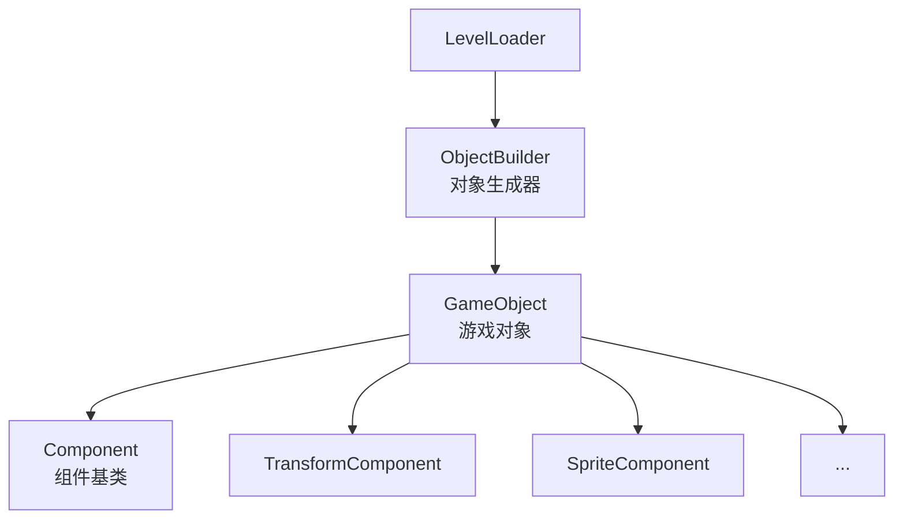
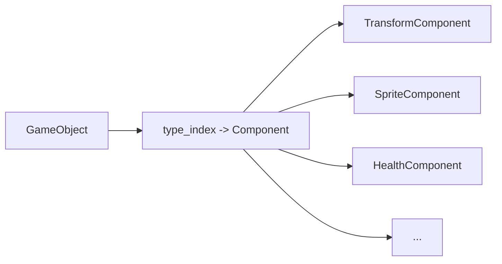
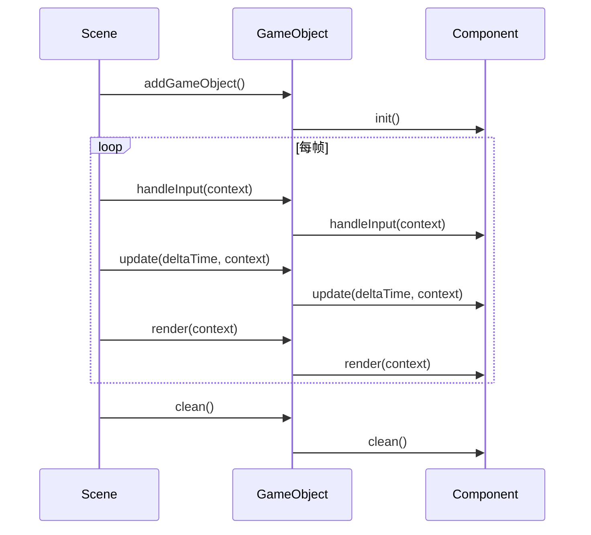
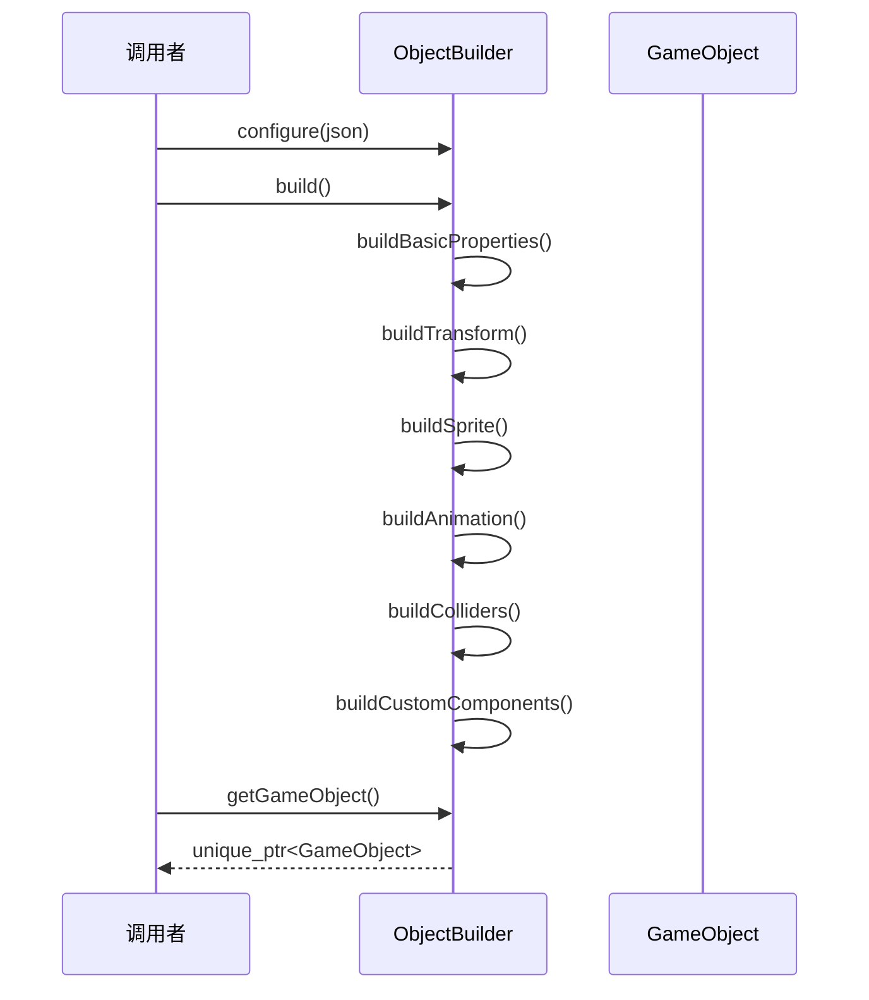
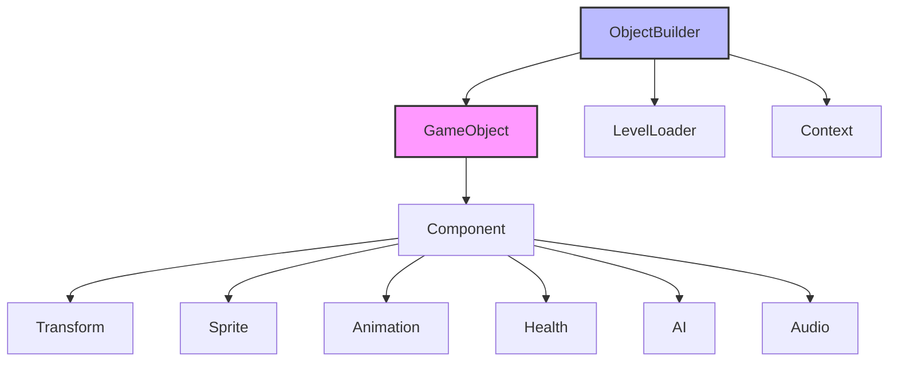

# Object 对象系统模块

Object 模块实现了游戏对象系统，采用组件化架构（Component-Based Architecture），通过组合而非继承来构建复杂的游戏对象。

## 架构概览



## 类概览

| 类名 | 描述 |
|------|------|
| [GameObject](#gameobject) | 游戏对象类，组件的容器 |
| [ObjectBuilder](#objectbuilder) | 对象生成器，用于从配置创建对象 |

---

## GameObject

**文件**: `src/engine/object/game_object.h`

游戏对象基类，采用组件化架构。游戏对象本身不包含具体功能，功能由附加的组件提供。

### 类定义

```cpp
class GameObject final {
private:
    std::string name_;      // 对象名称
    std::string tag_;       // 对象标签
    std::unordered_map<std::type_index, std::unique_ptr<Component>> components_;
    bool need_remove_ = false;

public:
    GameObject(const std::string& name = "", const std::string& tag = "");
    ~GameObject();
    
    // 禁止拷贝和移动
    GameObject(const GameObject&) = delete;
    GameObject& operator=(const GameObject&) = delete;
    GameObject(GameObject&&) = delete;
    GameObject& operator=(GameObject&&) = delete;

    // 名称和标签
    const std::string& getName() const;
    void setName(const std::string& name);
    const std::string& getTag() const;
    void setTag(const std::string& tag);
    
    // 移除标记
    void setNeedRemove(bool need_remove);
    bool getNeedRemove() const;

    // 组件管理（模板方法）
    template<typename T, typename... Args>
    T* addComponent(Args&&... args);
    
    template<typename T>
    T* getComponent() const;
    
    template<typename T>
    bool hasComponent() const;
    
    template<typename T>
    void removeComponent();

    // 生命周期
    void init();
    void handleInput(engine::core::Context& context);
    void update(float deltaTime, engine::core::Context& context);
    void render(engine::core::Context& context);
    void clean();
};
```

### 组件管理



### 使用示例

```cpp
// 创建游戏对象
auto player = std::make_unique<GameObject>("Player", "Character");

// 添加组件
auto transform = player->addComponent<TransformComponent>(
    glm::vec2(100.0f, 200.0f),  // 位置
    0.0f,                        // 旋转
    glm::vec2(2.0f, 2.0f)        // 缩放
);

auto sprite = player->addComponent<SpriteComponent>(
    "player_texture",
    resource_manager,
    engine::utils::Alignment::CENTER
);

auto health = player->addComponent<HealthComponent>(100, 2.0f);

// 获取组件
auto t = player->getComponent<TransformComponent>();
if (t) {
    t->setPosition(glm::vec2(300.0f, 400.0f));
}

// 检查组件是否存在
if (player->hasComponent<HealthComponent>()) {
    // 处理生命值逻辑
}

// 移除组件
player->removeComponent<AnimationComponent>();

// 标记移除
player->setNeedRemove(true);
```

### 生命周期流程



---

## ObjectBuilder

**文件**: `src/engine/object/object_builder.h`

游戏对象生成器基类，实现生成器模式（Builder Pattern）。将复杂对象的构建过程分解为一系列步骤。

### 类定义

```cpp
class ObjectBuilder {
    friend class LevelLoader;

public:
    explicit ObjectBuilder(LevelLoader& level_loader, Context& context);
    virtual ~ObjectBuilder();
    
    // 禁止拷贝和移动
    ObjectBuilder(const ObjectBuilder&) = delete;
    ObjectBuilder& operator=(const ObjectBuilder&) = delete;
    ObjectBuilder(ObjectBuilder&&) = delete;
    ObjectBuilder& operator=(ObjectBuilder&&) = delete;

    // 配置方法
    ObjectBuilder* configure(const nlohmann::json* object_json);
    ObjectBuilder* configure(const nlohmann::json* object_json,
                             const nlohmann::json* tile_json,
                             TileInfo tile_info);

    // 构建和获取
    ObjectBuilder* build();
    std::unique_ptr<GameObject> getGameObject();

protected:
    // 构建步骤（子类可重写）
    virtual void buildBasicProperties();
    virtual void buildTransform();
    virtual void buildSprite();
    virtual void buildAnimation();
    virtual void buildColliders();
    virtual void buildCustomComponents();

    LevelLoader& level_loader_;
    Context& context_;
    std::unique_ptr<GameObject> game_object_;
    
    // 解析数据
    const nlohmann::json* object_json_ = nullptr;
    const nlohmann::json* tile_json_ = nullptr;
    TileInfo tile_info_;
    
    // 缓存变量
    std::string name_;
    glm::vec2 dst_size_;
    glm::vec2 src_size_;
};
```

### 使用示例

```cpp
// 基本使用
ObjectBuilder builder(level_loader, context);
auto game_object = builder
    .configure(&object_json, &tile_json, tile_info)
    ->build()
    ->getGameObject();

scene.addGameObject(std::move(game_object));
```

### 自定义生成器

```cpp
class EnemyBuilder : public ObjectBuilder {
public:
    using ObjectBuilder::ObjectBuilder;

protected:
    void buildCustomComponents() override {
        // 添加敌人特有的组件
        game_object_->addComponent<AIComponent>(
            std::make_unique<PatrolBehavior>()
        );
        
        game_object_->addComponent<HealthComponent>(50);
        
        game_object_->addComponent<AudioComponent>();
        auto audio = game_object_->getComponent<AudioComponent>();
        audio->registerSound("death", "assets/enemy_death.wav");
    }
};

// 使用自定义生成器
EnemyBuilder builder(level_loader, context);
auto enemy = builder
    .configure(&enemy_json, &tile_json, tile_info)
    ->build()
    ->getGameObject();
```

### 构建流程



---

## 组件组合示例

### 玩家对象

```cpp
auto player = std::make_unique<GameObject>("Player", "Character");

// 基础组件
player->addComponent<TransformComponent>(glm::vec2(100, 100));
player->addComponent<SpriteComponent>("player", resource_manager);
player->addComponent<AnimationComponent>();
player->addComponent<HealthComponent>(100, 1.5f);

// 输入组件
player->addComponent<PlayerInputComponent>();

// 物理组件
player->addComponent<RigidbodyComponent>();
player->addComponent<BoxColliderComponent>(glm::vec2(32, 48));

// 音频组件
auto audio = player->addComponent<AudioComponent>();
audio->registerSound("jump", "assets/jump.wav");
audio->registerSound("attack", "assets/attack.wav");
```

### 敌人对象

```cpp
auto enemy = std::make_unique<GameObject>("Enemy", "Enemy");

enemy->addComponent<TransformComponent>(glm::vec2(500, 200));
enemy->addComponent<SpriteComponent>("enemy", resource_manager);
enemy->addComponent<AnimationComponent>();
enemy->addComponent<HealthComponent>(50);

// AI 组件
enemy->addComponent<AIComponent>(std::make_unique<ChaseBehavior>(player));

// 碰撞组件
enemy->addComponent<BoxColliderComponent>(glm::vec2(32, 32));
```

### 道具对象

```cpp
auto coin = std::make_unique<GameObject>("Coin", "Collectible");

coin->addComponent<TransformComponent>(glm::vec2(300, 150));
coin->addComponent<SpriteComponent>("coin", resource_manager);
coin->addComponent<AnimationComponent>();
coin->addComponent<AudioComponent>();

// 触发器组件（无物理碰撞，仅触发事件）
coin->addComponent<TriggerComponent>([](GameObject* player) {
    // 增加分数
    score += 10;
    // 播放音效
    audio->playSound("coin");
    // 销毁自己
    coin->setNeedRemove(true);
});
```

---

## 模块依赖图



## 最佳实践

1. **组合优于继承**: 使用组件组合功能，而非创建深层次的类继承
2. **单一职责**: 每个组件只负责一个功能
3. **数据驱动**: 使用 ObjectBuilder 从配置创建对象
4. **延迟移除**: 使用 `setNeedRemove` 安全地移除对象
5. **标签过滤**: 使用 `tag` 快速筛选对象类型
