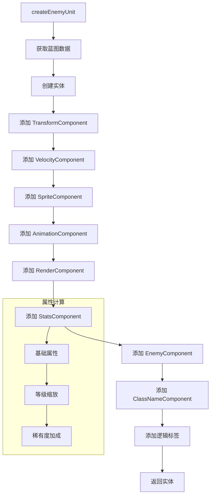
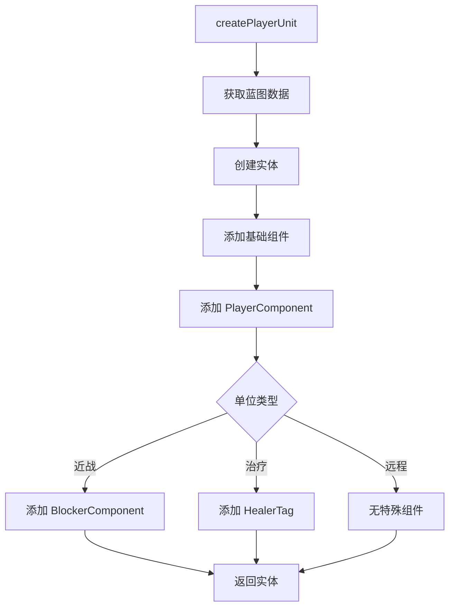

# Factory 工厂模块

> **版本**: 1.0.0  
> **最后更新**: 2026-02-15  
> **相关文档**: [组件模块](../component/README.md) | [数据模块](../data/README.md)

Factory 模块负责实体的创建和管理，通过数据驱动的方式将实体的配置（蓝图）与创建逻辑（工厂）分离。

---

## 目录

- [类/结构概览](#类结构概览)
- [BlueprintManager](#blueprintmanager)
- [EntityFactory](#entityfactory)
- [实体创建流程](#实体创建流程)
- [蓝图数据结构](#蓝图数据结构)
- [使用示例](#使用示例)

---

## 类/结构概览

| 名称 | 描述 |
|------|------|
| [BlueprintManager](#blueprintmanager) | 蓝图管理器，从 JSON 加载并缓存实体配置数据 |
| [EntityFactory](#entityfactory) | 实体工厂，根据蓝图数据装配 ECS 组件并创建实体 |

---

## BlueprintManager

**文件**: `src/game/factory/blueprint_manager.h`, `src/game/factory/blueprint_manager.cpp`

蓝图管理器负责读取 `assets/data/enemy_data.json` 等配置文件，将其解析为内存中的蓝图结构体。它使用 `entt::hashed_string` 生成的 `id_type` 作为键来存储蓝图。

### 主要功能

- **加载与解析**：支持加载敌人、单位等配置。
- **资源预加载**：在加载蓝图时自动预加载关联的音效资源。
- **快速查询**：提供哈希后的 ID 进行 $O(1)$ 级别的配置查找。

### 核心接口

```cpp
bool loadEnemyClassBlueprints(std::string_view enemy_json_path);
const data::EnemyClassBlueprint& getEnemyClassBlueprint(entt::id_type id) const;
```

---

## EntityFactory

**文件**: `src/game/factory/entity_factory.h`, `src/game/factory/entity_factory.cpp`

实体工厂是创建实体的核心。它从蓝图管理器获取数据，并按照预设的步骤将各种 ECS 组件（Transform, Sprite, Animation, Stats 等）装配到实体上。

### 工作流程

1. **获取数据**：根据传入的 `class_id` 从 `BlueprintManager` 查找蓝图。
2. **创建实体**：使用 `registry_.create()` 生成新的实体句柄。
3. **分步装配**：
   - 添加基础组件（Transform, Velocity, Render）。
   - 添加表现组件（Sprite, Animation）。
   - 添加战斗组件（Stats, Enemy, ClassName）。
   - 添加逻辑标签（FaceLeftTag, MeleeUnitTag 等）。
4. **属性计算**：根据等级（Level）和稀有度（Rarity）动态计算最终战斗属性。

### 核心接口

```cpp
entt::entity createEnemyUnit(
    entt::id_type class_id, 
    const glm::vec2& position, 
    int target_waypoint_id, 
    int level = 1, 
    int rarity = 1
);
```

---

## 实体创建流程

### 敌人创建流程



### 玩家单位创建流程



---

## 蓝图数据结构

### EnemyClassBlueprint

```cpp
struct EnemyClassBlueprint {
    entt::id_type class_id_;           // 类 ID（哈希值）
    std::string class_name_;           // 类名（如 "slime", "goblin"）
    std::string sprite_path_;          // 精灵图路径
    engine::utils::Rect sprite_rect_;  // 精灵源矩形
    
    // 动画数据
    std::unordered_map<entt::id_type, AnimationData> animations_;
    
    // 基础属性
    float base_hp_;
    float base_atk_;
    float base_def_;
    float base_speed_;
    float base_range_;
    float base_atk_interval_;
    
    // 缩放因子（每级/每稀有度增加的比例）
    float hp_scale_;
    float atk_scale_;
    float def_scale_;
};
```

### PlayerClassBlueprint

```cpp
struct PlayerClassBlueprint {
    entt::id_type class_id_;
    std::string class_name_;
    std::string sprite_path_;
    engine::utils::Rect sprite_rect_;
    
    std::unordered_map<entt::id_type, AnimationData> animations_;
    
    // 基础属性
    float base_hp_;
    float base_atk_;
    float base_def_;
    float base_range_;
    float base_atk_interval_;
    
    // 放置消耗
    int cost_;
    
    // 阻挡数（近战单位）
    int max_block_count_;
    
    // 单位类型标签
    bool is_melee_;
    bool is_healer_;
};
```

---

## 属性计算公式

实体工厂根据等级和稀有度动态计算最终属性：

```cpp
float calculateFinalStat(float base, float scale, int level, int rarity) {
    // 基础值 + 等级加成 + 稀有度加成
    return base * (1.0f + scale * (level - 1)) * (1.0f + 0.1f * (rarity - 1));
}
```

### 计算示例

```cpp
// 假设基础攻击力 20，缩放因子 0.1
// 等级 3，稀有度 2

float base_atk = 20.0f;
float atk_scale = 0.1f;
int level = 3;
int rarity = 2;

// 等级加成: 1.0 + 0.1 * (3-1) = 1.2
// 稀有度加成: 1.0 + 0.1 * (2-1) = 1.1
// 最终攻击力: 20 * 1.2 * 1.1 = 26.4
float final_atk = base_atk * (1.0f + atk_scale * (level - 1)) * (1.0f + 0.1f * (rarity - 1));
```

---

## JSON 配置示例

### enemy_data.json

```json
{
  "enemies": [
    {
      "class_name": "slime",
      "sprite_path": "assets/sprites/enemies/slime.png",
      "sprite_rect": {"x": 0, "y": 0, "w": 32, "h": 32},
      "animations": {
        "idle": {
          "frames": [
            {"rect": {"x": 0, "y": 0, "w": 32, "h": 32}, "duration": 200},
            {"rect": {"x": 32, "y": 0, "w": 32, "h": 32}, "duration": 200}
          ],
          "loop": true
        },
        "walk": {
          "frames": [
            {"rect": {"x": 64, "y": 0, "w": 32, "h": 32}, "duration": 100},
            {"rect": {"x": 96, "y": 0, "w": 32, "h": 32}, "duration": 100}
          ],
          "loop": true
        }
      },
      "stats": {
        "hp": 100,
        "atk": 10,
        "def": 5,
        "speed": 50,
        "range": 30,
        "atk_interval": 1.0
      },
      "scales": {
        "hp_scale": 0.2,
        "atk_scale": 0.1,
        "def_scale": 0.05
      }
    }
  ]
}
```

---

## 使用示例

### 创建敌人

```cpp
#include "game/factory/entity_factory.h"
#include "game/factory/blueprint_manager.h"

// 初始化
auto blueprint_manager = std::make_unique<game::factory::BlueprintManager>();
blueprint_manager->loadEnemyClassBlueprints("assets/data/enemy_data.json");

auto entity_factory = std::make_unique<game::factory::EntityFactory>(
    registry, 
    *blueprint_manager, 
    resource_manager
);

// 创建敌人
auto enemy = entity_factory->createEnemyUnit(
    "slime"_hs,           // 类 ID
    glm::vec2(100, 200),  // 初始位置
    1,                    // 目标路径点
    3,                    // 等级
    2                     // 稀有度
);
```

### 创建玩家单位

```cpp
// 创建近战单位
auto melee_unit = entity_factory->createPlayerUnit(
    "warrior"_hs,
    glm::vec2(300, 400),
    1  // 等级
);

// 创建治疗单位
auto healer = entity_factory->createPlayerUnit(
    "healer"_hs,
    glm::vec2(350, 400),
    1
);
```

---

## 设计优势

### 1. 数据驱动

- 配置与代码分离，策划可以独立调整数值
- 支持热重载（重新加载 JSON 即可更新配置）
- 便于批量修改和版本控制

### 2. 类型安全

```cpp
// 使用 entt::hashed_string 生成编译期 ID
auto enemy = factory.createEnemyUnit("slime"_hs, pos, waypoint);

// 避免字符串比较的性能开销
// "slime"_hs 在编译时计算哈希值
```

### 3. 可扩展性

```cpp
// 添加新的单位类型只需：
// 1. 在 JSON 中添加配置
// 2. 无需修改工厂代码

// 特殊单位可以通过添加额外组件实现
if (blueprint.has_special_ability) {
    registry.emplace<SpecialAbilityComponent>(entity, ...);
}
```

---

## 相关模块

- [BlueprintManager](#blueprintmanager) - 蓝图管理
- [EntityFactory](#entityfactory) - 实体创建
- [EnemyClassBlueprint](#enemyclassblueprint) - 敌人蓝图数据
- [PlayerClassBlueprint](#playerclassblueprint) - 玩家单位蓝图数据
