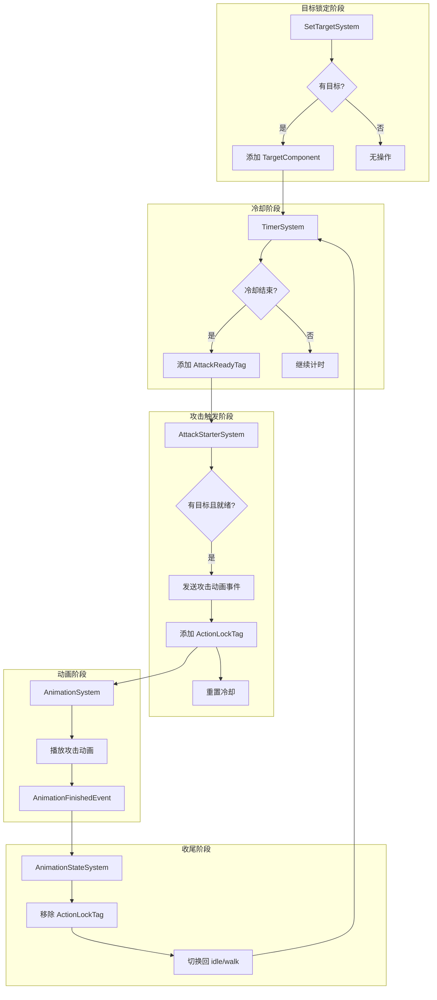
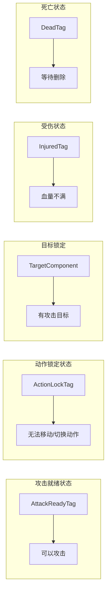
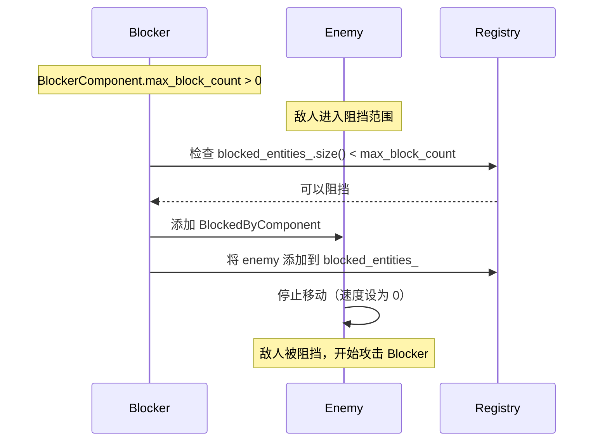
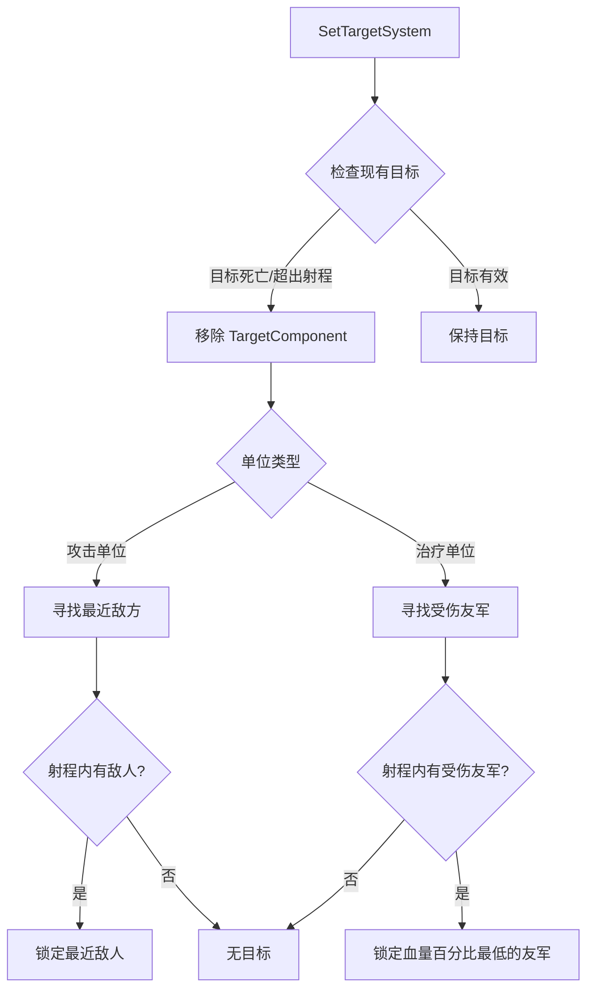
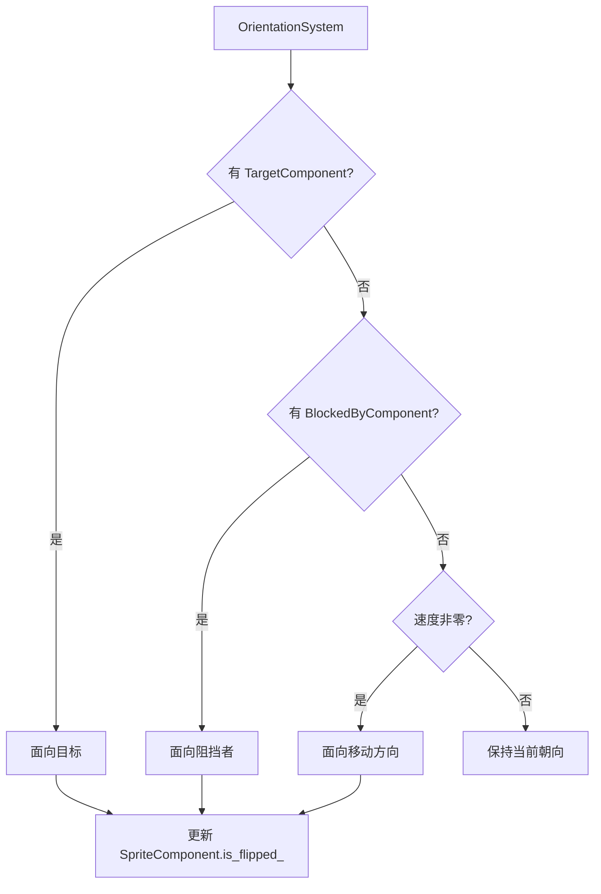

# System 系统模块

> **相关文档**: [组件模块](../component/README.md) | [ECS 架构](../../ECS_ARCHITECTURE.md)

System 模块包含游戏的核心逻辑系统，负责处理寻路、实体清理等游戏机制。

---

## 目录

- [类/结构概览](#类结构概览)
- [BlockSystem](#blocksystem)
- [SetTargetSystem](#settargetsystem)
- [TimerSystem](#timersystem)
- [AttackStarterSystem](#attackstartersystem)
- [AnimationStateSystem](#animationstatesystem)
- [OrientationSystem](#orientationsystem)
- [FollowPathSystem](#followpathsystem)
- [RemoveDeadSystem](#removedeadsystem)
- [系统执行顺序](#系统执行顺序)

---

## 类/结构概览

| 名称 | 描述 |
|------|------|
| [FollowPathSystem](#followpathsystem) | 寻路系统，控制敌人沿路径移动 |
| [RemoveDeadSystem](#removedeadsystem) | 清理系统，删除标记死亡的实体 |
| [BlockSystem](#blocksystem) | 阻挡系统，处理近战单位拦截敌人 |
| [SetTargetSystem](#settargetsystem) | 锁定系统，为单位寻找攻击或治疗目标 |
| [TimerSystem](#timersystem) | 计时系统，处理攻击冷却时间 |
| [AttackStarterSystem](#attackstartersystem) | 启动系统，触发攻击动画和动作硬直 |
| [AnimationStateSystem](#animationstatesystem) | 动画状态系统，处理动作结束后的逻辑转换 |
| [OrientationSystem](#orientationsystem) | 朝向系统，根据目标或速度调整面朝方向 |

---

## BlockSystem

**文件**: `src/game/system/block_system.h`, `src/game/system/block_system.cpp`

处理近战玩家单位（Blocker）对敌人的拦截。当距离小于 `BLOCK_RADIUS` 时建立阻挡关系。

---

## SetTargetSystem

**文件**: `src/game/system/set_target_system.h`, `src/game/system/set_target_system.cpp`

统一处理所有单位的目标锁定逻辑：
1. **有效性检测**: 目标死亡或超出射程时移除 `TargetComponent`。
2. **策略搜索**:
   - **普通攻击单位**: 在射程内寻找最近的敌方目标。
   - **治疗单位**: 通过 `InjuredTag` 寻找射程内血量百分比最低的友军。

---

## TimerSystem

**文件**: `src/game/system/timer_system.h`, `src/game/system/timer_system.cpp`

管理攻击冷却时间。累加 `atk_timer_`，并在计时结束后添加 `AttackReadyTag`，使实体进入待攻击状态。

---

## AttackStarterSystem

**文件**: `src/game/system/attack_starter_system.h`, `src/game/system/attack_starter_system.cpp`

游戏战斗循环的触发器。当单位具备 `AttackReadyTag` 且有有效目标（或被阻挡）时：
- 发送播放攻击/治疗动画事件。
- 为敌人添加 `ActionLockTag`（动作锁）。
- 重置攻击计时器并移除就绪标签。

---

## AnimationStateSystem

**文件**: `src/game/system/animation_state_system.h`, `src/game/system/animation_state_system.cpp`

监听 `AnimationFinishedEvent`。负责处理攻击等非循环动画播放结束后的收尾工作：
- 移除 `ActionLockTag`（解除硬直）。
- 切换回 `idle` 或 `walk` 动画。

---

## OrientationSystem

**文件**: `src/game/system/orientation_system.h`, `src/game/system/orientation_system.cpp`

统一管理实体的翻转状态。优先级顺序：
1. **锁定目标**: 面向当前攻击/治疗的目标。
2. **阻挡关系**: 被阻挡的敌人面向阻挡者。
3. **移动速度**: 面向当前移动的方向。

---

## FollowPathSystem

## FollowPathSystem

**文件**: `src/game/system/followpath_system.h`, `src/game/system/followpath_system.cpp`

寻路系统负责控制敌人沿着预定义的路径点移动。支持分叉路径，敌人到达节点时随机选择下一方向。

### 类定义

```cpp
class FollowPathSystem {
public:
    void update(
        entt::registry& registry,
        entt::dispatcher& dispatcher,
        std::unordered_map<int, game::data::WaypointNode>& waypoint_nodes
    );
};
```

### 工作原理

```
查询所有带 EnemyComponent 的实体
    ↓
获取当前目标路径点
    ↓
计算到目标点的方向向量
    ↓
距离 < 5.0f ?
    ├── 是 → 到达节点
    │           ├── 有下一节点？→ 随机选择下一个目标
    │           └── 无下一节点？→ 到达终点，发送事件并标记删除
    └── 否 → 继续移动
    ↓
更新速度向量（方向 × 速度）
```

### 核心算法

```cpp
void FollowPathSystem::update(...) {
    auto view = registry.view<
        EnemyComponent, 
        TransformComponent, 
        VelocityComponent>();
    
    for (auto entity : view) {
        auto& enemy = registry.get<EnemyComponent>(entity);
        auto& transform = registry.get<TransformComponent>(entity);
        
        // 1. 获取目标节点
        auto target_node = waypoint_nodes.at(enemy.target_waypoint_id_);
        
        // 2. 计算方向
        glm::vec2 direction = target_node.position_ - transform.position_;
        
        // 3. 到达检测（阈值 5.0f）
        if (glm::length(direction) < 5.0f) {
            // 到达终点？
            if (target_node.next_node_ids_.empty()) {
                dispatcher.enqueue<EnemyArriveHomeEvent>();
                registry.emplace<DeadTag>(entity);
                continue;
            }
            
            // 随机选择下一节点（支持分叉路径）
            int index = randomInt(0, target_node.next_node_ids_.size() - 1);
            enemy.target_waypoint_id_ = target_node.next_node_ids_[index];
            
            // 重新计算方向
            target_node = waypoint_nodes.at(enemy.target_waypoint_id_);
            direction = target_node.position_ - transform.position_;
        }
        
        // 4. 更新速度
        velocity.velocity_ = glm::normalize(direction) * enemy.speed_;
    }
}
```

### 设计要点

| 设计 | 说明 |
|------|------|
| **距离阈值** | 5.0f 像素，避免浮点误差和速度过快导致的震荡 |
| **随机选择** | 分叉路径时随机选择方向，实现敌人分流 |
| **延迟删除** | 到达终点时添加 DeadTag，由 RemoveDeadSystem 实际删除 |

### 使用示例

```cpp
#include "game/system/followpath_system.h"

// 创建系统
auto follow_path_system = std::make_unique<game::system::FollowPathSystem>();

// 每帧更新
follow_path_system->update(registry, dispatcher, waypoint_nodes);
```

### 相关模块

- [EnemyComponent](../component/README.md#enemycomponent) - 存储敌人的寻路目标
- [WaypointNode](../data/README.md#waypointnode) - 路径点数据结构
- [RemoveDeadSystem](#removedeadsystem) - 清理到达终点的敌人

---

## RemoveDeadSystem

**文件**: `src/game/system/remove_dead_system.h`, `src/game/system/remove_dead_system.cpp`

清理系统负责删除标记为死亡的实体。实现 ECS 中的"延迟删除"模式，确保在安全的时机销毁实体。

### 类定义

```cpp
class RemoveDeadSystem {
public:
    void update(entt::registry& registry);
};
```

### 为什么需要延迟删除？

在 ECS 系统中，遍历组件视图时直接销毁实体会破坏迭代器，导致未定义行为。因此采用"标记-删除"模式：

```
敌人到达终点
    ↓
添加 DeadTag 标记
    ↓
当前帧继续处理其他实体
    ↓
帧末调用 RemoveDeadSystem
    ↓
安全地销毁所有带 DeadTag 的实体
```

### 实现

```cpp
void RemoveDeadSystem::update(entt::registry& registry) {
    // 查询所有带 DeadTag 的实体
    auto view = registry.view<game::defs::DeadTag>();
    
    for (auto entity : view) {
        auto entity_id = static_cast<entt::id_type>(entity);
        registry.destroy(entity);
        spdlog::info("Entity {} destroyed", entity_id);
    }
}
```

### 使用场景

- 敌人到达终点需要删除
- 敌人被击败需要删除
- 子弹命中目标需要删除
- 任何需要安全删除实体的情况

### 使用示例

```cpp
#include "game/system/remove_dead_system.h"
#include "game/defs/tags.h"

// 创建系统
auto remove_dead_system = std::make_unique<game::system::RemoveDeadSystem>();

// 标记实体死亡（在 FollowPathSystem 中）
registry.emplace<game::defs::DeadTag>(enemy_entity);

// 帧末清理
remove_dead_system->update(registry);
```

### 相关模块

- [DeadTag](../defs/README.md#deadtag) - 死亡标记组件
- [FollowPathSystem](#followpathsystem) - 标记到达终点的敌人

---

## 战斗系统流程

游戏中的战斗逻辑由多个系统协作完成，形成完整的战斗循环：

### 战斗系统架构



### 系统执行顺序

```cpp
void GameScene::update(float delta_time) {
    // 1. 目标锁定
    set_target_system_->update(registry_);
    
    // 2. 冷却计时
    timer_system_->update(registry_, delta_time);
    
    // 3. 攻击触发
    attack_starter_system_->update(registry_, dispatcher_);
    
    // 4. 阻挡处理
    block_system_->update(registry_);
    
    // 5. 寻路移动
    follow_path_system_->update(registry_, dispatcher_, waypoint_nodes_);
    
    // 6. 朝向更新
    orientation_system_->update(registry_);
    
    // 7. 动画更新
    animation_system_->update(delta_time);
    
    // 8. 基础移动
    movement_system_->update(registry_, delta_time);
    
    // 9. 清理死亡实体
    remove_dead_system_->update(registry_);
}
```

### 组件与标签协作



---

## BlockSystem 详细说明

**文件**: `src/game/system/block_system.h`, `src/game/system/block_system.cpp`

### 功能说明

处理近战玩家单位（Blocker）对敌人的拦截。当敌人进入阻挡范围时建立阻挡关系。

### 阻挡流程



### 类定义

```cpp
class BlockSystem {
public:
    void update(entt::registry& registry, entt::dispatcher& dispatcher);
    
private:
    static constexpr float BLOCK_RADIUS = 30.0f;  // 阻挡范围
};
```

### 核心逻辑

```cpp
void BlockSystem::update(entt::registry& registry, entt::dispatcher& dispatcher) {
    auto blockers = registry.view<BlockerComponent, TransformComponent>();
    auto enemies = registry.view<EnemyComponent, TransformComponent, VelocityComponent>();
    
    for (auto blocker : blockers) {
        auto& blocker_comp = blockers.get<BlockerComponent>(blocker);
        auto& blocker_pos = blockers.get<TransformComponent>(blocker);
        
        // 检查是否还能阻挡更多敌人
        if (blocker_comp.blocked_entities_.size() >= blocker_comp.max_block_count_) {
            continue;
        }
        
        for (auto enemy : enemies) {
            // 跳过已被阻挡的敌人
            if (registry.all_of<BlockedByComponent>(enemy)) continue;
            
            auto& enemy_pos = enemies.get<TransformComponent>(enemy);
            float distance = glm::length(enemy_pos.position_ - blocker_pos.position_);
            
            if (distance < BLOCK_RADIUS) {
                // 建立阻挡关系
                registry.emplace<BlockedByComponent>(enemy, blocker);
                blocker_comp.blocked_entities_.push_back(enemy);
                
                // 停止敌人移动
                enemies.get<VelocityComponent>(enemy).velocity_ = glm::vec2(0.0f);
            }
        }
    }
}
```

---

## SetTargetSystem 详细说明

**文件**: `src/game/system/set_target_system.h`, `src/game/system/set_target_system.cpp`

### 功能说明

统一处理所有单位的目标锁定逻辑，支持攻击目标和治疗目标两种模式。

### 类定义

```cpp
class SetTargetSystem {
public:
    void update(entt::registry& registry);

private:
    void updateHasTarget(entt::registry& registry);
    void updateNoTargetPlayer(entt::registry& registry);
    void updateNoTargetEnemy(entt::registry& registry);
    void updateHealer(entt::registry& registry);
};
```

### 私有方法说明

| 方法 | 描述 |
|------|------|
| `updateHasTarget()` | 处理已有目标的逻辑，校验距离和存活状态 |
| `updateNoTargetPlayer()` | 为没有目标的玩家单位寻找敌人 |
| `updateNoTargetEnemy()` | 为没有目标的敌方远程单位寻找射程内的目标 |
| `updateHealer()` | 为没有目标的治疗单位寻找受伤最重的友军 |

### 目标选择策略



### 核心逻辑

```cpp
void SetTargetSystem::update(entt::registry& registry) {
    // 处理攻击单位
    auto attackers = registry.view<StatsComponent, TransformComponent>(entt::exclude<HealerTag>);
    
    for (auto entity : attackers) {
        auto& stats = registry.get<StatsComponent>(entity);
        auto& pos = registry.get<TransformComponent>(entity);
        
        // 检查现有目标有效性
        if (registry.all_of<TargetComponent>(entity)) {
            auto& target = registry.get<TargetComponent>(entity);
            if (!isTargetValid(registry, entity, target.entity_, stats.range_)) {
                registry.remove<TargetComponent>(entity);
            }
        }
        
        // 寻找新目标
        if (!registry.all_of<TargetComponent>(entity)) {
            auto new_target = findNearestEnemy(registry, pos.position_, stats.range_);
            if (new_target != entt::null) {
                registry.emplace<TargetComponent>(entity, new_target);
            }
        }
    }
    
    // 处理治疗单位（类似逻辑）
    // ...
}
```

---

## OrientationSystem 详细说明

**文件**: `src/game/system/orientation_system.h`, `src/game/system/orientation_system.cpp`

### 功能说明

统一管理实体的翻转状态，确保实体面向正确的方向。

### 朝向判断优先级



### 核心逻辑

```cpp
void OrientationSystem::update(entt::registry& registry) {
    auto view = registry.view<TransformComponent, SpriteComponent>();
    
    for (auto entity : view) {
        auto& transform = view.get<TransformComponent>(entity);
        auto& sprite = view.get<SpriteComponent>(entity);
        
        bool should_flip = false;
        
        // 优先级 1: 面向目标
        if (registry.all_of<TargetComponent>(entity)) {
            auto& target = registry.get<TargetComponent>(entity);
            if (registry.valid(target.entity_)) {
                auto& target_pos = registry.get<TransformComponent>(target.entity_);
                should_flip = target_pos.position_.x < transform.position_.x;
            }
        }
        // 优先级 2: 面向阻挡者
        else if (registry.all_of<BlockedByComponent>(entity)) {
            auto& blocked = registry.get<BlockedByComponent>(entity);
            if (registry.valid(blocked.blocker_entity_)) {
                auto& blocker_pos = registry.get<TransformComponent>(blocked.blocker_entity_);
                should_flip = blocker_pos.position_.x < transform.position_.x;
            }
        }
        // 优先级 3: 面向移动方向
        else if (registry.all_of<VelocityComponent>(entity)) {
            auto& velocity = registry.get<VelocityComponent>(entity);
            if (velocity.velocity_.x != 0) {
                should_flip = velocity.velocity_.x < 0;
            }
        }
        
        sprite.sprite_.is_flipped_ = should_flip;
    }
}
```
