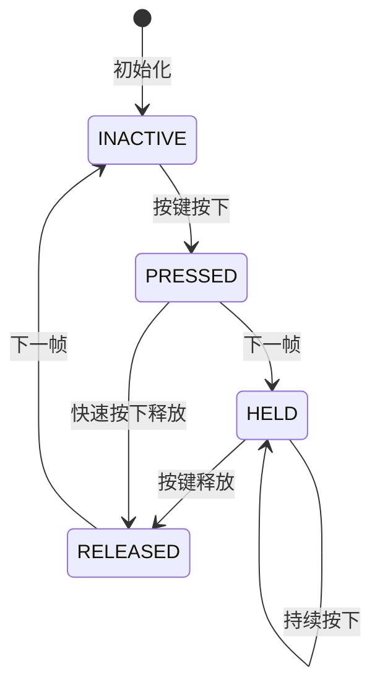
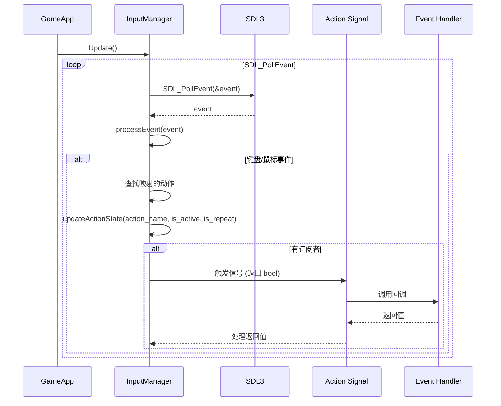
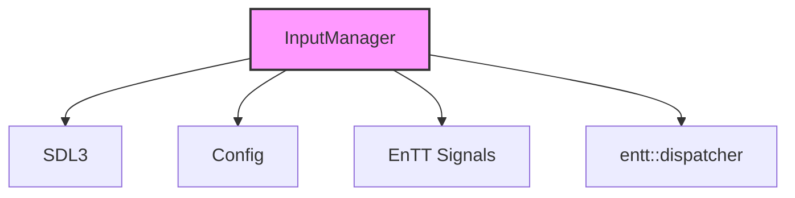

# Input 输入模块

Input 模块负责处理键盘、鼠标事件并将其映射为游戏动作，使用 EnTT 的信号系统实现事件分发。

## 架构概览

```mermaid
graph TB
    InputManager[InputManager<br/>输入管理器]
    
    InputManager --> SDL3[SDL3 Events]
    InputManager --> Config[Config<br/>输入映射]
    InputManager --> Dispatcher[entt::dispatcher<br/>事件分发器]
    
    InputManager --> ActionState[ActionState<br/>动作状态]
    InputManager --> Signal[entt::sigh<bool()><br/>信号槽]
    
    Signal --> Observer1[观察者1]
    Signal --> Observer2[观察者2]
    Signal --> Observer3[观察者3]
```

## 类概览

| 类/枚举 | 描述 |
|---------|------|
| [InputManager](#inputmanager) | 输入管理器，处理事件和动作映射 |
| [ActionState](#actionstate) | 动作状态枚举 |

---

## InputManager

**文件**: `src/engine/input/input_manager.h`

负责事件循环轮询、输入状态维护及动作映射的类。

### 类定义

```cpp
class InputManager final {
private:
    entt::dispatcher* dispatcher_; ///< 事件分发器
    SDL_Renderer* sdl_renderer_; ///< SDL 渲染器，用于坐标转换
    std::unordered_map<std::string,std::array<entt::sigh<bool()>,3>> action_entities_; ///< 动作对应的实体列表
    std::unordered_map<std::variant<SDL_Scancode, Uint32>, std::vector<std::string>> input_to_action_;
    std::unordered_map<std::string, ActionState> action_states_;
    glm::vec2 logical_mouse_position_; ///< 逻辑渲染坐标系下的鼠标位置
    glm::vec2 mouse_position_; ///< 窗口坐标系下的鼠标位置
public:
    InputManager(SDL_Renderer* sdl_renderer, entt::dispatcher* dispatcher, const engine::core::Config* config);
    
    // 每帧更新，处理事件
    void Update();
    
    // 动作事件订阅
    entt::sink<entt::sigh<bool()>> onAction(const std::string& action_name, 
                                             ActionState state = ActionState::PRESSED);
    
    // 动作状态查询
    bool isActionDown(const std::string& action_name) const;
    bool isActionPressed(const std::string& action_name) const;
    bool isActionReleased(const std::string& action_name) const;
    
    // 鼠标位置
    glm::vec2 getMousePosition() const;
    glm::vec2 getLogicalMousePosition() const;
    
    // 退出方法
    void quit();

private:
    void processEvent(const SDL_Event& event);
    void initializeMapFromConfig(const engine::core::Config* config);
    void updateActionState(const std::string& action_name, bool is_input_active, bool is_repeat_event);
};
```

---

## ActionState

**文件**: `src/engine/input/input_manager.h`

动作的状态枚举，描述动作在当前帧的状态。

```cpp
enum class ActionState {
    PRESSED,   // 动作在本帧刚刚被按下
    HELD,      // 动作被持续按下
    RELEASED,  // 动作在本帧刚刚被释放
    INACTIVE   // 动作未激活
};
```

### 状态转换



---

## 输入映射配置

输入映射在 Config 中定义，将物理按键映射到逻辑动作：

```json
{
    "input": {
        "move_left": ["A", "Left"],
        "move_right": ["D", "Right"],
        "move_up": ["W", "Up"],
        "move_down": ["S", "Down"],
        "jump": ["J", "Space"],
        "attack": ["K", "MouseLeft"],
        "pause": ["P", "Escape"],
        "switch_player": ["Tab"]
    }
}
```

### 支持的按键格式

| 类型 | 格式 | 示例 |
|------|------|------|
| 键盘按键 | 单个大写字母或名称 | "A", "Space", "Escape", "Left" |
| 鼠标按键 | "Mouse" + 按钮名 | "MouseLeft", "MouseRight", "MouseMiddle" |

---

## 使用示例

### 订阅动作事件

```cpp
// 在初始化时订阅动作
input_manager.onAction("jump", ActionState::PRESSED)
    .connect<&Player::onJump>(player);

input_manager.onAction("attack", ActionState::PRESSED)
    .connect<&Player::onAttack>(player);

// 使用 Lambda（返回 bool）
input_manager.onAction("pause", ActionState::PRESSED)
    .connect([]() -> bool {
        game_state.setState(GameStateType::Paused);
        return true;
    });
```

### 查询动作状态

```cpp
// 在 update 中查询持续按下状态
void Player::update(float delta_time) {
    if (input_manager.isActionDown("move_left")) {
        velocity.x = -speed;
    } else if (input_manager.isActionDown("move_right")) {
        velocity.x = speed;
    }
    
    // 查询按下状态（单帧触发）
    if (input_manager.isActionPressed("jump")) {
        // 刚按下时触发（单帧）
        jump();
    }
    
    // 查询释放状态（单帧触发）
    if (input_manager.isActionReleased("attack")) {
        // 释放攻击键时触发
        endAttack();
    }
}
```

### 获取鼠标位置

```cpp
// 获取鼠标在窗口中的位置
glm::vec2 mouse_pos = input_manager.getMousePosition();

// 获取逻辑渲染坐标系下的鼠标位置（考虑缩放）
glm::vec2 logical_mouse_pos = input_manager.getLogicalMousePosition();

// 转换为世界坐标（通过摄像机）
glm::vec2 world_pos = camera.screenToWorld(logical_mouse_pos);
```

---

## 事件处理流程



---

## 模块依赖图



## 最佳实践

1. **配置驱动**: 在 JSON 配置文件中定义输入映射，便于玩家自定义
2. **动作抽象**: 使用逻辑动作名（如 "jump"）而非物理按键（如 "Space"）
3. **事件订阅**: 对于触发一次的行为（如打开菜单）使用事件订阅，并返回合适的 bool 值
4. **状态查询**: 
   - 对于持续行为（如移动）使用 `isActionDown` 查询
   - 对于按下瞬间（如跳跃）使用 `isActionPressed` 查询
   - 对于释放瞬间（如结束攻击）使用 `isActionReleased` 查询
5. **鼠标位置**: 根据需要选择合适的鼠标位置获取方法
   - `getMousePosition()`: 获取窗口坐标系下的原始位置
   - `getLogicalMousePosition()`: 获取逻辑渲染坐标系下的位置
6. **每帧更新**: 在主循环中每帧调用 `Update()` 处理输入事件
7. **优雅退出**: 使用 `quit()` 方法触发退出流程
