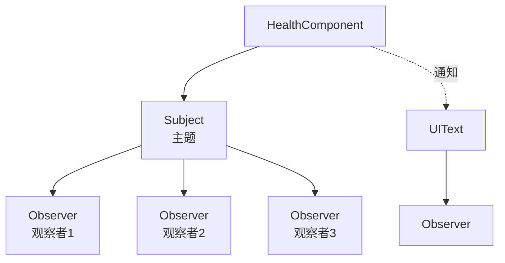
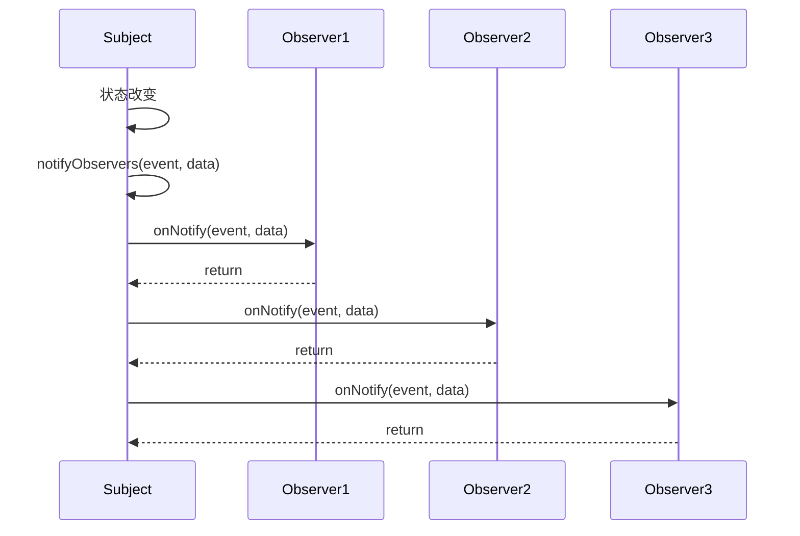
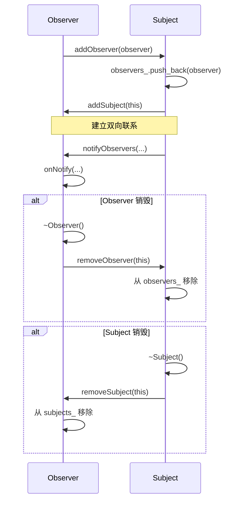
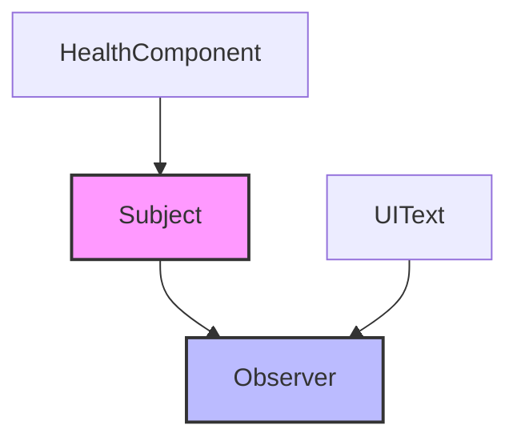

# Interface 接口模块

Interface 模块实现了观察者模式（Observer Pattern），提供了一种松耦合的对象间通信机制。

## 架构概览



## 类概览

| 类名 | 描述 |
|------|------|
| [Subject](#subject) | 主题基类，维护观察者列表并发送通知 |
| [Observer](#observer) | 观察者接口，定义接收通知的方法 |
| [EventType](#eventtype) | 事件类型枚举 |

---

## Subject

**文件**: `src/engine/interface/subject.h`

主题基类，用于实现观察者模式。Subject 维护一个观察者列表，并在其状态改变时通知它们。

### 类定义

```cpp
class Subject {
public:
    virtual ~Subject();
    
    // 观察者管理
    void addObserver(Observer* observer);
    void removeObserver(Observer* observer);
    void clearObservers();

protected:
    // 通知所有观察者
    void notifyObservers(const EventType& event, const std::any& data);

private:
    std::vector<Observer*> observers_;
};
```

### 使用示例

```cpp
#include "engine/interface/subject.h"
#include "engine/interface/observer.h"

class ScoreManager : public engine::interface::Subject {
private:
    int score_ = 0;

public:
    void addScore(int points) {
        score_ += points;
        // 通知观察者分数变化
        notifyObservers(EventType::SCORE_CHANGED, score_);
    }
    
    int getScore() const { return score_; }
};
```

---

## Observer

**文件**: `src/engine/interface/observer.h`

观察者接口，用于实现观察者模式。观察者订阅一个 Subject，并在 Subject 状态改变时接收通知。

### 类定义

```cpp
class Observer {
public:
    virtual ~Observer();
    
    // 当 Subject 的状态改变时，此方法被调用
    virtual void onNotify(const EventType event, const std::any& data) = 0;

private:
    std::vector<Subject*> subjects_;
    
    void addSubject(Subject* subject);
    void removeSubject(Subject* subject);
    void clearSubjects();
};
```

### 使用示例

```cpp
#include "engine/interface/observer.h"

class ScoreUI : public engine::interface::Observer {
private:
    UIText* score_text_;

public:
    explicit ScoreUI(UIText* text) : score_text_(text) {}
    
    void onNotify(const EventType event, const std::any& data) override {
        if (event == EventType::SCORE_CHANGED) {
            int score = std::any_cast<int>(data);
            score_text_->setText("Score: " + std::to_string(score));
        }
    }
};
```

---

## EventType

**文件**: `src/engine/interface/observer.h`

事件类型枚举，定义了所有可能的事件类型。

```cpp
enum class EventType {
    HEALTH_CHANGED,      // 生命值改变
    MAX_HEALTH_CHANGED,  // 最大生命值改变
    SCORE_CHANGED,       // 得分改变
    // 未来可添加更多事件类型
};
```

---

## 完整使用示例

### 生命值系统与 UI 联动

```cpp
// ==================== HealthComponent.h ====================
#include "engine/interface/subject.h"

class HealthComponent : public Component, 
                        public engine::interface::Subject {
private:
    int max_health_;
    int current_health_;

public:
    HealthComponent(int max_health) 
        : max_health_(max_health), current_health_(max_health) {}
    
    void takeDamage(int damage) {
        int old_health = current_health_;
        current_health_ = std::max(0, current_health_ - damage);
        
        if (current_health_ != old_health) {
            notifyObservers(EventType::HEALTH_CHANGED, current_health_);
        }
        
        if (current_health_ == 0) {
            notifyObservers(EventType::ENTITY_DIED, 0);
        }
    }
    
    void heal(int amount) {
        int old_health = current_health_;
        current_health_ = std::min(max_health_, current_health_ + amount);
        
        if (current_health_ != old_health) {
            notifyObservers(EventType::HEALTH_CHANGED, current_health_);
        }
    }
    
    void setMaxHealth(int max_health) {
        max_health_ = max_health;
        notifyObservers(EventType::MAX_HEALTH_CHANGED, max_health_);
    }
};

// ==================== HealthBar.h ====================
#include "engine/interface/observer.h"
#include "engine/ui/ui_element.h"

class HealthBar : public UIPanel, 
                  public engine::interface::Observer {
private:
    UIPanel* health_fill_;
    int max_health_ = 100;
    int current_health_ = 100;

public:
    HealthBar(engine::core::Context& context) 
        : UIPanel(context) {
        // 创建血条背景
        setBackgroundColor({0.3f, 0.0f, 0.0f, 1.0f});
        setSize(glm::vec2(200, 20));
        
        // 创建血条填充
        health_fill_ = new UIPanel(context);
        health_fill_->setBackgroundColor({1.0f, 0.0f, 0.0f, 1.0f});
        health_fill_->setSize(glm::vec2(200, 20));
        addChild(std::unique_ptr<UIElement>(health_fill_));
    }
    
    void onNotify(const EventType event, const std::any& data) override {
        switch (event) {
            case EventType::HEALTH_CHANGED:
                current_health_ = std::any_cast<int>(data);
                updateHealthBar();
                break;
                
            case EventType::MAX_HEALTH_CHANGED:
                max_health_ = std::any_cast<int>(data);
                updateHealthBar();
                break;
        }
    }
    
private:
    void updateHealthBar() {
        float health_percent = static_cast<float>(current_health_) / max_health_;
        health_fill_->setSize(glm::vec2(200 * health_percent, 20));
    }
};

// ==================== 使用 ====================
void GameScene::init() {
    // 创建玩家
    auto player = std::make_unique<GameObject>("Player");
    auto health = player->addComponent<HealthComponent>(100);
    
    // 创建血条 UI
    auto health_bar = std::make_unique<HealthBar>(context_);
    health_bar->setPosition(glm::vec2(50, 50));
    
    // 订阅生命值变化
    health->addObserver(health_bar.get());
    
    // 添加到场景
    ui_manager_->addElement(std::move(health_bar));
    addGameObject(std::move(player));
}
```

---

## 通知流程



---

## 生命周期管理



---

## 模块依赖图



## 最佳实践

1. **事件类型**: 使用 EventType 枚举定义清晰的事件类型
2. **数据传递**: 使用 std::any 传递事件数据，注意类型安全
3. **生命周期**: 注意 Observer 和 Subject 的生命周期管理，避免悬垂指针
4. **解耦合**: 使用观察者模式解耦 UI 和游戏逻辑
5. **性能考虑**: 避免在通知回调中执行耗时操作
