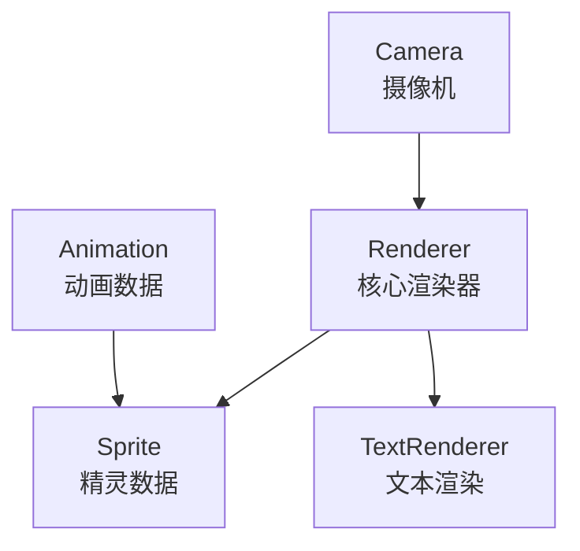
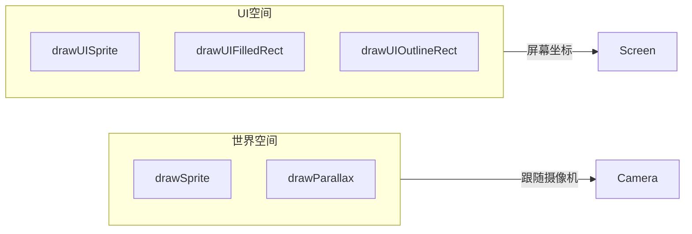
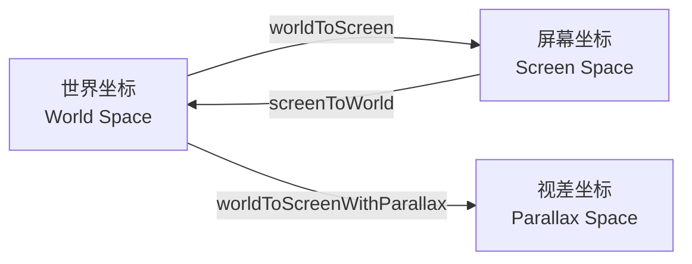
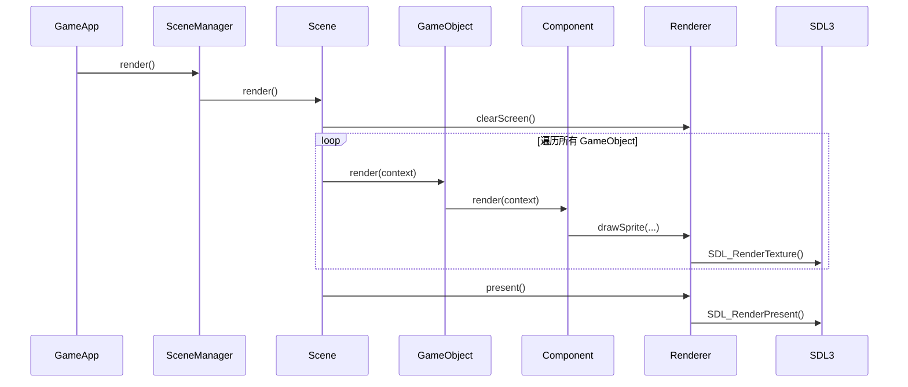
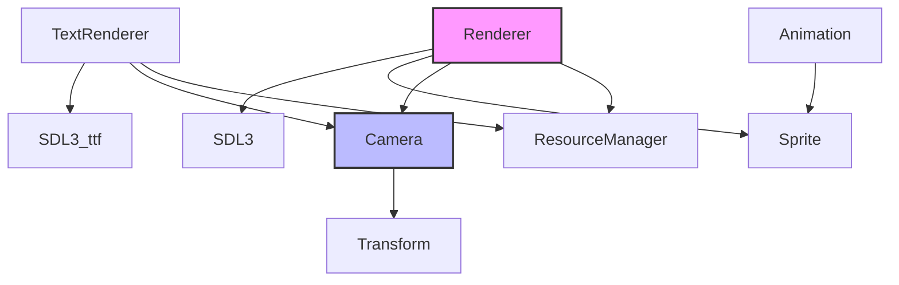

# Render 渲染模块

Render 模块负责处理 2D 图形渲染，包括精灵绘制、摄像机管理、动画和文本渲染。

## 架构概览



## 类概览

| 类名 | 描述 |
|------|------|
| [Renderer](#renderer) | 核心渲染类，封装 SDL 渲染操作 |
| [Camera](#camera) | 摄像机类，负责视口管理和坐标转换 |
| [Sprite](#sprite) | 精灵类，表示可渲染的 2D 图像 |
| [Animation](#animation) | 动画类，管理动画帧和播放逻辑 |
| [TextRenderer](#textrenderer) | 文本渲染类，使用 SDL3_ttf |

---

## Renderer

**文件**: `src/engine/render/renderer.h`

核心渲染类，负责封装 SDL 渲染操作和处理场景绘制逻辑。

### 类定义

```cpp
class Renderer final {
public:
    Renderer(SDL_Renderer* sdl_renderer, 
             engine::resource::ResourceManager* resource_manager);
    ~Renderer() = default;
    
    // 世界空间绘制
    void drawSprite(const Camera& camera,
                    const Sprite& sprite, 
                    const glm::vec2& position, 
                    const glm::vec2& scale = { 1.0f, 1.0f }, 
                    double angle = 0.0f);
    
    // 视差背景绘制
    void drawParallax(const Camera& camera,
                      const Sprite& sprite, 
                      const glm::vec2& position,
                      const glm::vec2& scroll_factor,
                      const glm::bvec2& repeat = { true, true },
                      const glm::vec2& scale = { 1.0f, 1.0f });
    
    // UI 空间绘制
    void drawUISprite(const Sprite& sprite, 
                      const glm::vec2& position, 
                      const std::optional<glm::vec2>& size = std::nullopt);
    
    // UI 矩形绘制
    void drawUIFilledRect(const engine::utils::Rect& rect, 
                          const engine::utils::FColor& color);
    void drawUIOutlineRect(const engine::utils::Rect& rect, 
                           const engine::utils::FColor& color);
    
    // 帧操作
    void present();
    void clearScreen();
    
    // 渲染状态
    void setDrawColor(const engine::utils::FColor& color);
    void setViewport(const SDL_Rect* rect);
    void resetViewport();
    
    // 获取 SDL 渲染器
    SDL_Renderer* getSDLRenderer() const;
};
```

### 绘制模式



### 使用示例

```cpp
// 世界空间绘制
renderer.drawSprite(
    camera,
    sprite,
    glm::vec2(100.0f, 200.0f),  // 位置
    glm::vec2(2.0f, 2.0f),       // 缩放
    45.0f                        // 旋转角度
);

// 视差背景
renderer.drawParallax(
    camera,
    bg_sprite,
    glm::vec2(0.0f, 0.0f),
    glm::vec2(0.5f, 0.5f),       // 视差因子
    glm::bvec2(true, false)      // 重复设置
);

// UI 绘制
renderer.drawUISprite(
    ui_sprite,
    glm::vec2(50.0f, 50.0f),     // 屏幕坐标
    glm::vec2(100.0f, 50.0f)     // 目标大小
);

// 绘制填充矩形
renderer.drawUIFilledRect(
    {{10.0f, 10.0f}, {200.0f, 50.0f}},
    {1.0f, 0.0f, 0.0f, 0.5f}     // 半透明红色
);
```

---

## Camera

**文件**: `src/engine/render/camera.h`

摄像机类，负责视口管理、坐标转换和边界平滑移动。

### 类定义

```cpp
class Camera final {
public:
    Camera(const glm::vec2& viewport_size,
           const glm::vec2& position = {0.0f, 0.0f},
           const std::optional<engine::utils::Rect>& limit_bounds = std::nullopt);
    ~Camera();
    
    // 更新
    void update(float delta_time);
    
    // 移动
    void move(const glm::vec2& offset);
    void setPosition(const glm::vec2& position);
    const glm::vec2& getPosition() const;
    
    // 跟随目标
    void setTarget(engine::component::TransformComponent* target);
    void setSmoothSpeed(float speed);
    
    // 视口
    void setViewportSize(const glm::vec2& size);
    const glm::vec2& getViewportSize() const;
    
    // 边界限制
    void setLimitBounds(const std::optional<engine::utils::Rect>& bounds);
    
    // 坐标转换
    glm::vec2 worldToScreen(const glm::vec2& world_pos) const;
    glm::vec2 worldToScreenWithParallax(const glm::vec2& world_pos, 
                                        float scroll_factor) const;
    glm::vec2 worldToScreenWithParallax(const glm::vec2& world_pos, 
                                        const glm::vec2& scroll_factor) const;
    glm::vec2 screenToWorld(const glm::vec2& screen_pos) const;
    
    // 像素对齐
    void setPixelSnap(bool enabled);
    bool getPixelSnap() const;
};
```

### 坐标转换



### 使用示例

```cpp
// 创建摄像机
camera = std::make_unique<Camera>(
    glm::vec2(1280.0f, 720.0f),  // 视口大小
    glm::vec2(0.0f, 0.0f),        // 初始位置
    engine::utils::Rect{{0, 0}, {2000, 1000}}  // 边界限制
);

// 设置跟随目标
camera->setTarget(player_transform);
camera->setSmoothSpeed(5.0f);

// 每帧更新
camera->update(delta_time);

// 坐标转换
glm::vec2 screen_pos = camera->worldToScreen(world_pos);
glm::vec2 world_pos = camera->screenToWorld(mouse_pos);
```

---

## Sprite

**文件**: `src/engine/render/sprite.h`

表示一个可渲染的精灵对象，包含纹理引用、裁剪区域及翻转状态。

### 类定义

```cpp
class Sprite final {
private:
    std::string texture_id_;
    std::optional<SDL_FRect> source_rect_;
    bool is_flipped_{ false };

public:
    Sprite() = default;
    explicit Sprite(const std::string& texture_id,
                    const std::optional<SDL_FRect>& source_rect = std::nullopt, 
                    bool is_flipped = false);
    ~Sprite() = default;
    
    // Getters
    const std::string& getTextureId() const;
    const std::optional<SDL_FRect>& getSourceRect() const;
    bool getIsFlipped() const;
    
    // Setters
    void setTextureId(const std::string& texture_id);
    void setSourceRect(const std::optional<SDL_FRect>& source_rect);
    void setIsFlipped(bool is_flipped);
};
```

### 使用示例

```cpp
// 完整纹理
Sprite full_sprite("player_texture");

// 裁剪纹理（精灵图）
SDL_FRect src_rect = {0, 0, 32, 32};
Sprite clipped_sprite("sprite_sheet", src_rect);

// 翻转精灵
Sprite flipped_sprite("player_texture", std::nullopt, true);

// 动态修改
sprite.setSourceRect(SDL_FRect{32, 0, 32, 32});
sprite.setIsFlipped(true);
```

---

## Animation

**文件**: `src/engine/render/animation.h`

动画类，管理一系列动画帧和动画播放逻辑。

### 类定义

```cpp
struct AnimationFrame {
    SDL_FRect src_rect;  // 纹理源矩形
    float duration;      // 帧持续时间（秒）
};

class Animation final {
public:
    Animation(const std::string& name = "default", bool loop = true);
    ~Animation() = default;
    
    // 帧管理
    void addFrame(const SDL_FRect& source_rect, float duration);
    const AnimationFrame& getFrame(float time) const;
    
    // 查询
    const std::string& getName() const;
    float getTotalDuration() const;
    bool isLooping() const;
    bool isEmpty() const;
};
```

### 使用示例

```cpp
// 创建行走动画
auto walk_anim = std::make_unique<Animation>("walk", true);

// 添加帧
walk_anim->addFrame({0, 0, 32, 32}, 0.1f);
walk_anim->addFrame({32, 0, 32, 32}, 0.1f);
walk_anim->addFrame({64, 0, 32, 32}, 0.1f);
walk_anim->addFrame({96, 0, 32, 32}, 0.1f);

// 获取当前帧
float anim_time = fmod(current_time, walk_anim->getTotalDuration());
const AnimationFrame& frame = walk_anim->getFrame(anim_time);
```

---

## TextRenderer

**文件**: `src/engine/render/text_renderer.h`

文本渲染类，负责使用 SDL3_ttf 渲染文本到屏幕。

### 渲染模式

| 模式 | 描述 |
|------|------|
| 世界文本 | 使用世界坐标，跟随相机移动 |
| UI 文本 | 使用屏幕坐标，不跟随相机 |

### 类定义

```cpp
class TextRenderer final {
public:
    TextRenderer(SDL_Renderer* sdl_renderer, 
                 engine::resource::ResourceManager* resource_manager);
    ~TextRenderer();
    
    // 世界空间文本
    void drawText(const Camera& camera,
                  const std::string& text,
                  const std::string& font_path,
                  int font_size,
                  const glm::vec2& position,
                  const engine::utils::FColor& color);
    
    // UI 空间文本
    void drawUIText(const std::string& text,
                    const std::string& font_path,
                    int font_size,
                    const glm::vec2& position,
                    const engine::utils::FColor& color,
                    bool is_dirty = true);
    
    void drawUIText(std::string&& text,
                    const std::string& font_path,
                    int font_size,
                    const glm::vec2& position,
                    const engine::utils::FColor& color,
                    bool is_dirty = true);
    
    // 缓存管理
    void clearCache();
};
```

### 使用示例

```cpp
// 世界空间文本（如漂浮伤害数字）
text_renderer.drawText(
    camera,
    "-25",
    "assets/fonts/arial.ttf",
    24,
    glm::vec2(100.0f, 200.0f),
    {1.0f, 0.0f, 0.0f, 1.0f}  // 红色
);

// UI 文本
 text_renderer.drawUIText(
    "Score: 1000",
    "assets/fonts/arial.ttf",
    32,
    glm::vec2(50.0f, 50.0f),  // 屏幕坐标
    {1.0f, 1.0f, 1.0f, 1.0f}  // 白色
);
```

---

## 渲染流程



---

## 模块依赖图


