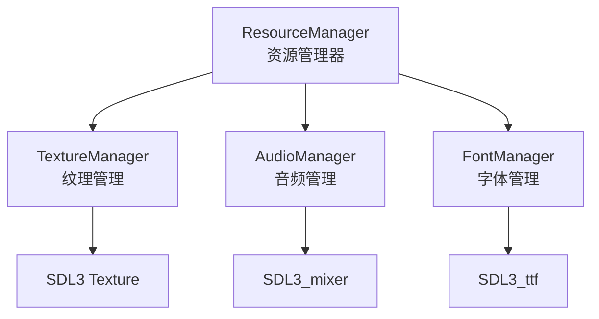
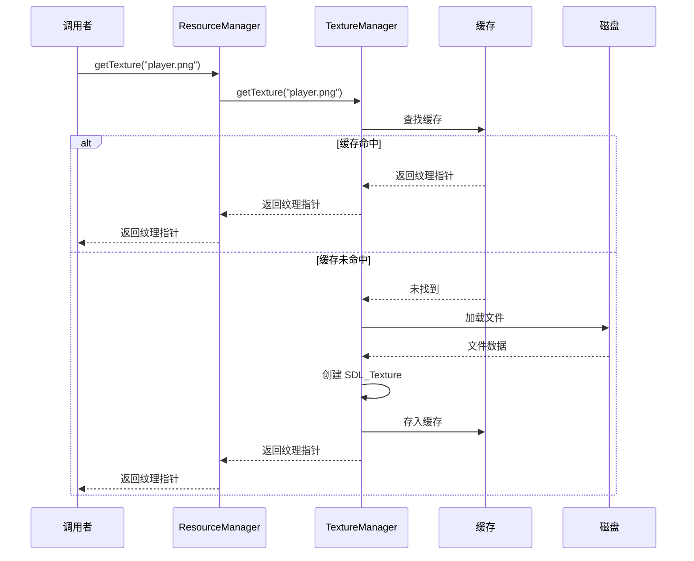
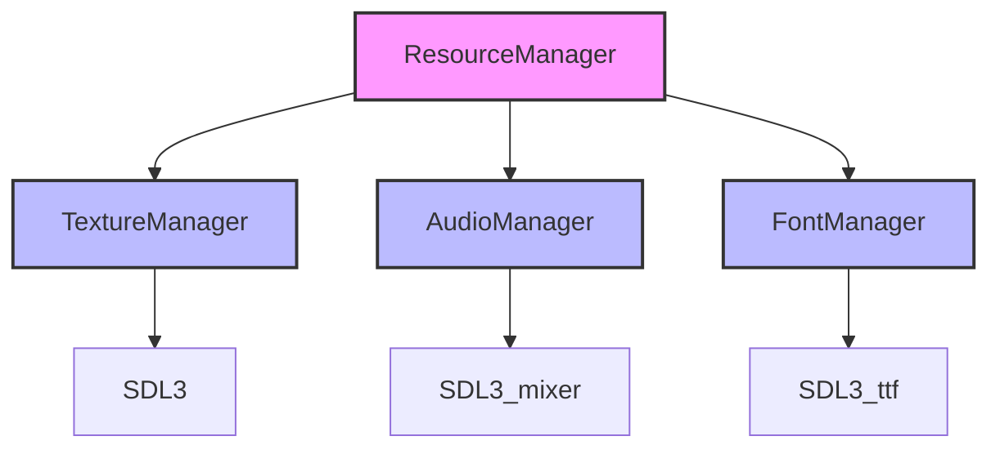

# Resource 资源管理模块

Resource 模块负责游戏所有资产（纹理、音频、字体）的生命周期管理，提供统一的资源加载、缓存和卸载接口。

## 架构概览



## 类概览

| 类名 | 描述 |
|------|------|
| [ResourceManager](#resourcemanager) | 集中式资源管理器，统一接口 |
| [TextureManager](#texturemanager) | 纹理资源管理 |
| [AudioManager](#audiomanager) | 音频资源管理 |
| [FontManager](#fontmanager) | 字体资源管理 |

---

## ResourceManager

**文件**: `src/engine/resource/resource_manager.h`

集中式资源管理器，通过封装具体的子管理器实现资源的统一加载、缓存和卸载。

### 类定义

```cpp
class ResourceManager {
public:
    explicit ResourceManager(SDL_Renderer* renderer);
    ~ResourceManager();
    
    // 清空所有资源
    void clear();
    
    // ========== 纹理接口 ==========
    SDL_Texture* loadTexture(const std::string& file_path);
    SDL_Texture* getTexture(const std::string& file_path);
    void unloadTexture(const std::string& file_path);
    glm::vec2 getTextureSize(const std::string& file_path);
    void clearTextures();
    
    // ========== 音效接口 ==========
    MIX_Audio* loadSound(const std::string& file_path);
    void playSound(const std::string& file_path);
    void stopSound();
    MIX_Audio* getSound(const std::string& file_path);
    void unloadSound(const std::string& file_path);
    void clearSounds();
    
    // ========== 音乐接口 ==========
    MIX_Audio* loadMusic(const std::string& file_path);
    void playMusic(const std::string& file_path, int loops = -1);
    void stopMusic();
    void pauseMusic();
    void resumeMusic();
    MIX_Audio* getMusic(const std::string& file_path);
    void unloadMusic(const std::string& file_path);
    void clearMusic();
    
    // ========== 字体接口 ==========
    TTF_Font* loadFont(const std::string& file_path, int point_size);
    TTF_Font* getFont(const std::string& file_path, int point_size);
    void unloadFont(const std::string& file_path, int point_size);
    void clearFonts();
};
```

### 使用示例

```cpp
// 创建资源管理器
auto resource_manager = std::make_unique<ResourceManager>(sdl_renderer);

// 加载纹理
SDL_Texture* player_tex = resource_manager->loadTexture("assets/player.png");
glm::vec2 size = resource_manager->getTextureSize("assets/player.png");

// 加载音效
resource_manager->loadSound("assets/jump.wav");
resource_manager->playSound("assets/jump.wav");

// 播放音乐
resource_manager->playMusic("assets/bgm.mp3", -1);  // -1 表示循环播放

// 加载字体
TTF_Font* font = resource_manager->loadFont("assets/arial.ttf", 24);

// 清空所有资源
resource_manager->clear();
```

---

## TextureManager

**文件**: `src/engine/resource/texture_manager.h`

负责 SDL 纹理资源的集中管理、加载与缓存。

### 类定义

```cpp
class TextureManager final {
public:
    explicit TextureManager(SDL_Renderer* renderer);
    ~TextureManager() = default;
    
    // 禁止拷贝和移动
    TextureManager(const TextureManager&) = delete;
    TextureManager& operator=(const TextureManager&) = delete;
    TextureManager(TextureManager&&) = delete;
    TextureManager& operator=(TextureManager&&) = delete;

private:
    SDL_Texture* loadTexture(const std::string& file_path);
    SDL_Texture* getTexture(const std::string& file_path);
    void unloadTexture(const std::string& file_path);
    glm::vec2 getTextureSize(const std::string& file_path);
    void clearTextures();
    
    friend class ResourceManager;
};
```

### 特性

- **自动缓存**: 相同路径的纹理只会加载一次
- **RAII 管理**: 使用 `std::unique_ptr` 自动管理纹理生命周期
- **延迟加载**: `getTexture` 会在纹理未加载时自动加载

### 自定义删除器

```cpp
struct SDLTextureDeleter {
    void operator()(SDL_Texture* texture) const {
        if (texture) {
            SDL_DestroyTexture(texture);
        }
    }
};
```

---

## AudioManager

**文件**: `src/engine/resource/audio_manager.h`

音频管理器类，负责音频资源（音乐和音效）的加载、缓存及生命周期管理。

### 类定义

```cpp
class AudioManager final {
public:
    AudioManager();
    ~AudioManager();
    
    // 禁止拷贝和移动
    AudioManager(const AudioManager&) = delete;
    AudioManager& operator=(const AudioManager&) = delete;
    AudioManager(AudioManager&&) = delete;
    AudioManager& operator=(AudioManager&&) = delete;

private:
    // 音效
    MIX_Audio* loadSound(const std::string& file_path);
    MIX_Audio* getSound(const std::string& file_path);
    void unloadSound(const std::string& file_path);
    void clearSounds();
    
    // 音乐
    MIX_Audio* loadMusic(const std::string& file_path);
    void playMusic(const std::string& file_path, int loops = -1);
    void stopMusic();
    void pauseMusic();
    void resumeMusic();
    MIX_Audio* getMusic(const std::string& file_path);
    void unloadMusic(const std::string& file_path);
    void clearMusic();
    
    friend class ResourceManager;
};
```

### 自定义删除器

```cpp
struct MixerDeleter {
    void operator()(MIX_Mixer* m) const {
        if (m) MIX_DestroyMixer(m);
    }
};

struct MixAudioDeleter {
    void operator()(MIX_Audio* c) const {
        if (c) MIX_DestroyAudio(c);
    }
};

struct TrackDeleter {
    void operator()(MIX_Track* t) const {
        if (t) MIX_DestroyTrack(t);
    }
};
```

### 音频轨道

AudioManager 使用独立的轨道分别播放音乐和音效：

| 轨道 | 用途 |
|------|------|
| music_track_ | 背景音乐 (BGM) |
| sound_track_ | 音效 (SFX) |

---

## FontManager

**文件**: `src/engine/resource/font_manager.h`

字体资源管理器，负责 SDL3_ttf 的初始化与字体资源的集中管理。

### 类定义

```cpp
class FontManager final {
public:
    FontManager();
    ~FontManager();
    
    // 禁止拷贝和移动
    FontManager(const FontManager&) = delete;
    FontManager& operator=(const FontManager&) = delete;
    FontManager(FontManager&&) = delete;
    FontManager& operator=(FontManager&&) = delete;

private:
    TTF_Font* loadFont(const std::string& file_path, int point_size);
    TTF_Font* getFont(const std::string& file_path, int point_size);
    void unloadFont(const std::string& file_path, int point_size);
    void clearFonts();
    
    friend class ResourceManager;
};
```

### FontKey 结构

字体缓存使用组合键（文件路径 + 字体大小）来唯一标识字体：

```cpp
struct FontKey {
    std::string file_path;
    int point_size;
    
    bool operator==(const FontKey& other) const {
        return file_path == other.file_path && point_size == other.point_size;
    }
};

struct FontKeyHasher {
    std::size_t operator()(const FontKey& key) const {
        return std::hash<std::string>()(key.file_path) ^ 
               std::hash<int>()(key.point_size);
    }
};
```

### 使用示例

```cpp
// 加载不同大小的同一字体
TTF_Font* font_small = resource_manager->loadFont("assets/arial.ttf", 16);
TTF_Font* font_medium = resource_manager->loadFont("assets/arial.ttf", 24);
TTF_Font* font_large = resource_manager->loadFont("assets/arial.ttf", 32);

// 这三个字体会被分别缓存
```

---

## 资源加载流程



---

## 模块依赖图



## 最佳实践

1. **使用 get 方法**: 优先使用 `getTexture()`、`getSound()` 等方法，它们会自动处理缓存
2. **统一路径**: 使用相对路径，以项目根目录为基准
3. **及时清理**: 场景切换时调用 `clear()` 释放不需要的资源
4. **预加载**: 在场景初始化时预加载所需资源，避免运行时卡顿
