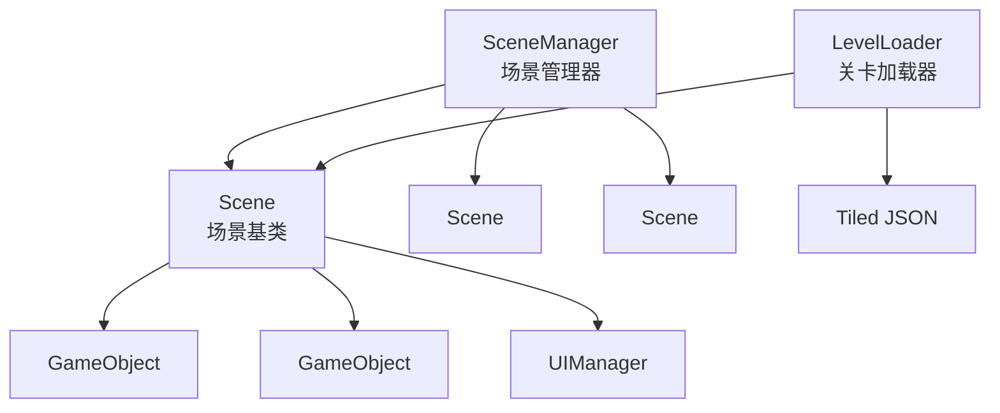
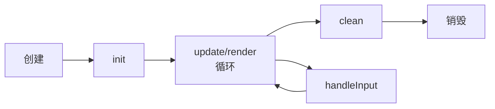
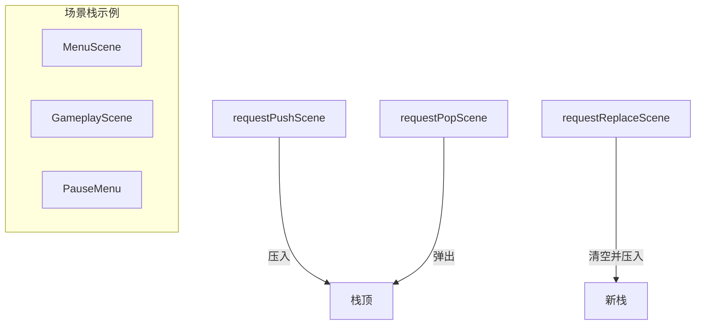
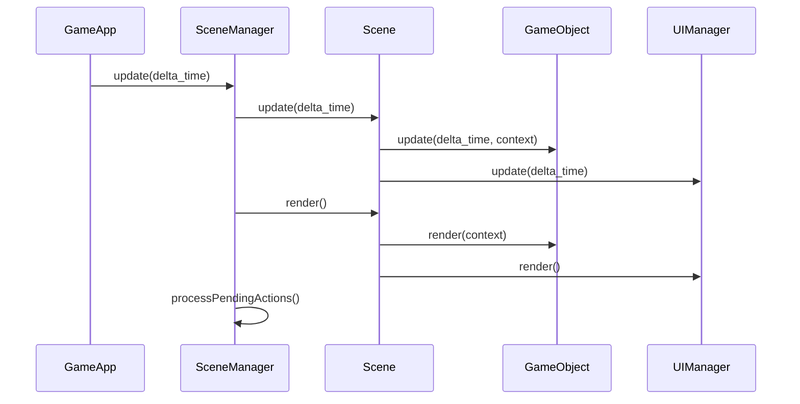
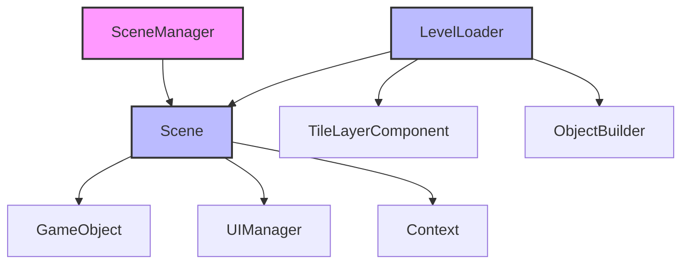

# Scene 场景模块

Scene 模块负责管理游戏场景的生命周期、场景切换和关卡加载。支持场景栈管理，允许场景叠加（如在游戏场景上弹出菜单）。

## 架构概览



## 类概览

| 类名 | 描述 |
|------|------|
| [Scene](#scene) | 场景基类，管理游戏对象和生命周期 |
| [SceneManager](#scenemanager) | 场景管理器，处理场景切换和栈管理 |
| [LevelLoader](#levelloader) | 关卡加载器，从 Tiled JSON 加载关卡 |

---

## Scene

**文件**: `src/engine/scene/scene.h`

场景基类，负责管理属于该场景的所有游戏对象及其生命周期。

### 类定义

```cpp
class Scene {
protected:
    std::string scene_name_;                        // 场景名称
    engine::core::Context& context_;               // 引擎上下文
    engine::scene::SceneManager& scene_manager_;    // 场景管理器引用
    bool is_initialized_ = false;                   // 初始化标记
    std::vector<std::unique_ptr<GameObject>> game_objects_;         // 活动对象
    std::vector<std::unique_ptr<GameObject>> pending_game_objects_; // 待添加对象
    std::unique_ptr<UIManager> ui_manager_;         // UI 管理器

public:
    Scene(const std::string& scene_name, 
          engine::core::Context& context, 
          engine::scene::SceneManager& scene_manager);
    virtual ~Scene();
    
    // 禁止拷贝和移动
    Scene(const Scene&) = delete;
    Scene& operator=(const Scene&) = delete;
    Scene(Scene&&) = delete;
    Scene& operator=(Scene&&) = delete;

    // 生命周期方法
    virtual void init();
    virtual void update(float delta_time);
    virtual void render();
    virtual bool handleInput();
    virtual void clean();

    // 游戏对象管理
    virtual void addGameObject(std::unique_ptr<GameObject>&& game_object);
    virtual void safeAddGameObject(std::unique_ptr<GameObject>&& game_object);
    virtual void removeGameObject(GameObject* game_object);
    virtual void safeRemoveGameObject(GameObject* game_object);
    
    // 查询
    GameObject* findGameObjectByName(const std::string& name) const;
    const std::vector<std::unique_ptr<GameObject>>& getGameObjects() const;
    UIManager* getUIManager();

    // Getters and Setters
    const std::string& getSceneName() const;
    bool isInitialized() const;
    engine::core::Context& getContext() const;
    engine::scene::SceneManager& getSceneManager() const;
};
```

### 生命周期



### 使用示例

```cpp
class GameplayScene : public engine::scene::Scene {
public:
    GameplayScene(engine::core::Context& context, 
                  engine::scene::SceneManager& scene_manager)
        : Scene("Gameplay", context, scene_manager) {}

    void init() override {
        // 加载关卡
        engine::scene::LevelLoader loader;
        loader.loadLevel("assets/levels/level1.tmj", *this);
        
        // 创建玩家
        auto player = std::make_unique<GameObject>("Player");
        player->addComponent<TransformComponent>(glm::vec2(100, 100));
        player->addComponent<SpriteComponent>("player", context_.getResourceManager());
        addGameObject(std::move(player));
    }

    void update(float delta_time) override {
        // 自定义更新逻辑
        Scene::update(delta_time);
    }

    void render() override {
        // 自定义渲染逻辑
        Scene::render();
    }
};
```

---

## SceneManager

**文件**: `src/engine/scene/scene_manager.h`

场景管理器，负责游戏场景的切换、叠加（栈管理）和生命周期调度。

### 特性

- **场景栈**: 支持场景叠加，如游戏场景上弹出暂停菜单
- **延迟处理**: 在帧末尾统一处理场景切换请求，避免遍历中修改容器
- **会话数据**: 支持跨场景共享数据

### 类定义

```cpp
class SceneManager {
public:
    explicit SceneManager(engine::core::Context& context);
    ~SceneManager();
    
    // 禁止拷贝和移动
    SceneManager(const SceneManager&) = delete;
    SceneManager& operator=(const SceneManager&) = delete;
    SceneManager(SceneManager&&) = delete;
    SceneManager& operator=(SceneManager&&) = delete;

    // 场景切换请求（异步，延迟执行）
    void requestPushScene(std::unique_ptr<Scene>&& scene);
    void requestPopScene();
    void requestReplaceScene(std::unique_ptr<Scene>&& scene);

    // 获取当前场景
    Scene* getCurrentScene() const;
    
    // 帧更新
    void update(float delta_time);
    void render();
    void handleInput();
    
    // 清理
    void close();

    // 上下文
    engine::core::Context& getContext() const;
    
    // 会话数据
    std::shared_ptr<game::data::SessionData> getSessionData();
    void setSessionData(std::shared_ptr<game::data::SessionData> session_data);

private:
    enum class PendingAction {
        None,    // 无操作
        Push,    // 压入新场景
        Pop,     // 弹出当前场景
        Replace  // 替换整个场景栈
    };
    
    void processPendingActions();
};
```

### 场景栈操作



### 使用示例

```cpp
// 切换到游戏场景
scene_manager.requestReplaceScene(
    std::make_unique<GameplayScene>(context, scene_manager)
);

// 弹出暂停菜单（叠加在当前场景上）
scene_manager.requestPushScene(
    std::make_unique<PauseMenuScene>(context, scene_manager)
);

// 关闭暂停菜单，返回游戏
scene_manager.requestPopScene();

// 跨场景数据传递
auto session_data = std::make_shared<game::data::SessionData>();
session_data->player_score = 1000;
scene_manager.setSessionData(session_data);

// 在另一个场景获取数据
auto data = scene_manager.getSessionData();
int score = data->player_score;
```

---

## LevelLoader

**文件**: `src/engine/scene/level_loader.h`

负责从 Tiled JSON 文件 (.tmj) 加载关卡数据到 Scene 中。

### 支持的图层类型

| 类型 | 描述 |
|------|------|
| Image Layer | 图片图层，用于背景 |
| Tile Layer | 瓦片图层，用于地图 |
| Object Layer | 对象图层，用于实体和触发器 |

### 类定义

```cpp
struct TileData {
    engine::component::TileInfo info;
    const nlohmann::json* json_ptr = nullptr;
};

class LevelLoader final {
    friend class ObjectBuilder;

public:
    LevelLoader() = default;
    
    // 加载关卡
    bool loadLevel(const std::string& map_path, Scene& scene);

private:
    void loadImageLayer(const nlohmann::json& layer_json, Scene& scene);
    void loadTileLayer(const nlohmann::json& layer_json, Scene& scene);
    void loadObjectLayer(const nlohmann::json& layer_json, Scene& scene);
    
    TileData getTileDataByGid(int gid);
    engine::component::TileInfo getTileInfoByGid(int gid);
    const nlohmann::json* findTileset(int gid);
    void loadTileset(const std::string& tileset_path, int first_gid);
};
```

### Tiled JSON 支持

- 支持外部瓦片集 (.tsj) 链接
- 支持自定义属性
- 支持对象层中的各种形状（矩形、多边形等）

### 使用示例

```cpp
void GameplayScene::init() {
    engine::scene::LevelLoader loader;
    
    if (!loader.loadLevel("assets/levels/level1.tmj", *this)) {
        spdlog::error("Failed to load level!");
        return;
    }
    
    // 关卡已加载，所有图层和对象已添加到场景
}
```

### 瓦片类型映射

LevelLoader 将 Tiled 中的瓦片类型映射到引擎的 TileType：

| Tiled 属性 | TileType |
|------------|----------|
| 无/默认 | NORMAL |
| solid=true | SOLID |
| hazard=true | HAZARD |
| ladder=true | LADDER |
| exit=true | LEVEL_EXIT |

---

## 场景生命周期流程



---

## 模块依赖图



## 最佳实践

1. **继承 Scene**: 为每个游戏画面创建 Scene 子类
2. **使用 safe 方法**: 在 update 循环中使用 `safeAddGameObject` 和 `safeRemoveGameObject`
3. **延迟切换**: 使用 `requestXxx` 方法进行场景切换，避免在遍历中修改场景栈
4. **关卡数据**: 使用 LevelLoader 加载 Tiled 编辑器创建的关卡
5. **会话数据**: 使用 SessionData 在场景间传递数据
