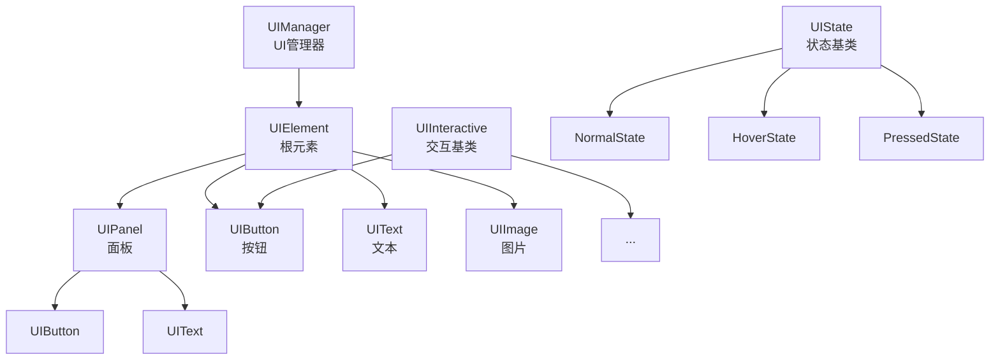
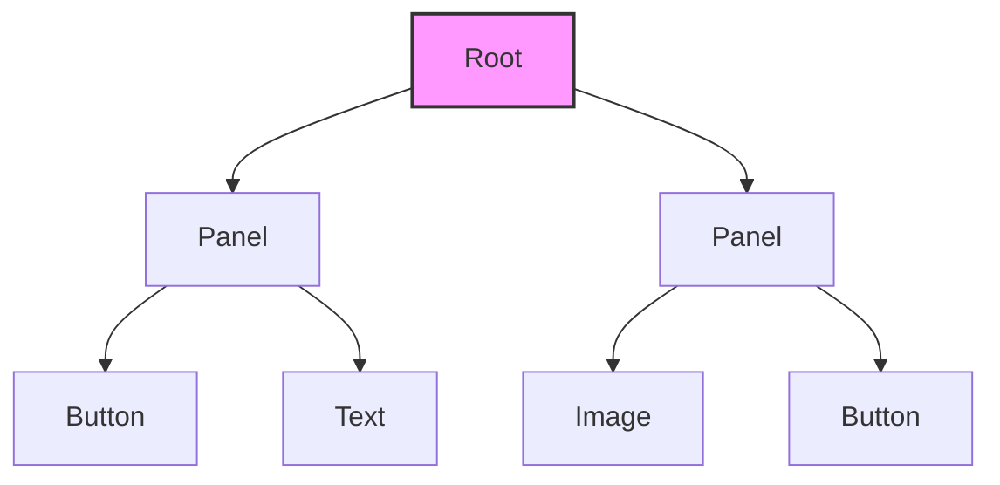
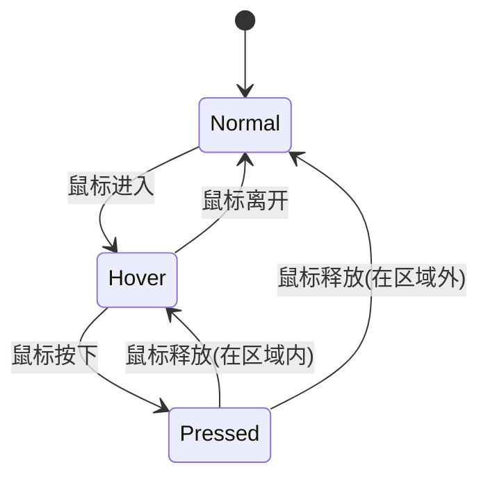
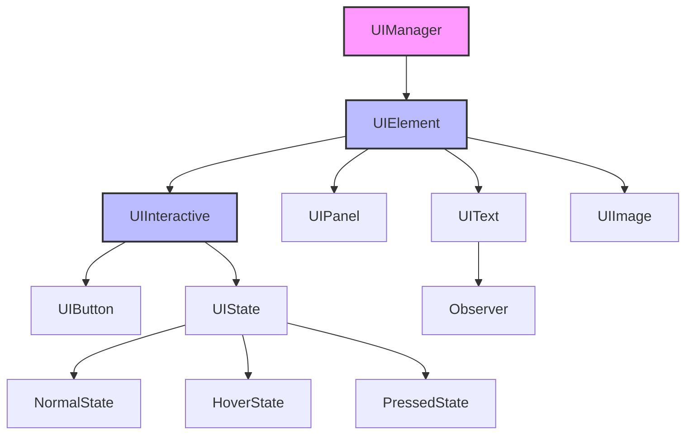

# UI 用户界面模块

UI 模块提供了一套完整的用户界面系统，支持按钮、面板、文本、图片等控件，采用树形结构组织，支持事件处理和状态管理。

## 架构概览



## 类概览

| 类名 | 描述 |
|------|------|
| [UIManager](#uimanager) | UI 管理器，管理整个 UI 系统 |
| [UIElement](#uielement) | 所有 UI 控件的基类 |
| [UIInteractive](#uiinteractive) | 可交互 UI 元素的基类 |
| [UIButton](#uibutton) | 按钮控件 |
| [UIPanel](#uipanel) | 面板容器 |
| [UIText](#uitext) | 文本显示 |
| [UIImage](#uiimage) | 图片显示 |
| [UIState](#uistate) | UI 状态基类 |

---

## UIManager

**文件**: `src/engine/ui/ui_manager.h`

UI 管理器类，负责管理整个 UI 系统。

### 类定义

```cpp
class UIManager {
public:
    explicit UIManager(engine::core::Context& context);
    ~UIManager();
    
    // 初始化
    bool init(const glm::vec2& window_size);
    
    // 生命周期
    void update(float delta_time);
    void render();
    bool handleInput();
    
    // 元素管理
    void addElement(std::unique_ptr<UIElement> element);
    void addElement(UIElement* parent, std::unique_ptr<UIElement> element);
    void removeElement(UIElement* element);
    
    // 查询
    UIElement* getRootElement() const;
    
    // 清理
    void clear();
};
```

### 使用示例

```cpp
// 在场景中初始化 UI
void MenuScene::init() {
    ui_manager_ = std::make_unique<UIManager>(context_);
    ui_manager_->init(glm::vec2(1280, 720));
    
    // 创建开始按钮
    auto start_btn = std::make_unique<UIButton>(
        context_, "Start Game", "assets/fonts/arial.ttf", 24
    );
    start_btn->setPosition(glm::vec2(540, 300));
    start_btn->setSize(glm::vec2(200, 50));
    start_btn->setClickCallback([this]() {
        scene_manager_.requestReplaceScene(
            std::make_unique<GameplayScene>(context_, scene_manager_)
        );
    });
    
    ui_manager_->addElement(std::move(start_btn));
}
```

---

## UIElement

**文件**: `src/engine/ui/ui_element.h`

所有 UI 控件的基类，提供通用的 UI 元素功能。

### 类定义

```cpp
class UIElement {
protected:
    UIElement* parent_ = nullptr;
    std::vector<std::unique_ptr<UIElement>> children_;
    glm::vec2 position_ = { 0.0f, 0.0f };
    glm::vec2 size_ = { 0.0f, 0.0f };
    bool visible_ = true;
    bool enabled_ = true;
    engine::core::Context& context_;

public:
    explicit UIElement(engine::core::Context& context);
    virtual ~UIElement();
    
    // 生命周期
    virtual void update(float delta_time);
    virtual void render();
    virtual bool handleInput();
    
    // 层级管理
    virtual void addChild(std::unique_ptr<UIElement> child);
    virtual void removeChild(UIElement* child);
    
    // 坐标转换
    virtual glm::vec2 getWorldPosition() const;
    virtual bool containsPoint(const glm::vec2& point) const;
    
    // Getters and Setters
    UIElement* getParent() const;
    void setParent(UIElement* parent);
    const std::vector<std::unique_ptr<UIElement>>& getChildren() const;
    
    virtual const glm::vec2& getPosition() const;
    virtual void setPosition(const glm::vec2& position);
    virtual const glm::vec2& getSize() const;
    virtual void setSize(const glm::vec2& size);
    
    bool isVisible() const;
    void setVisible(bool visible);
    bool isEnabled() const;
    void setEnabled(bool enabled);
    
    engine::core::Context& getContext() const;
};
```

### 层级结构



---

## UIInteractive

**文件**: `src/engine/ui/ui_interactive.h`

可交互 UI 元素的基类，支持状态管理、精灵切换和声音播放。

### 类定义

```cpp
class UIInteractive : public UIElement {
public:
    UIInteractive(engine::core::Context& context);
    virtual ~UIInteractive() = default;
    
    // 生命周期
    void update(float delta_time) override;
    bool handleInput() override;
    void render() override;
    
    // 状态管理
    void setState(std::unique_ptr<state::UIState> state);
    state::UIState* getCurrentState() const;
    
    // 精灵管理
    void addSprite(const std::string& name, std::unique_ptr<engine::render::Sprite> sprite);
    engine::render::Sprite* getSprite(const std::string& name) const;
    void setCurrentSprite(engine::render::Sprite* sprite);
    engine::render::Sprite* getCurrentSprite() const;
    
    // 声音管理
    void addSound(const std::string& name, const std::string& file_path);
    void playSound(const std::string& name);
    
    // 交互设置
    void setInteractive(bool interactive);
    bool isInteractive() const;
    void setClickCallback(std::function<void()> callback);
    void onClick();

protected:
    std::unique_ptr<state::UIState> current_state_;
    std::unordered_map<std::string, std::unique_ptr<engine::render::Sprite>> sprites_;
    std::unordered_map<std::string, std::string> sound_;
    engine::render::Sprite* current_sprite_ = nullptr;
    bool interactive_ = true;
    std::function<void()> click_callback_;
};
```

### 状态机



---

## UIButton

**文件**: `src/engine/ui/ui_button.h`

UI 按钮类，用于处理用户交互。

### 类定义

```cpp
class UIButton : public UIInteractive {
public:
    // 文本按钮
    UIButton(engine::core::Context& context, 
             const std::string& text, 
             const std::string& font_path, 
             int font_size = 16);
    
    // 精灵按钮
    UIButton(engine::core::Context& context,
             const std::string& normal_sprite_path,
             const std::string& hover_sprite_path,
             const std::string& pressed_sprite_path,
             const glm::vec2& position,
             const glm::vec2& size,
             std::function<void()> callback);
    
    ~UIButton() override;
    
    bool handleInput() override;
    void setSize(const glm::vec2& size) override;
    void render() override;
    
    // 回调设置
    void setClickCallback(std::function<void()> callback);
    
    // 颜色设置
    void setNormalBgColor(const FColor& color);
    void setHoverBgColor(const FColor& color);
    void setPressedBgColor(const FColor& color);
    void setNormalTextColor(const FColor& color);
    void setHoverTextColor(const FColor& color);
    void setPressedTextColor(const FColor& color);
    
    // 文本设置
    void setText(const std::string& text);
    const std::string& getText() const;
};
```

### 使用示例

```cpp
// 文本按钮
auto btn = std::make_unique<UIButton>(
    context_, 
    "Click Me", 
    "assets/fonts/arial.ttf", 
    24
);
btn->setPosition(glm::vec2(100, 100));
btn->setSize(glm::vec2(200, 50));
btn->setClickCallback([]() {
    spdlog::info("Button clicked!");
});

// 设置颜色
btn->setNormalBgColor({0.2f, 0.2f, 0.2f, 1.0f});
btn->setHoverBgColor({0.3f, 0.3f, 0.3f, 1.0f});
btn->setPressedBgColor({0.4f, 0.4f, 0.4f, 1.0f});
```

---

## UIPanel

**文件**: `src/engine/ui/ui_panel.h`

UI 面板类，用于组织和管理其他 UI 元素。

### 类定义

```cpp
class UIPanel : public UIElement {
public:
    explicit UIPanel(engine::core::Context& context);
    ~UIPanel() override;
    
    void render() override;
    
    // 样式设置
    void setBackgroundColor(const FColor& color);
    const FColor& getBackgroundColor() const;
    void setBorderColor(const FColor& color);
    const FColor& getBorderColor() const;
    void setBorderWidth(float width);
    float getBorderWidth() const;

private:
    FColor background_color_ = { 0.0f, 0.0f, 0.0f, 0.0f };
    FColor border_color_ = { 0.0f, 0.0f, 0.0f, 0.0f };
    float border_width_ = 0.0f;
};
```

### 使用示例

```cpp
auto panel = std::make_unique<UIPanel>(context_);
panel->setPosition(glm::vec2(50, 50));
panel->setSize(glm::vec2(300, 400));
panel->setBackgroundColor({0.1f, 0.1f, 0.1f, 0.9f});
panel->setBorderColor({0.5f, 0.5f, 0.5f, 1.0f});
panel->setBorderWidth(2.0f);

// 向面板添加子元素
auto btn = std::make_unique<UIButton>(context_, "OK", "assets/fonts/arial.ttf");
btn->setPosition(glm::vec2(100, 300));
panel->addChild(std::move(btn));

ui_manager_->addElement(std::move(panel));
```

---

## UIText

**文件**: `src/engine/ui/ui_text.h`

UI 文本类，用于显示文本内容。继承自 Observer，支持响应数据变化。

### 类定义

```cpp
enum class TextAlignment {
    LEFT,
    CENTER,
    RIGHT
};

class UIText : public UIElement, public engine::interface::Observer {
public:
    UIText(engine::core::Context& context, 
           const std::string& text, 
           const std::string& font_path, 
           int font_size = 16);
    ~UIText() override;
    
    void render() override;
    const glm::vec2& getSize() const override;
    void ensureUpToDate() const;
    
    // 文本设置
    void setText(const std::string& text);
    const std::string& getText() const;
    
    // 字体设置
    void setFontPath(const std::string& font_path);
    const std::string& getFontPath() const;
    void setFontSize(int font_size);
    int getFontSize() const;
    
    // 样式设置
    void setColor(const FColor& color);
    const FColor& getColor() const;
    void setAlignment(TextAlignment alignment);
    TextAlignment getAlignment() const;
    
    // 观察者接口
    void onNotify(const engine::interface::EventType event, 
                  const std::any& data) override;

private:
    std::string text_;
    std::string font_path_;
    int font_size_ = 16;
    FColor color_ = { 1.0f, 1.0f, 1.0f, 1.0f };
    TextAlignment alignment_ = TextAlignment::LEFT;
    mutable bool is_dirty_ = true;
};
```

### 使用示例

```cpp
auto score_text = std::make_unique<UIText>(
    context_, 
    "Score: 0", 
    "assets/fonts/arial.ttf", 
    32
);
score_text->setPosition(glm::vec2(50, 50));
score_text->setColor({1.0f, 1.0f, 0.0f, 1.0f});  // 黄色
score_text->setAlignment(TextAlignment::LEFT);

// 订阅分数变化
score_component->addObserver(score_text.get());

// 在 onNotify 中更新文本
void ScoreUI::onNotify(const EventType event, const std::any& data) {
    if (event == EventType::SCORE_CHANGED) {
        int score = std::any_cast<int>(data);
        setText("Score: " + std::to_string(score));
    }
}
```

---

## UIImage

**文件**: `src/engine/ui/ui_image.h`

UI 图片类，用于在 UI 上显示图片。

### 类定义

```cpp
class UIImage : public UIElement {
public:
    UIImage(engine::core::Context& context, 
            const std::string& texture_id, 
            const glm::vec2& position = {0.0f, 0.0f}, 
            const glm::vec2& size = {0.0f, 0.0f});
    ~UIImage() override;
    
    void render() override;
    
    // 透明度
    float getOpacity() const;
    void setOpacity(float opacity);
    
    // 精灵访问
    engine::render::Sprite& getSprite();
    const engine::render::Sprite& getSprite() const;

private:
    engine::render::Sprite sprite_;
    float opacity_ = 1.0f;
};
```

### 使用示例

```cpp
auto icon = std::make_unique<UIImage>(
    context_, 
    "heart_icon", 
    glm::vec2(50, 50), 
    glm::vec2(32, 32)
);
icon->setOpacity(0.8f);
```

---

## UIState

**文件**: `src/engine/ui/state/ui_state.h`

UI 状态基类，用于实现状态模式。

### 类定义

```cpp
namespace state {
    class UIState {
    public:
        virtual ~UIState() = default;
        virtual void enter(UIInteractive* element) = 0;
        virtual void exit(UIInteractive* element) = 0;
        virtual void update(UIInteractive* element, float delta_time) = 0;
        virtual void render(UIInteractive* element) = 0;
        virtual bool handleInput(UIInteractive* element) = 0;
    };
}
```

### 内置状态

| 状态 | 描述 |
|------|------|
| NormalState | 正常状态 |
| HoverState | 鼠标悬停状态 |
| PressedState | 按下状态 |

---

## 模块依赖图



## 最佳实践

1. **使用 UIManager**: 每个 Scene 应该有自己的 UIManager
2. **层级组织**: 使用 UIPanel 组织相关控件
3. **事件处理**: 使用回调函数处理按钮点击
4. **数据绑定**: 使用 Observer 模式绑定 UI 和数据
5. **屏幕坐标**: UI 元素使用屏幕坐标，不受摄像机影响
