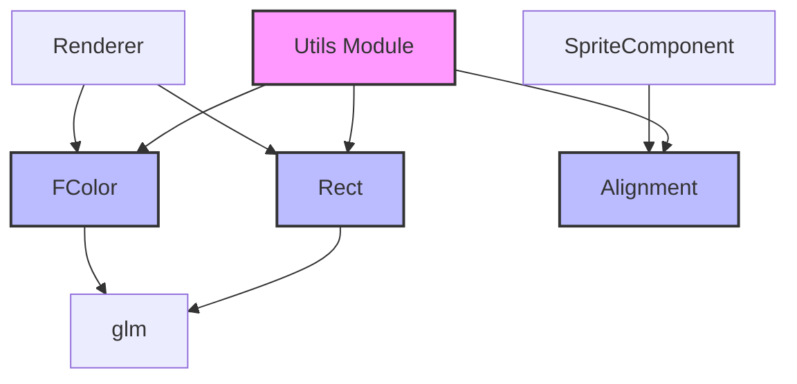

# Utils 工具模块

Utils 模块提供了引擎中使用的各种工具类和辅助结构，包括数学工具和枚举定义。

## 类/结构概览

| 名称 | 描述 |
|------|------|
| [Rect](#rect) | 二维矩形区域 |
| [FColor](#fcolor) | 浮点颜色结构 |
| [Alignment](#alignment) | 对齐方式枚举 |

---

## Rect

**文件**: `src/engine/utils/math.h`

表示一个二维矩形区域，包含位置和大小信息。

### 结构定义

```cpp
struct Rect {
    glm::vec2 position;  // 矩形的左上角位置坐标
    glm::vec2 size;      // 矩形的宽度和高度
};
```

### 使用示例

```cpp
#include "engine/utils/math.h"

// 创建矩形
engine::utils::Rect rect;
rect.position = glm::vec2(100.0f, 200.0f);
rect.size = glm::vec2(50.0f, 50.0f);

// 或使用初始化列表
engine::utils::Rect rect2{{100.0f, 200.0f}, {50.0f, 50.0f}};

// 检查点是否在矩形内
bool contains(const engine::utils::Rect& rect, const glm::vec2& point) {
    return point.x >= rect.position.x &&
           point.x <= rect.position.x + rect.size.x &&
           point.y >= rect.position.y &&
           point.y <= rect.position.y + rect.size.y;
}

// 检查两个矩形是否相交
bool intersects(const engine::utils::Rect& a, const engine::utils::Rect& b) {
    return a.position.x < b.position.x + b.size.x &&
           a.position.x + a.size.x > b.position.x &&
           a.position.y < b.position.y + b.size.y &&
           a.position.y + a.size.y > b.position.y;
}
```

### 应用场景

| 场景 | 用途 |
|------|------|
| 碰撞检测 | 定义碰撞盒 |
| 渲染裁剪 | 定义视口和裁剪区域 |
| UI 布局 | 定义 UI 元素的位置和大小 |
| 摄像机边界 | 定义摄像机的移动限制 |

---

## FColor

**文件**: `src/engine/utils/math.h`

浮点颜色结构，使用 0.0f-1.0f 范围的浮点数表示 RGBA 颜色。

### 结构定义

```cpp
struct FColor {
    float r;  // 红色通道 (0.0f-1.0f)
    float g;  // 绿色通道 (0.0f-1.0f)
    float b;  // 蓝色通道 (0.0f-1.0f)
    float a;  // alpha通道 (0.0f-1.0f)
    
    // 默认构造函数，创建白色不透明颜色
    FColor() : r(1.0f), g(1.0f), b(1.0f), a(1.0f) {}
    
    // 带参数的构造函数
    FColor(float r, float g, float b, float a = 1.0f) 
        : r(r), g(g), b(b), a(a) {}
};
```

### 预定义颜色

```cpp
namespace Colors {
    constexpr FColor WHITE    = FColor(1.0f, 1.0f, 1.0f, 1.0f);
    constexpr FColor BLACK    = FColor(0.0f, 0.0f, 0.0f, 1.0f);
    constexpr FColor RED      = FColor(1.0f, 0.0f, 0.0f, 1.0f);
    constexpr FColor GREEN    = FColor(0.0f, 1.0f, 0.0f, 1.0f);
    constexpr FColor BLUE     = FColor(0.0f, 0.0f, 1.0f, 1.0f);
    constexpr FColor YELLOW   = FColor(1.0f, 1.0f, 0.0f, 1.0f);
    constexpr FColor CYAN     = FColor(0.0f, 1.0f, 1.0f, 1.0f);
    constexpr FColor MAGENTA  = FColor(1.0f, 0.0f, 1.0f, 1.0f);
    constexpr FColor TRANSPARENT = FColor(0.0f, 0.0f, 0.0f, 0.0f);
}
```

### 使用示例

```cpp
#include "engine/utils/math.h"

// 创建颜色
engine::utils::FColor red(1.0f, 0.0f, 0.0f, 1.0f);
engine::utils::FColor semi_transparent_blue(0.0f, 0.0f, 1.0f, 0.5f);

// 用于渲染
renderer.setDrawColor(red);
renderer.drawUIFilledRect(rect, semi_transparent_blue);

// 用于 UI
text.setColor(engine::utils::FColor(1.0f, 1.0f, 0.0f, 1.0f));  // 黄色

// 颜色插值（渐变）
engine::utils::FColor lerp(const engine::utils::FColor& a, 
                           const engine::utils::FColor& b, 
                           float t) {
    return engine::utils::FColor(
        a.r + (b.r - a.r) * t,
        a.g + (b.g - a.g) * t,
        a.b + (b.b - a.b) * t,
        a.a + (b.a - a.a) * t
    );
}
```

### 颜色值参考

| 颜色 | RGB 值 |
|------|--------|
| 白色 | (1.0, 1.0, 1.0) |
| 黑色 | (0.0, 0.0, 0.0) |
| 红色 | (1.0, 0.0, 0.0) |
| 绿色 | (0.0, 1.0, 0.0) |
| 蓝色 | (0.0, 0.0, 1.0) |
| 黄色 | (1.0, 1.0, 0.0) |
| 青色 | (0.0, 1.0, 1.0) |
| 品红 | (1.0, 0.0, 1.0) |
| 灰色 | (0.5, 0.5, 0.5) |

---

## Alignment

**文件**: `src/engine/utils/alignment.h`

定义对象或组件相对于其位置参考点的对齐方式。

### 枚举定义

```cpp
enum class Alignment {
    NONE,           // 不指定对齐方式
    TOP_LEFT,       // 左上角
    TOP_CENTER,     // 顶部中心
    TOP_RIGHT,      // 右上角
    CENTER_LEFT,    // 中心左侧
    CENTER,         // 正中心
    CENTER_RIGHT,   // 中心右侧
    BOTTOM_LEFT,    // 左下角
    BOTTOM_CENTER,  // 底部中心
    BOTTOM_RIGHT    // 右下角
};
```

### 对齐示意图

```
+-------------------------------------+
| TOP_LEFT    TOP_CENTER    TOP_RIGHT |
|                                     |
| CENTER_LEFT   CENTER    CENTER_RIGHT|
|                                     |
| BOTTOM_LEFT BOTTOM_CENTER BOTTOM_RIG|
+-------------------------------------+
```

### 使用示例

```cpp
#include "engine/utils/alignment.h"

// 创建精灵组件，居中对齐
auto sprite = player->addComponent<SpriteComponent>(
    "player_texture",
    resource_manager,
    engine::utils::Alignment::CENTER  // 精灵中心与变换位置对齐
);

// 不同对齐方式的应用场景
// TOP_LEFT:     UI 元素默认对齐
// CENTER:       游戏对象精灵对齐
// BOTTOM_CENTER: 地面物体的底部对齐
```

### 偏移计算

```cpp
glm::vec2 calculateOffset(Alignment alignment, const glm::vec2& size) {
    switch (alignment) {
        case Alignment::NONE:
            return glm::vec2(0.0f, 0.0f);
        case Alignment::TOP_LEFT:
            return glm::vec2(0.0f, 0.0f);
        case Alignment::TOP_CENTER:
            return glm::vec2(-size.x * 0.5f, 0.0f);
        case Alignment::TOP_RIGHT:
            return glm::vec2(-size.x, 0.0f);
        case Alignment::CENTER_LEFT:
            return glm::vec2(0.0f, -size.y * 0.5f);
        case Alignment::CENTER:
            return glm::vec2(-size.x * 0.5f, -size.y * 0.5f);
        case Alignment::CENTER_RIGHT:
            return glm::vec2(-size.x, -size.y * 0.5f);
        case Alignment::BOTTOM_LEFT:
            return glm::vec2(0.0f, -size.y);
        case Alignment::BOTTOM_CENTER:
            return glm::vec2(-size.x * 0.5f, -size.y);
        case Alignment::BOTTOM_RIGHT:
            return glm::vec2(-size.x, -size.y);
    }
    return glm::vec2(0.0f, 0.0f);
}
```

---

## 模块依赖图



## 最佳实践

1. **使用 FColor**: 优先使用 FColor 而非 SDL_Color，保持引擎内部一致性
2. **归一化颜色**: 使用 0.0f-1.0f 范围的颜色值，便于计算和插值
3. **对齐方式**: 根据对象类型选择合适的对齐方式
4. **矩形操作**: 使用工具函数处理矩形运算，避免重复代码
